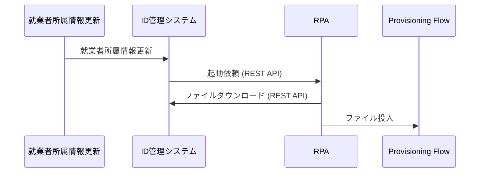

# インターフェイス定義

**K0025 Provisioning Flow**

---
## 更新履歴

| 更新日     | 更新者 | 更新内容 |
| ---------- | ------ | -------- |
| 2025/12/22 |        | 新規作成 |

---
## 承認者情報ファイル
### ファイルフォーマット
| 項目           | 内容                                      |
| -------------- | ----------------------------------------- |
| 種類           | CSV                                       |
| ファイル名     | 承認権情報.csv                            |
| 文字コード     | UTF-8                                     |
| 改行コード     | CRLF                                      |
| タイトル行     | あり                                      |
| エスケープ     | なし                                      |
| 全量／差分     | 全量                                      |
| 抽出条件       | 就業者所属情報.役職コード IN (部長、室長) |
| 連携タイミング | 発令日                                    |

### 出力項目
| No  | 項目名   | 種別 | 桁数 | 必須 | 項目説明 | 設定元マスターデータ                |
| --- | -------- | ---- | ---- | ---- | -------- | ----------------------------------- |
| 1   | 所属     | 文字 |      |      |          | 就業者所属情報.グループ名称         |
| 2   | IT管理者 | 文字 |      |      |          | 就業者情報.姓 + " " + 就業者情報.名 |

### 処理フロー

---
## 社員情報ファイル
### ファイルフォーマット
| 項目           | 内容                                                                      |
| -------------- | ------------------------------------------------------------------------- |
| 種類           | CSV                                                                       |
| ファイル名     | 社員情報.csv                                                              |
| 文字コード     | UTF-8                                                                     |
| 改行コード     | CRLF                                                                      |
| タイトル行     | あり                                                                      |
| エスケープ     | なし                                                                      |
| 全量／差分     | 全量                                                                      |
| 抽出条件       | 就業者情報.雇用形態 IN (役員、社員、契約社員、直接雇用スタッフ、派遣社員) |
| 連携タイミング | 発令日                                                                    |

### 出力項目
| No  | 項目名             | 種別 | 桁数 | 必須 | 項目説明 | 設定元マスターデータ                                                                           |
| --- | ------------------ | ---- | ---- | ---- | -------- | ---------------------------------------------------------------------------------------------- |
| 1   | 所属               | 文字 |      |      |          | 就業者所属情報.グループ名称                                                                    |
| 2   | ユーザー           | 文字 |      |      |          | 就業者情報.姓 + " " + 就業者情報.名                                                            |
| 3   | UserPrincipalName  | 文字 |      |      |          | 就業者情報.マンナンバーの下6桁 + "@nhk-tech.co.jp"                                             |
| 4   | ユーザー（検索用） | 文字 |      |      |          | 就業者情報.姓 + " " + 就業者情報.名 + " " + 就業者情報.マンナンバーの下6桁 + "@nhk-tech.co.jp" |

### 処理フロー

