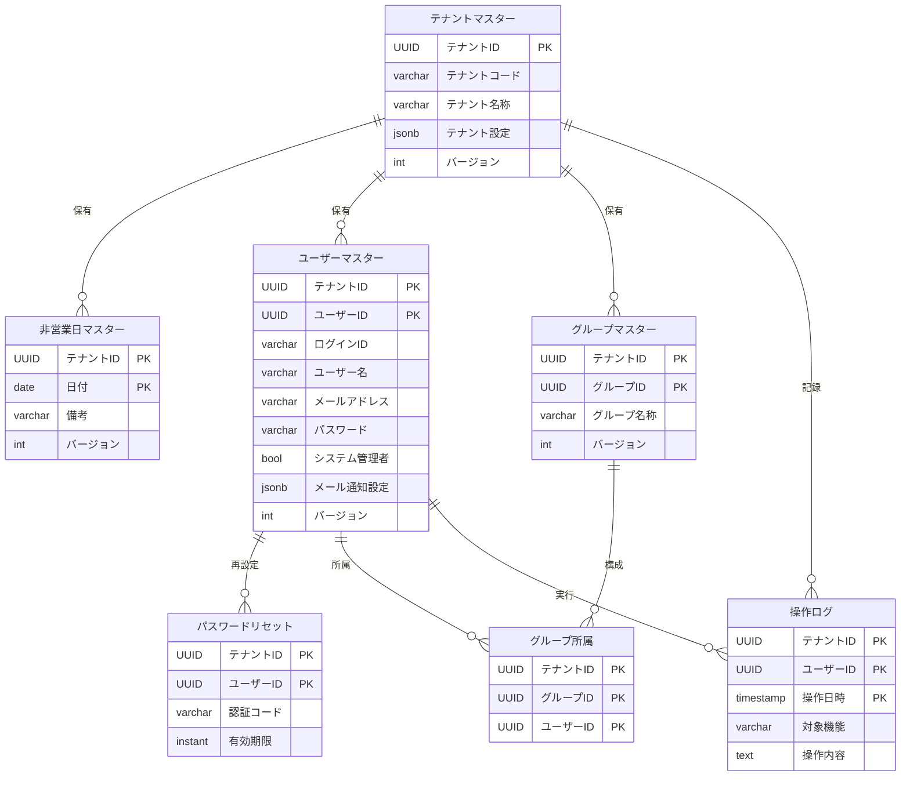
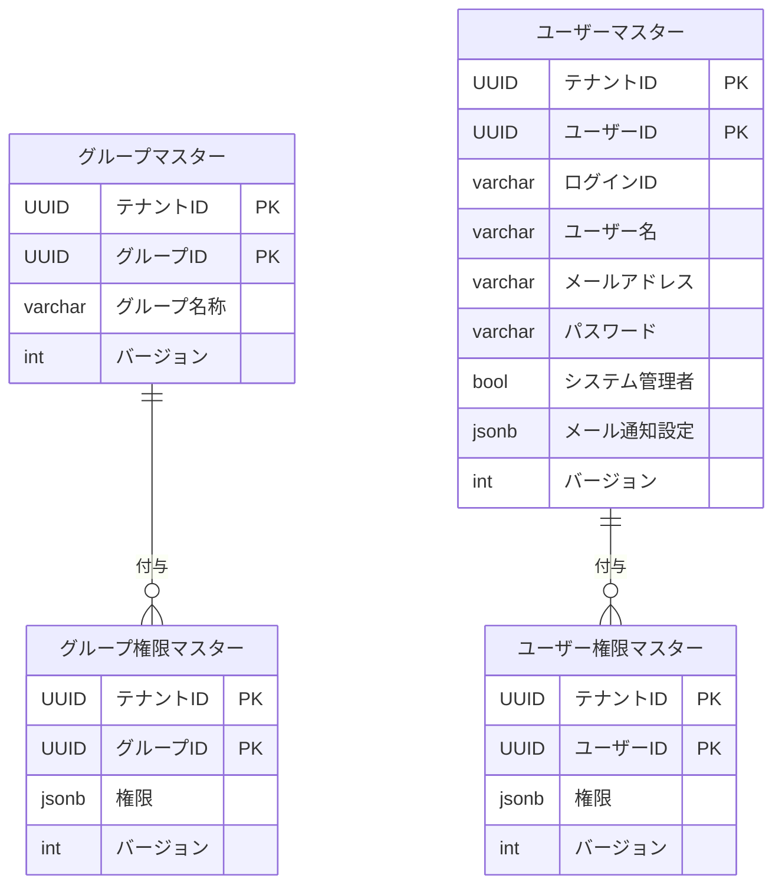
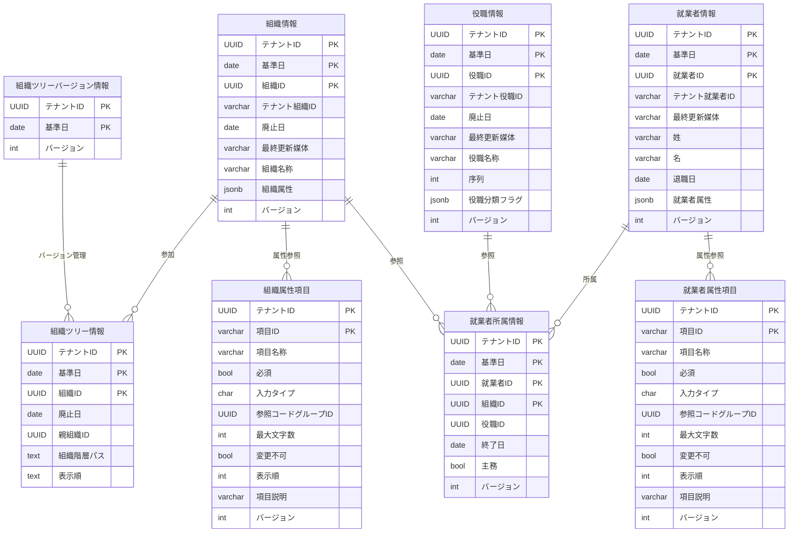
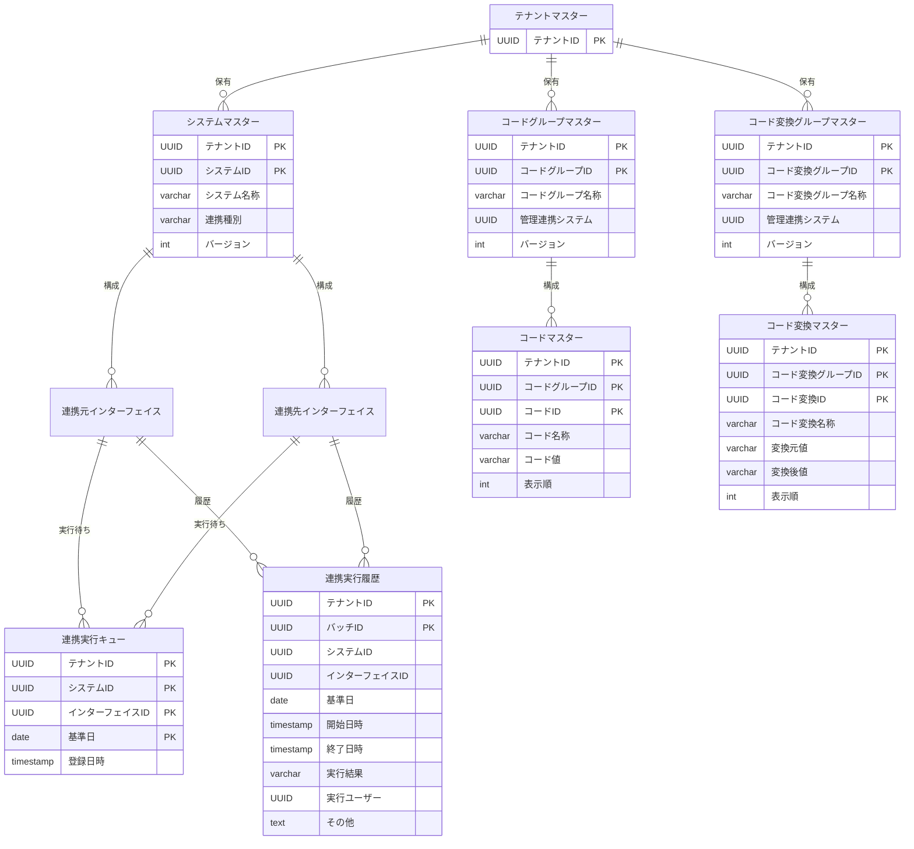
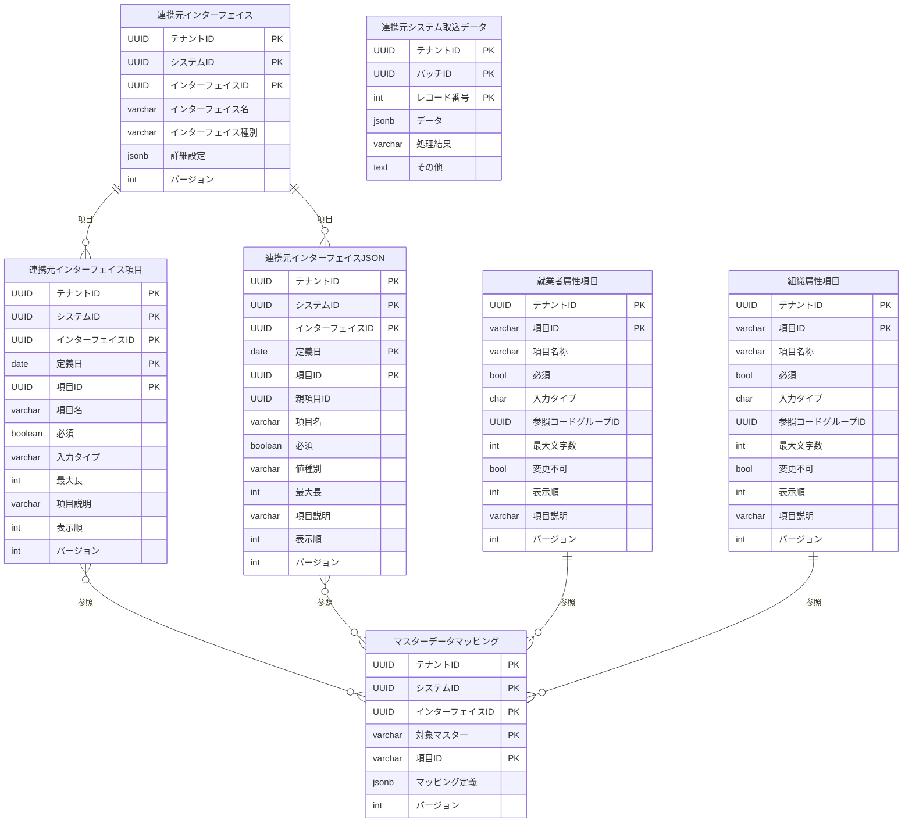
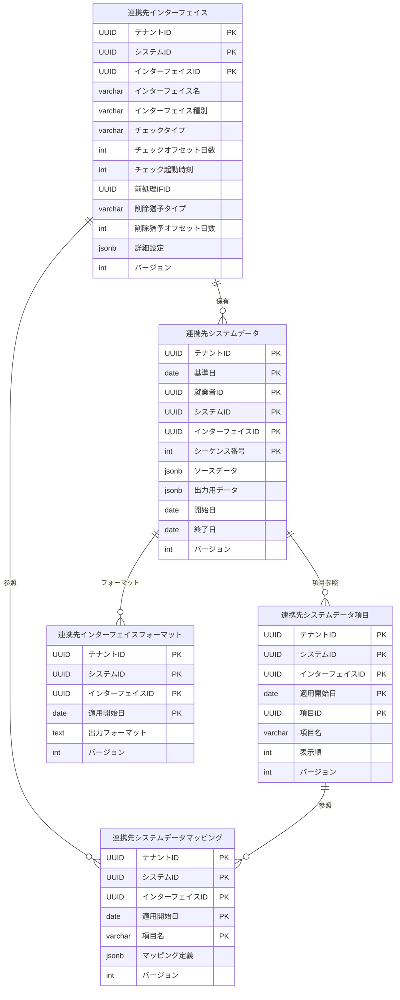
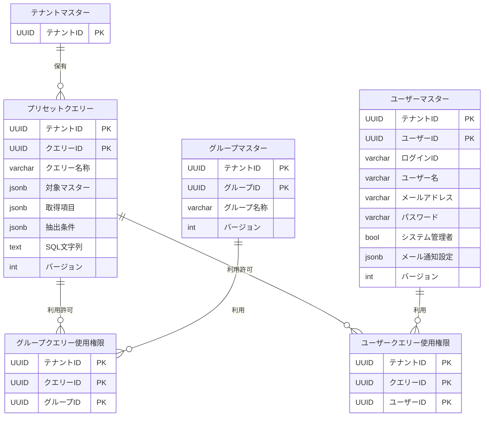

# ID管理システム エンティティ定義

## 更新履歴

| 更新日     | 更新者 | 更新内容 |
| ---------- | ------ | -------- |
| 2025/12/17 |        | 新規作成 |


## 目次

- [ID管理システム エンティティ定義](#id管理システム-エンティティ定義)
  - [更新履歴](#更新履歴)
  - [目次](#目次)
- [注意事項](#注意事項)
- [システム用エンティティ](#システム用エンティティ)
  - [テナントマスター](#テナントマスター)
  - [非営業日マスター](#非営業日マスター)
  - [ユーザーマスター](#ユーザーマスター)
  - [メール通知設定 設定項目](#メール通知設定-設定項目)
  - [パスワードリセット](#パスワードリセット)
  - [グループマスター](#グループマスター)
  - [グループ所属](#グループ所属)
  - [操作ログ](#操作ログ)
  - [システム用エンティティ ER図](#システム用エンティティER図)
- [権限に関わるエンティティ](#権限に関わるエンティティ)
  - [グループ権限マスター](#グループ権限マスター)
  - [ユーザー権限マスター](#ユーザー権限マスター)
    - [権限定義仕様](#権限定義仕様)
  - [権限に関わるエンティティ ER図](#権限に関わるエンティティER図)
- [マスターデータに関わるエンティティ](#マスターデータに関わるエンティティ)
  - [組織情報](#組織情報)
    - [属性カラム仕様](#属性カラム仕様)
  - [組織属性項目](#組織属性項目)
  - [組織ツリーバージョン情報](#組織ツリーバージョン情報)
  - [組織ツリー情報](#組織ツリー情報)
  - [役職情報](#役職情報)
  - [就業者情報](#就業者情報)
  - [就業者属性項目](#就業者属性項目)
  - [就業者所属情報](#就業者所属情報)
  - [マスターデータに関わるエンティティ ER図](#マスターデータに関わるエンティティER図)
- [連携インターフェイス関連のエンティティ（連携元／連携先共通）](#連携インターフェイス関連のエンティティ連携元連携先共通)
  - [システムマスター](#システムマスター)
  - [コードグループマスター](#コードグループマスター)
  - [コードマスター](#コードマスター)
  - [コード変換グループマスター](#コード変換グループマスター)
  - [コード変換マスター](#コード変換マスター)
  - [連携実行キュー](#連携実行キュー)
  - [連携実行履歴](#連携実行履歴)
  - [連携インターフェイス関連のエンティティ ER図](#連携インターフェイス関連のエンティティER図)
- [連携元インターフェイス関連のエンティティ](#連携元インターフェイス関連のエンティティ)
  - [連携元インターフェイス](#連携元インターフェイス)
  - [連携元インターフェイス種別一覧](#連携元インターフェイス種別一覧)
  - [連携元インターフェイス詳細設定](#連携元インターフェイス詳細設定)
  - [連携元インターフェイス項目](#連携元インターフェイス項目)
  - [連携元インターフェイスJSON](#連携元インターフェイスjson)
    - [増幅データ指定](#増幅データ指定)
  - [マスターデータマッピング](#マスターデータマッピング)
    - [連携元マッピング定義カラム仕様](#連携元マッピング定義カラム仕様)
  - [連携元システム取込データ](#連携元システム取込データ)
  - [連携元インターフェイス関連のエンティティ ER図](#連携元インターフェイス関連のエンティティER図)
- [連携先インターフェイス関連のエンティティ](#連携先インターフェイス関連のエンティティ)
  - [連携先インターフェイス](#連携先インターフェイス)
  - [連携先インターフェイス種別一覧](#連携先インターフェイス種別一覧)
  - [連携先インターフェイス詳細設定](#連携先インターフェイス詳細設定)
  - [連携先システムデータ項目](#連携先システムデータ項目)
  - [連携先システムデータマッピング](#連携先システムデータマッピング)
  - [連携先インターフェイスフォーマット](#連携先インターフェイスフォーマット)
    - [オペレータ種別について](#オペレータ種別について)
  - [連携先システムデータ](#連携先システムデータ)
    - [連携先システムデータの動作イメージ](#連携先システムデータの動作イメージ)
  - [連携先インターフェイス関連のエンティティ ER図](#連携先インターフェイス関連のエンティティER図)
- [手動設定関連のエンティティ](#手動設定関連のエンティティ)
  - [就業者情報スキップ設定](#就業者情報スキップ設定)
  - [就業者情報上書設定](#就業者情報上書設定)
  - [組織情報スキップ設定](#組織情報スキップ設定)
  - [組織情報上書設定](#組織情報上書設定)
  - [手動設定関連のエンティティ ER図](#手動設定関連のエンティティER図)
- [プリセットクエリー関連のエンティティ](#プリセットクエリー関連のエンティティ)
  - [プリセットクエリー](#プリセットクエリー)
  - [対象マスター仕様](#対象マスター仕様)
  - [取得項目仕様](#取得項目仕様)
  - [抽出条件仕様](#抽出条件仕様)
  - [グループクエリー使用権限](#グループクエリー使用権限)
  - [ユーザークエリー使用権限](#ユーザークエリー使用権限)
  - [プリセットクエリー関連のエンティティ ER図](#プリセットクエリー関連のエンティティER図)


# 注意事項
**UUIDは全てUUIDv7を使用するものとする。**

# システム用エンティティ

## テナントマスター
物理名: tenant_master
当システムを利用するテナントを管理するマスターテーブル。
| 項目名         | 項目物理名      | 型名    | 桁数 |  PK | UK  | Not Null | デフォルト値 | 項目説明                                                           |
| :------------- | :-------------- | :------ | :--: | --: | :-- | :------- | :----------- | :----------------------------------------------------------------- |
| テナントID     | tenant_id       | UUID    |  -   |   1 |     | 〇       |              | テナントを一意に識別するID                                         |
| テナントコード | tenant_code     | varchar |  10  |     | UK1 | 〇       |              | 外部からテナントを指定する機能用の、テナントを一意に識別するコード |
| テナント名称   | tenant_name     | varchar | 100  |   - |     | 〇       |              | テナントの名称                                                     |
| テナント設定   | tenant_settings | jsonb   |  -   |   - |     | 〇       |              | テナント用の各種設定。設定内容は**テナント設定 設定項目**を参照。  |
| バージョン     | version         | int     |  -   |   - |     | 〇       | 0            | データのバージョン                                                 |

**テナント設定 設定項目**
※必要に応じて随時追加
```json
{
    "weeklyHoliday": [             // 週休とする曜日を設定
        "SUNDAY",
        "SATURDAY"
    ],
    "autoRelation": "ON",               // 自動連携を行うかのフラグ。行う場合、"ON"
    "personColumnName": "社員番号",            // テナント就業者IDの画面表示上の文言を設定する。
    "orgColumnName": "部門コード(基軸コード)", // テナント組織IDの画面表示上の文言を設定する。
    "useIdPassAuth": "OFF",             // ID/PASSでのログインを可能にするかのフラグ。可能にする場合、"ON"。 
    "useADSAMLSSO": "ON",               // ActiveDirectoryのSAML認証によるSSOログインを可能にするかのフラグ。可能にする場合、"ON"。
    "adSAMLSettings": {                 // useADSAMLSSOがONの場合のみ必要
        "type": "EntraId",              // ADの種別。EntraID(Azure)のみ対応
        "entraId": {                    // typeがEntraIdの場合のみ使用。
            "idpEntityId": "https://adfs.example.com/adfs/services/trust",   // IdP(AD FS)のエンティティID。ADFSで発行される一意識別子
            "idpSsoUrl": "https://adfs.example.com/adfs/ls/",                // IdPのシングルサインオンエンドポイントURL。認証リクエスト送信先
            "idpSloUrl": "https://adfs.example.com/adfs/ls/?wa=wsignout1.0", // IdPのシングルログアウトURL（オプション）。ログアウト時の通知先
            "idpCertificate": "MIIDejCCAmKgAwIBAgI...",                      // IdPの署名検証用X.509証明書（Base64エンコード）。SAML応答の署名検証に使用
        },
        "nameIdFormat": "urn:oasis:names:tc:SAML:1.1:nameid-format:emailAddress", // ユーザー識別子の形式。emailAddress, unspecified等
        "attributeMapping": {                                            // SAML属性からアプリケーション項目へのマッピング定義
            "mailAddress": "http://schemas.xmlsoap.org/ws/2005/05/identity/claims/emailaddress" // メールアドレスにマッピングするSAML属性名
        },
    },
}
```

## 非営業日マスター
物理名: holiday_master
テナントが営業を行わない日付を登録するマスターテーブル。
| 項目名     | 項目物理名  | 型名    | 桁数 |  PK | UK  | Not Null | デフォルト値 | 項目説明                                                                         |
| :--------- | :---------- | :------ | :--: | --: | :-- | :------- | :----------- | :------------------------------------------------------------------------------- |
| テナントID | tenant_id   | UUID    |  -   |   1 |     | 〇       |              | テナントを一意に識別するID                                                       |
| 日付       | holiday     | date    |  -   |   2 |     | 〇       |              | 休日となる日付                                                                   |
| 備考       | description | varchar | 100  |     |     | 〇       |              | 説明文                                                                           |
| バージョン | version     | int     |  -   |   - |     | 〇       | 0            | データのバージョン。同一テナントの同一年レコードのバージョンは全て同一値とする。 |

## ユーザーマスター
物理名: user_master
当システムを利用するユーザーの基本的な情報を管理するマスターテーブル。
**注意** ログインユーザーのテナントIDを参照する場合、このテーブルから取得してはならない。必ずセッション情報から取得すること。
| 項目名         | 項目物理名    | 型名    | 桁数 |  PK | UK       | Not Null | デフォルト値 | 項目説明                                                                        |
| :------------- | :------------ | :------ | :--: | --: | :------- | :------- | :----------- | :------------------------------------------------------------------------------ |
| テナントID     | tenant_id     | UUID    |  -   |   1 | UK1, UK2 | 〇       |              | テナントを一意に識別するID                                                      |
| ユーザーID     | user_id       | UUID    |  -   |   2 |          | 〇       |              | ユーザーを一意に識別するID                                                      |
| ログインID     | login_id      | varchar | 100  |     | UK1      | 〇       |              | ログインに使用するID                                                            |
| ユーザー名     | user_name     | varchar | 100  |     |          | 〇       |              | ユーザーの名称                                                                  |
| メールアドレス | mail_address  | varchar | 2048 |     | UK2      | 〇       |              | ユーザーのメールアドレス。                                                      |
| パスワード     | password      | varchar | 100  |     |          |          |              | ID/PASS認証の場合に使用する、ハッシュ化されたパスワード。                       |
| システム管理者 | is_admin      | bool    |  -   |     |          |          |              | 当システムのシステム管理者かを表すフラグ                                        |
| メール通知設定 | mail_settings | jsonb   |      |     |          |          |              | 各種メール通知を受信するかの設定。設定内容は**メール通知設定 設定項目**を参照。 |
| バージョン     | version       | int     |  -   |   - |          | 〇       | 0            | データのバージョン                                                              |


## メール通知設定 設定項目
```json
{
    "send": [
        {
            "timing": "INTERFACE_IMPORT_FAILED",                // 通知タイミングを表す文字列
            "systemId": "019b20f9-59b0-72a0-ad5b-277c78c12c82", // 連携システムに関わる通知の場合、対象のシステムID
        },
        ...
    ]
}
```

## パスワードリセット
物理名: password_reset
パスワードリセット時、ユーザー確認に必要な情報を登録する。
| 項目名     | 項目物理名      | 型名    | 桁数 |  PK | UK  | Not Null | デフォルト値 | 項目説明                                         |
| :--------- | :-------------- | :------ | :--: | --: | :-- | :------- | :----------- | :----------------------------------------------- |
| テナントID | tenant_id       | UUID    |  -   |   1 |     | 〇       |              | テナントを一意に識別するID                       |
| ユーザーID | user_id         | UUID    |  -   |   2 |     | 〇       |              | テナント内のユーザーを一意に識別するID           |
| 認証コード | initialize_code | varchar | 256  |     |     |          |              | ユーザーに送信した認証コード                     |
| 有効期限   | enable_limit    | instant |  -   |     |     |          |              | このパスワードリセット情報が有効である最大の日時 |

## グループマスター
物理名: group_master
ユーザーが所属するグループを管理するテーブル。
| 項目名       | 項目物理名      | 型名    | 桁数 |  PK | UK  | Not Null | デフォルト値 | 項目説明                               |
| :----------- | :-------------- | :------ | :--: | --: | :-- | :------- | :----------- | :------------------------------------- |
| テナントID   | tenant_id       | UUID    |  -   |   1 |     | 〇       |              | テナントを一意に識別するID             |
| グループID   | user_group_id   | UUID    |  -   |   2 |     | 〇       |              | テナント内のグループを一意に識別するID |
| グループ名称 | user_group_name | varchar | 100  |     |     | 〇       |              | グループの名称                         |
| バージョン   | version         | int     |  -   |   - |     | 〇       | 0            | データのバージョン                     |

## グループ所属
物理名: group_join_user
グループに所属するユーザーを表すテーブル。
| 項目名     | 項目物理名    | 型名 | 桁数 |  PK | UK  | Not Null | デフォルト値 | 項目説明                               |
| :--------- | :------------ | :--- | :--: | --: | :-- | :------- | :----------- | :------------------------------------- |
| テナントID | tenant_id     | UUID |  -   |   1 |     | 〇       |              | テナントを一意に識別するID             |
| グループID | user_group_id | UUID |  -   |   2 |     | 〇       |              | テナント内のグループを一意に識別するID |
| ユーザーID | user_id       | UUID |  -   |   3 |     | 〇       |              | テナント内のユーザーを一意に識別するID |

## 操作ログ
物理名: operation_log
ユーザーが行った主要な操作内容を記録する。
| 項目名     | 項目物理名     | 型名      | 桁数 |  PK | UK  | Not Null | デフォルト値 | 項目説明                                                     |
| :--------- | :------------- | :-------- | :--: | --: | :-- | :------- | :----------- | :----------------------------------------------------------- |
| テナントID | tenant_id      | UUID      |  -   |   1 |     | 〇       |              | テナントを一意に識別するID                                   |
| ユーザーID | user_id        | UUID      |  -   |   2 |     | 〇       |              | テナント内のユーザーを一意に識別するID                       |
| 操作日時   | operation_time | timestamp |  -   |   3 |     | 〇       |              | 操作を実行した日時                                           |
| 対象機能   | function       | varchar   | 100  |     |     | 〇       |              | 操作を行った機能の名称。機能一覧に記載されている名称とする。 |
| 操作内容   | operation      | text      |  -   |     |     | 〇       |              | 操作内容                                                     |

## ER図



# 権限に関わるエンティティ

## グループ権限マスター
物理名: group_authority
グループに付与される権限を保持するテーブル。
| 項目名     | 項目物理名  | 型名  | 桁数 |  PK | UK  | Not Null | デフォルト値 | 項目説明                                                           |
| :--------- | :---------- | :---- | :--: | --: | :-- | :------- | :----------- | :----------------------------------------------------------------- |
| テナントID | tenant_id   | UUID  |  -   |   1 |     | 〇       |              | テナントを一意に識別するID                                         |
| グループID | group_id    | UUID  |  -   |   2 |     | 〇       |              | テナント内のグループを一意に識別するID                             |
| 権限       | authorities | jsonb |  -   |     |     | 〇       |              | グループに設定される権限を表すjson。定義は**権限定義仕様**を参照。 |
| バージョン | version     | int   |  -   |   - |     | 〇       | 0            | データのバージョン                                                 |


## ユーザー権限マスター
物理名: user_authority
ユーザーに付与される権限を保持するテーブル。
| 項目名     | 項目物理名  | 型名  | 桁数 |  PK | UK  | Not Null | デフォルト値 | 項目説明                                                           |
| :--------- | :---------- | :---- | :--: | --: | :-- | :------- | :----------- | :----------------------------------------------------------------- |
| テナントID | tenant_id   | UUID  |  -   |   1 |     | 〇       |              | テナントを一意に識別するID                                         |
| ユーザーID | user_id     | UUID  |  -   |   2 |     | 〇       |              | テナント内のユーザーを一意に識別するID                             |
| 権限       | authorities | jsonb |  -   |     |     | 〇       |              | ユーザーに設定される権限を表すjson。定義は**権限定義仕様**を参照。 |
| バージョン | version     | int   |  -   |   - |     | 〇       | 0            | データのバージョン                                                 |


### 権限定義仕様
* 権限の設定値は[概要資料](../../概要資料/権限について.md)を参照
```json
{
    "authorities": [
        {
            "authority": "RELATION_SYSTEM_ADMIN", //保持する権限の種類。
            "systemId": "019b1034-486f-73a7-8d7c-7d712c5718b9",   //権限を持つシステムID。連携システム管理者権限、連携システム操作者権限のみ設定。
        },
        ...
    ],
}
```
## ER図



# マスターデータに関わるエンティティ

## 組織情報
物理名: organization
基準日時点から適用される、組織（支社や部署など）の情報を保持するテーブル。
| 項目名         | 項目物理名    | 型名    | 桁数 |  PK | UK  | Not Null | デフォルト値 | 項目説明                                                                                                   |
| :------------- | :------------ | :------ | :--: | --: | :-- | :------- | :----------- | :--------------------------------------------------------------------------------------------------------- |
| テナントID     | tenant_id     | UUID    |  -   |   1 | UK1 | 〇       |              | テナントを一意に識別するID                                                                                 |
| 基準日         | base_date     | date    |  -   |   2 | UK1 | 〇       |              | この組織・属性が適用される基準となる日付                                                                   |
| 組織ID         | org_id        | UUID    |  -   |   3 |     | 〇       |              | テナント内の組織を一意に識別するID                                                                         |
| テナント組織ID | tenant_org_id | varchar | 100  |     | UK1 | 〇       |              | 人が組織を一意に識別する文字列。例：部署コード                                                             |
| 廃止日         | abolish_date  | date    |  -   |     |     |          |              | この組織が廃止される基準となる日付                                                                         |
| 最終更新媒体   | latest_medium | varchar | 200  |     |     | 〇       |              | 基準日時点の情報を最終的に更新したシステムとインターフェイスの名称。画面からの入力の場合、"マスター編集"。 |
| 組織名称       | org_name      | varchar | 100  |     |     | 〇       |              | 組織の名称                                                                                                 |
| 組織属性       | org_attr      | jsonb   |  -   |     |     | 〇       |              | 組織情報として管理される項目の値を持つjson。定義は**属性カラム仕様**を参照。                               |
| バージョン     | version       | int     |  -   |   - |     | 〇       | 0            | データのバージョン                                                                                         |

### 属性カラム仕様
```json
{
    // オブジェクトや配列を属性値として格納しないこと。
    "【各属性項目テーブル.項目IDの値】": 【属性値】,　
    ...
}
```

## 組織属性項目
物理名: org_attribute
組織情報テーブルの組織属性カラムで管理される項目を定義するテーブル。
| 項目名               | 項目物理名      | 型名    | 桁数 |  PK | UK  | Not Null | デフォルト値 | 項目説明                                                                                                                      |
| :------------------- | :-------------- | :------ | :--: | --: | :-- | :------- | :----------- | :---------------------------------------------------------------------------------------------------------------------------- |
| テナントID           | tenant_id       | UUID    |  -   |   1 |     | 〇       |              | テナントを一意に識別するID                                                                                                    |
| 項目ID               | org_colmun_id   | varchar | 100  |   2 |     | 〇       |              | 組織情報項目のキーとなる文字列。"name","dept"など。組織属性jsonのキー名となる。**組織情報に存在する実カラムの名称は使用不可** |
| 項目名称             | org_column_name | varchar | 100  |     |     | 〇       |              | 組織の属性につける名称                                                                                                        |
| 必須                 | not_empty       | bool    |  -   |     |     | 〇       |              | 項目の未入力が許可されるかのフラグ                                                                                            |
| 入力タイプ           | input_type      | char    |  64  |     |     | 〇       |              | 属性の値の種別（"STRING", "DATE", "DATETIME"）                                                                                |
| 参照コードグループID | code_group_id   | UUID    |  -   |     |     |          |              | 入力タイプが"STRING"の場合のみ設定される。値のバリエーションとして参照するコードグループマスターのコードグループID。          |
| 最大文字数           | max_length      | int     |      |     |     | 〇       |              | 文字の場合のみ使用。最大文字数。                                                                                              |
| 変更不可             | not_change      | bool    |  -   |     |     | 〇       |              | 項目値の変更が許可されるか（＝登録後は変更不可）のフラグ                                                                      |
| 表示順               | order           | int     |      |     |     | 〇       |              | 項目の表示順                                                                                                                  |
| 項目説明             | description     | varchar | 200  |     |     | 〇       |              | 属性項目についての説明テキスト。                                                                                              |
| バージョン           | version         | int     |  -   |   - |     | 〇       | 0            | データのバージョン                                                                                                            |

## 組織ツリーバージョン情報
物理名: org_tree_version
基準日時点で適用される、組織のツリー構造のバージョン管理テーブル。組織ツリー情報を更新する際は必ずこのテーブルのバージョンを変更する。
| 項目名     | 項目物理名 | 型名 | 桁数 |  PK | UK  | Not Null | デフォルト値 | 項目説明                             |
| :--------- | :--------- | :--- | :--: | --: | :-- | :------- | :----------- | :----------------------------------- |
| テナントID | tenant_id  | UUID |  -   |   1 |     | 〇       |              | テナントを一意に識別するID           |
| バージョン | version    | int  |  -   |   - |     | 〇       | 0            | データのバージョン                   |

## 組織ツリー情報
物理名: org_tree
基準日時点で適用される、組織のツリー構造を保持するテーブル。ツリー情報の基準日はその時点で存在する全ての組織に共通で設定される。
| 項目名       | 項目物理名    | 型名 | 桁数 |  PK | UK  | Not Null | デフォルト値 | 項目説明                                                                                          |
| :----------- | :------------ | :--- | :--: | --: | :-- | :------- | :----------- | :------------------------------------------------------------------------------------------------ |
| テナントID   | tenant_id     | UUID |  -   |   1 | UK1 | 〇       |              | テナントを一意に識別するID                                                                        |
| 基準日       | base_date     | date |  -   |   2 | UK1 | 〇       |              | この組織ツリー情報が適用される基準日                                                              |
| 組織ID       | org_id        | UUID |  -   |   3 |     | 〇       |              | テナント内の組織を一意に識別するID                                                                |
| 廃止日       | abolish_date  | date |  -   |     |     |          |              | この組織ツリー情報が廃止される基準日                                                              |
| 親組織ID     | parent_org_id | UUID |  -   |     |     |          |              | 組織IDであらわされる組織の直接の親に当たる組織のID。最上位組織（ルート）の場合はNULL。            |
| 組織階層パス | org_id_path   | text |  -   |     | UK1 | 〇       |              | ルートから当該組織までの組織IDを"/"で連結したパス文字列。配下組織の検索を前方一致で高速に行える。 |
| 表示順       | view_index    | text |  -   |     |     | 〇       |              | 同一親組織の組織の中での表示順                                                                    |


## 役職情報
物理名: org_position
基準日時点から適用される、組織の役職情報を保持するテーブル。
| 項目名         | 項目物理名             | 型名    | 桁数 |  PK | UK  | Not Null | デフォルト値 | 項目説明                                                                                                   |
| :------------- | :--------------------- | :------ | :--: | --: | :-- | :------- | :----------- | :--------------------------------------------------------------------------------------------------------- |
| テナントID     | tenant_id              | UUID    |  -   |   1 | UK1 | 〇       |              | テナントを一意に識別するID                                                                                 |
| 基準日         | base_date              | date    |  -   |   2 | UK1 | 〇       |              | この役職が適用される基準となる日付                                                                         |
| 役職ID         | org_position_id        | UUID    |  -   |   3 |     | 〇       |              | テナント内の役職を一意に識別するID                                                                         |
| テナント役職ID | tenant_org_position_id | varchar | 100  |     | UK1 | 〇       |              | 人が役職を一意に識別する文字列。例：役職コード                                                             |
| 廃止日         | abolish_date           | date    |  -   |     |     |          |              | この役職が廃止される基準となる日付                                                                         |
| 最終更新媒体   | latest_medium          | varchar | 200  |     |     | 〇       |              | 基準日時点の情報を最終的に更新したシステムとインターフェイスの名称。画面からの入力の場合、"マスター編集"。 |
| 役職名称       | org_position_name      | varchar | 100  |     |     | 〇       |              | 役職の名称                                                                                                 |
| 序列           | org_position_order     | int     |  -   |     | UK2 | 〇       |              | 役職の序列。数値が小さいほど上位であることを表す。                                                         |
| 役職分類フラグ | position_type          | jsonb   |  -   |     |     | 〇       |              | 役職を任意に分類(例：管理職かどうか)した際、それに該当するかを表すフラグの配列                             |
| バージョン     | version                | int     |  -   |   - |     | 〇       | 0            | データのバージョン                                                                                         |


## 就業者情報
物理名: person
基準日時点から適用される、就業者の情報を保持するテーブル。
| 項目名           | 項目物理名       | 型名    | 桁数 |  PK | UK  | Not Null | デフォルト値 | 項目説明                                                                                                   |
| :--------------- | :--------------- | :------ | :--: | --: | :-- | :------- | :----------- | :--------------------------------------------------------------------------------------------------------- |
| テナントID       | tenant_id        | UUID    |  -   |   1 | UK1 | 〇       |              | テナントを一意に識別するID                                                                                 |
| 基準日           | base_date        | date    |  -   |   2 | UK1 | 〇       |              | この就業者属性が適用される基準日                                                                           |
| 就業者ID         | person_id        | UUID    |  -   |   3 |     | 〇       |              | テナント内の就業者を一意に識別するID                                                                       |
| テナント就業者ID | tenant_person_id | varchar | 100  |     | UK1 | 〇       |              | 社員番号など、人が就業者を一意に識別する文字列                                                             |
| 最終更新媒体     | latest_medium    | varchar | 200  |     |     | 〇       |              | 基準日時点の情報を最終的に更新したシステムとインターフェイスの名称。画面からの入力の場合、"マスター編集"。 |
| 姓               | last_name        | varchar | 100  |     |     | 〇       |              |                                                                                                            |
| 名               | first_name       | varchar | 100  |     |     | 〇       |              |                                                                                                            |
| 退職日           | retire_date      | date    |  -   |     |     | 〇       |              | 就業者が退職している場合、その日付。在職中の場合、NULL                                                     |
| 就業者属性       | person_attr      | jsonb   |  -   |     |     | 〇       |              | 就業者情報として管理される項目の値を持つjson。定義は**属性カラム仕様**を参照。                             |
| バージョン       | version          | int     |  -   |   - |     | 〇       | 0            | データのバージョン                                                                                         |


## 就業者属性項目
物理名: person_attribute
就業者情報テーブルの組織属性カラムで管理される項目を定義するテーブル。
| 項目名               | 項目物理名         | 型名    | 桁数 |  PK | UK  | Not Null | デフォルト値 | 項目説明                                                                                                                           |
| :------------------- | :----------------- | :------ | :--: | --: | :-- | :------- | :----------- | :--------------------------------------------------------------------------------------------------------------------------------- |
| テナントID           | tenant_id          | UUID    |  -   |   1 | UK1 | 〇       |              | テナントを一意に識別するID                                                                                                         |
| 項目ID               | person_column_id   | varchar | 100  |   2 |     | 〇       |              | 就業者情報項目のキーとなる文字列。"name","age"など。就業者属性jsonのキー名となる。**就業者情報に存在する実カラムの名称は使用不可** |
| 項目名称             | person_column_name | varchar | 100  |     | UK1 | 〇       |              | 就業者の属性につける名称                                                                                                           |
| 必須                 | not_empty          | bool    |  -   |     |     | 〇       |              | 項目の未入力が許可されるかのフラグ                                                                                                 |
| 入力タイプ           | input_type         | char    |  64  |     |     | 〇       |              | 属性の値の種別（"STRING", "DATE", "DATETIME"）                                                                                     |
| 参照コードグループID | code_group_id      | UUID    |  -   |     |     |          |              | 入力タイプが"STRING"の場合のみ設定される。値のバリエーションとして参照するコードグループマスターのコードグループID。               |
| 最大文字数           | max_length         | int     |      |     |     | 〇       |              | 文字の場合のみ使用。最大文字数。                                                                                                   |
| 変更不可             | not_change         | bool    |  -   |     |     | 〇       |              | 項目値の変更が許可されるか（＝登録後は変更不可）のフラグ                                                                           |
| 表示順               | order              | int     |      |     |     | 〇       |              | 項目の表示順                                                                                                                       |
| 項目説明             | description        | varchar | 200  |     |     | 〇       |              | 属性項目についての説明テキスト。                                                                                                   |
| バージョン           | version            | int     |  -   |   - |     | 〇       | 0            | データのバージョン                                                                                                                 |


## 就業者所属情報
物理名: person_affiliated
基準日時点から適用される、就業者の情報を保持するテーブル。就業者と組織／役職を繋ぐ情報であるため、両情報の更新の影響を受ける。
| 項目名     | 項目物理名      | 型名 | 桁数 |  PK | UK  | Not Null | デフォルト値 | 項目説明                                                 |
| :--------- | :-------------- | :--- | :--: | --: | :-- | :------- | :----------- | :------------------------------------------------------- |
| テナントID | tenant_id       | UUID |  -   |   1 |     | 〇       |              | テナントを一意に識別するID                               |
| 基準日     | base_date       | date |  -   |   2 |     | 〇       |              | 組織への所属が有効となる基準日                           |
| 就業者ID   | person_id       | UUID |  -   |   3 |     | 〇       |              | テナント内の就業者を一意に識別するID                     |
| 組織ID     | org_id          | UUID |  -   |   4 |     | 〇       |              | テナント内の組織を一意に識別するID                       |
| 役職ID     | org_position_id | UUID |  -   |   5 |     |          |              | テナント内の役職を一意に識別するID。役職がない場合はnull |
| 終了日     | end_date        | date |  -   |   - |     | 〇       |              | 組織への所属が終了する基準日                             |
| 主務       | is_main         | bool |  -   |   - |     | 〇       |              | この所属先が主務組織であるかを表すフラグ                 |
| バージョン | version         | int  |  -   |   - |     | 〇       | 0            | データのバージョン                                       |


## マスターデータに関わるエンティティER図



# 連携インターフェイス関連のエンティティ（連携元／連携先共通）

## システムマスター
物理名：system_master
連携元／連携先を問わず、連携対象となるシステムのマスターテーブル。連携元／連携先に同じシステムがある場合はそれぞれ個別に定義を行う。
| 項目名       | 項目物理名    | 型名    | 桁数 |  PK | UK  | Not Null | デフォルト値 | 項目説明                                 |
| :----------- | :------------ | :------ | :--: | --: | :-- | :------- | :----------- | :--------------------------------------- |
| テナントID   | tenant_id     | UUID    |  -   |   1 |     | 〇       |              | テナントを一意に識別するID               |
| システムID   | system_id     | UUID    |  -   |   2 |     | 〇       |              | テナント内のシステムを一意に識別するID   |
| システム名称 | system_name   | varchar | 100  |     |     | 〇       |              | システムの名称                           |
| 連携種別     | relation_type | varchar |  64  |     |     | 〇       |              | 連携元／連携先の種別（"UPPER", "LOWER"） |
| バージョン   | version       | int     |  -   |   - |     | 〇       | 0            | データのバージョン                       |

## コードグループマスター
物理名：code_group_master
コードの集まりであるコードグループのマスターテーブル。
| 項目名             | 項目物理名        | 型名    | 桁数 |  PK | UK  | Not Null | デフォルト値 | 項目説明                                                             |
| :----------------- | :---------------- | :------ | :--: | --: | :-- | :------- | :----------- | :------------------------------------------------------------------- |
| テナントID         | tenant_id         | UUID    |  -   |   1 | UK1 | 〇       |              | テナントを一意に識別するID                                           |
| コードグループID   | code_group_id     | UUID    |  -   |   2 |     | 〇       |              | テナント内のコードグループを一意に識別するID                         |
| コードグループ名称 | code_group_name   | varchar | 100  |     | UK1 | 〇       |              | コードグループの名称                                                 |
| 管理連携システム   | code_admin_system | UUID    |      |     |     |          |              | このコードグループを主体で管理する連携システム。特にない場合はNULL。 |
| バージョン         | version           | int     |  -   |   - |     | 〇       | 0            | データのバージョン                                                   |


## コードマスター
物理名：code_master
コードグループに定義されているコードのマスターテーブル。
| 項目名           | 項目物理名    | 型名    | 桁数 |  PK | UK      | Not Null | デフォルト値 | 項目説明                                       |
| :--------------- | :------------ | :------ | :--: | --: | :------ | :------- | :----------- | :--------------------------------------------- |
| テナントID       | tenant_id     | UUID    |  -   |   1 | UK1,UK2 | 〇       |              | テナントを一意に識別するID                     |
| コードグループID | code_group_id | UUID    |      |   2 | UK1,UK2 | 〇       |              | テナント内のコードグループを一意に識別するID   |
| コードID         | code_id       | UUID    |  -   |   3 | UK1,UK2 | 〇       |              | 単一コードグループ内のコードを一意に識別するID |
| コード名称       | code_name     | varchar | 100  |     | UK1     | 〇       |              | コードの名称                                   |
| コード値         | code_value    | varchar | 100  |     | UK2     | 〇       |              | コードの値                                     |
| 表示順           | view_index    | int     |  -   |     |         | 〇       |              | 表示上の順番                                   |


## コード変換グループマスター
物理名：convert_group_master
コード変換データの集まりであるコード変換グループのマスターテーブル。
| 項目名                 | 項目物理名           | 型名    | 桁数 |  PK | UK  | Not Null | デフォルト値 | 項目説明                                                                 |
| :--------------------- | :------------------- | :------ | :--: | --: | :-- | :------- | :----------- | :----------------------------------------------------------------------- |
| テナントID             | tenant_id            | UUID    |  -   |   1 | UK1 | 〇       |              | テナントを一意に識別するID                                               |
| コード変換グループID   | convert_group_id     | UUID    |  -   |   2 |     | 〇       |              | テナント内の変換グループを一意に識別するID                               |
| コード変換グループ名称 | convert_group_name   | varchar | 100  |     | UK1 | 〇       |              | 変換グループの名称                                                       |
| 管理連携システム       | convert_admin_system | UUID    |      |     |     |          |              | このコード変換グループを主体で管理する連携システム。特にない場合はNULL。 |
| バージョン             | version              | int     |  -   |   - |     | 〇       | 0            | データのバージョン                                                       |


## コード変換マスター
物理名：convert_master
変換グループに定義されている変換データのマスターテーブル。
| 項目名               | 項目物理名       | 型名    | 桁数 |  PK | UK  | Not Null | デフォルト値 | 項目説明                                               |
| :------------------- | :--------------- | :------ | :--: | --: | :-- | :------- | :----------- | :----------------------------------------------------- |
| テナントID           | tenant_id        | UUID    |  -   |   1 | UK1 | 〇       |              | テナントを一意に識別するID                             |
| コード変換グループID | convert_group_id | UUID    |      |   2 | UK1 | 〇       |              | テナント内の変換グループを一意に識別するID             |
| コード変換ID         | convert_id       | UUID    |  -   |   3 |     | 〇       |              | 単一コード変換グループ内の変換データを一意に識別するID |
| コード変換名称       | convert_name     | varchar | 100  |     |     | 〇       |              | コード変換データの名称                                 |
| 変換元値             | before_value     | varchar | 100  |     | UK1 | 〇       |              | 変換元の値                                             |
| 変換後値             | after_value      | varchar | 100  |     |     | 〇       |              | 変換後の値                                             |
| 表示順               | view_index       | int     |  -   |     |     | 〇       |              | 表示上の順番                                           |


## 連携実行キュー
物理名：execute_queue
連携を実行する順番を制御するキュー。連携処理はこのテーブルに登録された順番に行う。自動実行ではここに登録されている基準日の処理は行わない。起動した時点でレコードを削除し、実行履歴に登録する。
| 項目名             | 項目物理名   | 型名      | 桁数 |  PK | UK  | Not Null | デフォルト値 | 項目説明                                       |
| :----------------- | :----------- | :-------- | :--: | --: | :-- | :------- | :----------- | :--------------------------------------------- |
| テナントID         | tenant_id    | UUID      |  -   |   1 |     | 〇       |              | テナントを一意に識別するID                     |
| システムID         | system_id    | UUID      |  -   |   2 |     | 〇       |              | テナント内のシステムを一意に識別するID         |
| インターフェイスID | interface_id | UUID      |  -   |   3 |     | 〇       |              | システム内のインターフェイスを一意に識別するID |
| 基準日             | base_date    | date      |  -   |   4 |     | 〇       |              | 連携対象とするデータの基準日                   |
| 登録日時           | regist_times | timestamp |  -   |     |     | 〇       |              | 連携を開始した日時                             |


## 連携実行履歴
物理名：execute_history
連携インターフェイスが実行された履歴を保持するテーブル。
| 項目名             | 項目物理名   | 型名      | 桁数 |  PK | UK  | Not Null | デフォルト値 | 項目説明                                                       |
| :----------------- | :----------- | :-------- | :--: | --: | :-- | :------- | :----------- | :------------------------------------------------------------- |
| テナントID         | tenant_id    | UUID      |  -   |   1 | UK1 | 〇       |              | テナントを一意に識別するID                                     |
| バッチID           | batch_id     | UUID      |  -   |   2 |     | 〇       |              | 連携処理の実行を一意に識別するID                               |
| システムID         | system_id    | UUID      |  -   |     | UK1 | 〇       |              | テナント内のシステムを一意に識別するID                         |
| インターフェイスID | interface_id | UUID      |  -   |     | UK1 | 〇       |              | システム内のインターフェイスを一意に識別するID                 |
| 基準日             | base_date    | date      |  -   |     | UK1 | 〇       |              | 連携対象とするデータの基準日                                   |
| 開始日時           | exec_start   | timestamp |  -   |     | UK1 | 〇       |              | 連携を開始した日時                                             |
| 終了日時           | exec_end     | timestamp |  -   |     |     | 〇       |              | 連携が終了した日時                                             |
| 実行結果           | result       | varchar   |  20  |     |     |          |              | 実行結果。"COMPLETED", "FAILED"                                |
| 実行ユーザー       | execute_user | UUID      |  -   |     |     |          |              | 手動実行の場合、実行したユーザーのユーザーID。自動実行時はnull |
| その他             | description  | text      |  -   |     |     | 〇       |              | 実行エラーの場合、可能な場合はエラー内容を設定する             |


## 連携インターフェイス関連のエンティティER図



# 連携元インターフェイス関連のエンティティ

## 連携元インターフェイス
物理名：upper_system_interface
システムごとに定義される、連携単位となるインターフェイスのマスターテーブル。
| 項目名               | 項目物理名      | 型名    | 桁数 |  PK | UK  | Not Null | デフォルト値 | 項目説明                                                                                 |
| :------------------- | :-------------- | :------ | :--: | --: | :-- | :------- | :----------- | :--------------------------------------------------------------------------------------- |
| テナントID           | tenant_id       | UUID    |  -   |   1 |     | 〇       |              | テナントを一意に識別するID                                                               |
| システムID           | system_id       | UUID    |  -   |   2 |     | 〇       |              | テナント内のシステムを一意に識別するID                                                   |
| インターフェイスID   | interface_id    | UUID    |  -   |   3 |     | 〇       |              | システムのインターフェイスを一意に識別するID                                             |
| インターフェイス名   | interface_name  | varchar | 100  |     |     | 〇       |              | システムのインターフェイスの名称                                                         |
| インターフェイス種別 | interface_type  | varchar | 100  |     |     | 〇       |              | インターフェイスの種類                                                                   |
| 詳細設定             | detail_settings | jsonb   |  -   |     |     | 〇       |              | インターフェイスの詳細な設定を定義する。詳細は**連携元インターフェイス詳細設定**を参照。 |
| バージョン           | version         | int     |  -   |   - |     | 〇       | 0            | データのバージョン                                                                       |


## 連携元インターフェイス種別一覧
**TODO 必要に応じて追加**
| 設定値  | 内容                                        |
| :------ | :------------------------------------------ |
| "CSV"   | インターフェイスにCSVファイルを指定する。   |
| "TSV"   | インターフェイスにTSVファイルを指定する。   |
| "EXCEL" | インターフェイスにEXCELファイルを指定する。 |
| "JSON"  | インターフェイスにJSONファイルを指定する。  |
| "API"   | インターフェイスにAPIを指定する。           |

## 連携元インターフェイス詳細設定
```json
{
    "matrixType": {            // CSV,TSV,Excelなど表形式データの場合に使用
        "rowOffset": "0",      // 出力の開始行。タイトル行も含む
        "hasTitle": "true",    // タイトル行が存在するか。
        "colOffset": "1"       // Excelの場合のみ使用。出力開始列の0始まりIndex。
    },
}
```

## 連携元インターフェイス項目
物理名：upper_system_interface_column
連携元インターフェイス（CSV、TSV、Excelなどの表形式と判断できるもの）の項目定義。定義日ごとに過去のインターフェイスの履歴を保持する。
| 項目名             | 項目物理名     | 型名    | 桁数 |  PK | UK  | Not Null | デフォルト値 | 項目説明                                                                                                                               |
| :----------------- | :------------- | :------ | :--: | --: | :-- | :------- | :----------- | :------------------------------------------------------------------------------------------------------------------------------------- |
| テナントID         | tenant_id      | UUID    |  -   |   1 |     | 〇       |              | テナントを一意に識別するID                                                                                                             |
| システムID         | system_id      | UUID    |  -   |   2 |     | 〇       |              | テナント内のシステムを一意に識別するID                                                                                                 |
| インターフェイスID | interface_id   | UUID    |  -   |   3 |     | 〇       |              | システム内のインターフェイスを一意に識別するID                                                                                         |
| 定義日             | defined_date   | date    |  -   |   4 |     | 〇       |              | 定義が設定された日付                                                                                                                   |
| 項目ID             | if_column_id   | UUID    |  -   |   5 |     | 〇       |              | インターフェイス内の項目を一意に識別するID                                                                                             |
| 項目名             | if_column_name | varchar | 100  |     |     | 〇       |              | インターフェイス項目の名称                                                                                                             |
| 必須               | required       | boolean |  -   |     |     |          |              | 項目が必須項目かを表す。                                                                                                               |
| 入力タイプ         | input_type     | varchar |  64  |     |     |          |              | 属性の値の種別（"NONE", "HALF_NUMBER", "HALF_NUMBER_MINUS", "HALF_ALPHABET_NUMBER", "HALF_ALPHABET", "HALF_CHAR", "DATE", "DATETIME"） |
| 最大長             | max_length     | int     |  -   |     |     |          |              | 項目の最大文字数。                                                                                                                     |
| 項目説明           | description    | varchar | 100  |     |     |          |              | 項目の説明文。                                                                                                                         |
| 表示順             | view_index     | int     |  -   |     |     |          |              | 項目を画面表示する際の順番。                                                                                                           |
| バージョン         | version        | int     |  -   |   - |     | 〇       | 0            | データのバージョン                                                                                                                     |


## 連携元インターフェイスJSON
物理名：upper_system_interface_json
連携元インターフェイスのJson定義。ルートオブジェクトから、読込が必要な階層の項目を定義する。読み込む必要のない項目は定義する必要はない。定義日ごとに過去のインターフェイスの履歴を保持する。
| 項目名             | 項目物理名       | 型名    | 桁数 |  PK | UK  | Not Null | デフォルト値 | 項目説明                                                                                                                                                                                 |
| :----------------- | :--------------- | :------ | :--: | --: | :-- | :------- | :----------- | :--------------------------------------------------------------------------------------------------------------------------------------------------------------------------------------- |
| テナントID         | tenant_id        | UUID    |  -   |   1 | UK1 | 〇       |              | テナントを一意に識別するID                                                                                                                                                               |
| システムID         | system_id        | UUID    |  -   |   2 | UK1 | 〇       |              | テナント内のシステムを一意に識別するID                                                                                                                                                   |
| インターフェイスID | interface_id     | UUID    |  -   |   3 | UK1 | 〇       |              | システム内のインターフェイスを一意に識別するID                                                                                                                                           |
| 定義日             | defined_date     | date    |  -   |   4 | UK1 | 〇       |              | 定義が設定された日付                                                                                                                                                                     |
| 項目ID             | if_column_id     | UUID    |  -   |   5 |     | 〇       |              | インターフェイス内の項目を一意に識別するID                                                                                                                                               |
| 親項目ID           | parent_column_id | UUID    |  -   |     | UK1 |          |              | この項目の親となる項目のID。ルート直下の項目の場合、NULL                                                                                                                                 |
| 項目名             | if_column_name   | varchar | 100  |     | UK1 | 〇       |              | インターフェイス項目の名称。末尾に"[#]"が設定されている項目が存在する場合、該当箇所が数字のものを配列とした複数データであるように扱う。(**増幅データ指定**を参照)                        |
| 必須               | required         | boolean |  -   |     |     |          |              | 項目が必須項目かを表す。                                                                                                                                                                 |
| 値種別             | input_type       | varchar |  64  |     |     |          |              | 属性の値の種別（"NONE", "HALF_NUMBER", "HALF_NUMBER_MINUS", "HALF_ALPHABET_NUMBER", "HALF_ALPHABET", "HALF_CHAR", "DATE", "DATETIME"）**項目が配列／オブジェクトの場合の考慮は現状不要** |
| 最大長             | max_length       | int     |  -   |     |     |          |              | 項目の最大文字数。                                                                                                                                                                       |
| 項目説明           | description      | varchar | 100  |     |     |          |              | 項目の説明文。                                                                                                                                                                           |
| 表示順             | view_index       | int     |  -   |     |     |          |              | 項目を画面表示する際の順番。階層に関わらず設定する。                                                                                                                                     |
| バージョン         | version          | int     |  -   |   - |     | 〇       | 0            | データのバージョン                                                                                                                                                                       |

## 増幅データ指定
同内容の項目でも別名を設定する必要があるJSONの場合（例えば氏名欄が3つあるとしたら項目名はSHIMEI_1,SHIMEI_2,SHIMEI_3としなければならない）に、
[#]を項目名にした場合、その部分を添え字と判定し、それ以外の項目を共通として処理する。
例えば次のようなJSONがあるとして、項目IDを"SHINSEIBI","SOFTWARE1","SOFTWARE2","SHIMEI_[#]","NENREI_[#]"の5項目で定義したとする。
```json
{
    "SHINSEIBI": "2026/01/02",
    "SOFTWARE1": "M365",
    "SOFTWARE2": "Adobe",
    "SHIMEI_1": "john",
    "NENREI_1": "20",
    "SHIMEI_2": "poul",
    "NENREI_2": "31",
    "SHIMEI_3": "eimy",
    "NENREI_3": "30",
}
```

その場合、データとしては下記のような3データが存在するものとして処理を行う必要がある。
**項目IDとして[#]をしていないSOFTWARE1,2は末尾が数字でも共通項目となることに注意**
```json
{
    "user": [  // 下記3データになることが重要でこの名前自体に意味はない
        {
            "SHINSEIBI": "2026/01/02",
            "SOFTWARE1": "M365",
            "SOFTWARE2": "Adobe",
            "SHIMEI_": "john",
            "NENREI_": "20",
        },
        {
            "SHINSEIBI": "2026/01/02",
            "SOFTWARE1": "M365",
            "SOFTWARE2": "Adobe",
            "SHIMEI_": "poul",
            "NENREI_": "31",
        },
        {
            "SHINSEIBI": "2026/01/02",
            "SOFTWARE1": "M365",
            "SOFTWARE2": "Adobe",
            "SHIMEI_": "eimy",
            "NENREI_": "30",
        }
    ]
}
```

## マスターデータマッピング
物理名：interface_to_master_mapping
就業者情報の項目に、連携データをどのようにマッピングするかを定義する。必要な項目のみ設定し、マッピングが登録されてない項目は無視する。
| 項目名             | 項目物理名     | 型名    | 桁数 |  PK | UK  | Not Null | デフォルト値 | 項目説明                                                                                                                                               |
| :----------------- | :------------- | :------ | :--: | --: | :-- | :------- | :----------- | :----------------------------------------------------------------------------------------------------------------------------------------------------- |
| テナントID         | tenant_id      | UUID    |  -   |   1 |     | 〇       |              | テナントを一意に識別するID                                                                                                                             |
| システムID         | system_id      | UUID    |  -   |   2 |     | 〇       |              | テナント内のシステムを一意に識別するID                                                                                                                 |
| インターフェイスID | interface_id   | UUID    |  -   |   3 |     | 〇       |              | システム内のインターフェイスを一意に識別するID                                                                                                         |
| 対象マスター       | master_name    | varchar | 100  |   4 |     | 〇       |              | データを設定する対象のマスターの名称。就業者情報／就業者所属情報／連携先システムデータの3種類を対象とする。                                            |
| 項目ID             | column_id      | varchar | 100  |   5 |     | 〇       |              | マッピング結果を設定する項目のID。                                                                                                                     |
| マッピング定義     | mapping_define | jsonb   |  -   |     |     | ○        |              | インターフェイスのデータをどの様にこの項目にマッピングするかの定義をjson形式で設定する。jsonの形式については後述の**マッピング定義カラム仕様**を参照。 |
| バージョン         | version        | int     |  -   |   - |     | 〇       | 0            | データのバージョン                                                                                                                                     |


## 連携元マッピング定義カラム仕様 
```json
{
    "mappings": [                                             // マスターデータへのマッピング定義の配列。この配列の要素を先頭から順に**全て判定し、各要素で算出されたテキストを連結したもの**が設定値となる。
        {
            "setMethod": "CONVERT",                               // 必須項目。設定方法を次の中から指定する。"PROCESS"(加工), "CODE_CONVERT"(コード変換), "FIXED"(固定テキスト)
            "baseColumn": "019b1034-486f-73a7-8d7c-7d712c5718b9", // 設定値の元となるインターフェイス項目のID。設定方法が「加工」／「コード変換」の場合に使用。
            "convertMethod": {                                    // 変換方法。設定方法が「加工」の場合に使用
                "type": "SEPARATE",                                   // 変換方法を次の中から指定する。"NONE"(変換なし), "SEPARATE"(区切り文字で分割), "HIRA_TO_KATA"(ひらがな→カタカナ変換), "KATA_TO_HIRA"(カタカナ→ひらがな変換), "KATA_TO_HKATA"(カタカナ→半角カタカナ変換), "FORMAT"(書式指定), "TO_HEX"(16進数変換), "ENCRYPT_SHA256"(暗号化(SHA256)) 設定方法が加工の場合に使用。
                "separate": {                                         // 変換方法が"区切り文字で分割"の場合に使用
                    "char": "/",                                        // 分割に使用する文字。変換方法が"区切り文字で分割"の場合に使用。
                    "index": 0,                                         // 分割した文字列の何番目を抽出するか。（0～n指定）
                },
                "format": "yyyy/mm/dd",                               // 変換方法が"書式指定"の場合に使用
            },
            "codeId": "019b1039-786f-73a7-843c-7d97c57739",       // 変換に使用するコードグループのID。設定方法が「コード変換」の場合に使用。
            "fixedText": "Fixed Text.",                           // 固定値で設定する文字列。設定方法が「固定テキストの」場合に使用,
            "conditions": [                                       // 条件オブジェクトを格納する配列。条件がない場合も空の配列を設定する。
                {   // 条件オブジェクト
                    "column": "019b1038-ad43-7ee9-a940-bf0204be7b8a", // 条件の判定値の元となるインターフェイス項目のID。
                    "operator": "EQUALS",                             // 判定を行うオペレーター。詳細は**オペレーター種別について**を参照
                    "value": "11021",                                 // オペレーターに基づいて判定値と比較する値。オペレーターによって不要。
                    "andOr": "AND",                                   // 次の条件との結合オペレーター。"AND", "OR"
                },
                ...
            ],
        },
        ...
    ],
}
```

## 連携元システム取込データ
物理名：upper_system_import_data
連携元インターフェイスでデータを取り込む際に使用する一時テーブル。1レコードにつき1データをデータのjsonに格納する
| 項目名       | 項目物理名  | 型名    | 桁数 |  PK | UK  | Not Null | デフォルト値 | 項目説明                                           |
| :----------- | :---------- | :------ | :--: | --: | :-- | :------- | :----------- | :------------------------------------------------- |
| テナントID   | tenant_id   | UUID    |  -   |   1 | UK1 | 〇       |              | テナントを一意に識別するID                         |
| バッチID     | batch_id    | UUID    |  -   |   2 |     | 〇       |              | 連携処理の実行を一意に識別するID                   |
| レコード番号 | record_no   | int     |  -   |   3 | UK1 | 〇       |              | 取込順序（CSV行番号/JSON配列Index等）              |
| データ       | raw_data    | jsonb   |  -   |     | UK1 | 〇       |              | システム内のインターフェイスを一意に識別するID     |
| 処理結果     | result      | varchar |  20  |     |     |          |              | 実行結果。"OK", "NG"                               |
| その他       | description |         |  -   |     | UK1 |          |              | バリデーションエラーなどがあればその内容を出力する |


## 連携元インターフェイス関連のエンティティER図



# 連携先インターフェイス関連のエンティティ

## 連携先インターフェイス
物理名：lower_system_interface
システムごとに定義される、連携単位となるインターフェイスのマスターテーブル。
| 項目名                 | 項目物理名        | 型名    | 桁数 |  PK | UK  | Not Null | デフォルト値 | 項目説明                                                                                                                                                                              |
| :--------------------- | :---------------- | :------ | :--: | --: | :-- | :------- | :----------- | :------------------------------------------------------------------------------------------------------------------------------------------------------------------------------------ |
| テナントID             | tenant_id         | UUID    |  -   |   1 |     | 〇       |              | テナントを一意に識別するID                                                                                                                                                            |
| システムID             | system_id         | UUID    |  -   |   2 |     | 〇       |              | テナント内のシステムを一意に識別するID                                                                                                                                                |
| インターフェイスID     | interface_id      | UUID    |  -   |   3 |     | 〇       |              | システムのインターフェイスを一意に識別するID                                                                                                                                          |
| インターフェイス名     | interface_name    | varchar | 100  |     |     | 〇       |              | システムのインターフェイスの名称                                                                                                                                                      |
| インターフェイス種別   | interface_type    | varchar | 100  |     |     | 〇       |              | インターフェイスの種類                                                                                                                                                                |
| チェックタイプ         | checkType         | varchar |  20  |     |     | 〇       |              | 連携チェックの種類。基準日を起点として日数オフセットを指定する場合、"DAYS"。営業日オフセットを指定する場合、"BUSINESS_DAYS" 。前段のインターフェイスの処理後とする場合、"INTERFACE"。 |
| チェックオフセット日数 | checkOffset       | int     |  -   |     |     | 〇       |              | チェックタイプが日数の場合、基準日からの日数オフセットを指定                                                                                                                          |
| チェック起動時刻       | checkTime         | int     |  -   |     |     | 〇       |              | チェックタイプが日数の場合、起動する時刻                                                                                                                                              |
| 前処理IFID             | prepare_if_id     | UUID    |  -   |     |     | 〇       |              | 前処理となるインターフェイスのID。同一システムのものを指定する必要がある。                                                                                                            |
| 削除猶予タイプ         | removeGraceType   | varchar |  20  |     |     | 〇       |              | 自動削除の種類。基準日を起点として日数オフセットを指定する場合、"DAYS"。営業日オフセットを指定する場合、"BUSINESS_DAYS" 。                                                            |
| 削除猶予オフセット日数 | removeGraceOffset | int     |  -   |     |     | 〇       |              | チェックタイプが日数の場合、基準日からの日数オフセットを指定                                                                                                                          |
| 詳細設定               | detail_settings   | jsonb   |  -   |     |     | 〇       |              | インターフェイスの詳細な設定を定義する。詳細は**インターフェイス詳細設定**を参照。                                                                                                    |
| バージョン             | version           | int     |  -   |   - |     | 〇       | 0            | データのバージョン                                                                                                                                                                    |

## 連携先インターフェイス種別一覧
**TODO 必要に応じて追加**
| 設定値  | 内容                                        |
| :------ | :------------------------------------------ |
| "CSV"   | インターフェイスにCSVファイルを指定する。   |
| "TSV"   | インターフェイスにTSVファイルを指定する。   |
| "EXCEL" | インターフェイスにEXCELファイルを指定する。 |
| "JSON"  | インターフェイスにJSONファイルを指定する。  |

## 連携先インターフェイス詳細設定
```json
{
    "dataLinkage": true,       // データ連携を行うかのフラグ。falseの場合はデータ作成のみとし他システム連携動作を行わない。
    "outputSettings": {        // 出力についての設定
        "type": "優先度",        // 出力の種別。差分（基準日のデータのみ）、基準日以前の有効な最新データを全て出力する場合、全量。優先度については次項目参照。
        "prioritySettings": [    // 出力の種別が優先度（抽出は全量だが、その中で優先度を判定し採用データのみ出力する）場合の設定
            {                      // 優先度設定の配列。指定がない場合や条件項目が全て同一の場合は基準日が新しいものを優先する。
                "columnId": "source_data.register_type",       // 判定に使用する対象の項目名
                "order": ["マスター更新", "承認", "ルール", ], // 優先度の高いものから記述
            },
        ],
        "matrixType": {          // CSV,TSV,Excelなど表形式データの場合に使用
            "rowOffset": "0",      // 出力の開始行。タイトル行も含む
            "hasTitle": "true",    // タイトル行が存在するか。
            "colOffset": "1"       // Excelの場合のみ使用。出力開始列の0始まりIndex。
        },
    },
    "dataKey": [                 // 連携先システムデータテーブルの入力データ内でデータを特定するキーに使用する項目名。
        "source_data.register_type",
        "source_data.approval_dept",
    ],
    "pickupCondition": {       // マスターデータから抽出するデータのピックアップ条件
        "conditions": [          // 条件のリスト
            {
                "master": "AFFILIATION",     // 検索対象のマスター
                "columnId": "groupCode",      // マスターの項目名
                "operator": "IN",             // オペレーター
                "value": "12023122,1231351",  // 検索値。オペレーターが"IN"または"NOT IN"の場合、カンマ区切りのリストとして扱う
                "andOr": "AND",               // 次の条件との結合オペレーター。"AND", "OR"
            },
            {
                "master": "AFFILIATION",
                "columnId": "postCode",
                "operator": "IN",
                "value": "0022,0094",
            },
            ...
        ],
    },    
}
```

## 連携先システムデータ項目
物理名: lower_system_data_column
`連携先システムデータ`の`出力データ`列の項目定義。項目に設定される内容は`連携先システムデータマッピング`により決定される。定義日ごとに過去のインターフェイスの履歴を保持する。
| 項目名             | 項目物理名   | 型名    | 桁数 |  PK | UK  | Not Null | デフォルト値 | 項目説明                                       |
| :----------------- | :----------- | :------ | :--: | --: | :-- | :------- | :----------- | :--------------------------------------------- |
| テナントID         | tenant_id    | UUID    |  -   |   1 | UK1 | 〇       |              | テナントを一意に識別するID                     |
| システムID         | system_id    | UUID    |  -   |   2 | UK1 | 〇       |              | テナント内のシステムを一意に識別するID         |
| インターフェイスID | interface_id | UUID    |  -   |   3 | UK1 | 〇       |              | システム内のインターフェイスを一意に識別するID |
| 適用開始日         | defined_date | date    |  -   |   4 | UK1 | 〇       |              | 定義が適用開始される日付                       |
| 項目ID             | column_id    | UUID    |  -   |   5 |     | 〇       |              | 項目を一意に識別するID                         |
| 項目名             | column_name  | varchar | 100  |     | UK1 | 〇       |              | 項目の名称。                                   |
| 表示順             | view_index   | int     |  -   |     |     |          |              | 項目を表示、出力する際の順番。                 |
| バージョン         | version      | int     |  -   |   - |     | 〇       | 0            | データのバージョン                             |

## 連携先システムデータマッピング
物理名：master_to_lower_system_data_mapping
参照マスターの情報を連携システムデータにどのようにマッピングするかを定義する。定義日ごとに過去のインターフェイスの履歴を保持する。
| 項目名             | 項目物理名     | 型名    | 桁数 |  PK | UK  | Not Null | デフォルト値 | 項目説明                                                                                                                                             |
| :----------------- | :------------- | :------ | :--: | --: | :-- | :------- | :----------- | :--------------------------------------------------------------------------------------------------------------------------------------------------- |
| テナントID         | tenant_id      | UUID    |  -   |   1 |     | 〇       |              | テナントを一意に識別するID                                                                                                                           |
| システムID         | system_id      | UUID    |  -   |   2 |     | 〇       |              | テナント内のシステムを一意に識別するID                                                                                                               |
| インターフェイスID | interface_id   | UUID    |  -   |   3 |     | 〇       |              | システム内のインターフェイスを一意に識別するID                                                                                                       |
| 適用開始日         | defined_date   | date    |  -   |   4 | UK1 | 〇       |              | 定義が適用開始される日付                                                                                                                             |
| 項目名             | column_name    | varchar | 100  |   5 |     | 〇       |              | マッピング結果を設定する`連携先システムデータ`の項目名                                                                                               |
| マッピング定義     | mapping_define | jsonb   |  -   |     |     |          |              | マスターデータをどのようにこの項目にマッピングするかの定義をjson形式で設定する。jsonの形式については後述の**連携先マッピング定義カラム仕様**を参照。 |
| バージョン         | version        | int     |  -   |   - |     | 〇       | 0            | データのバージョン                                                                                                                                   |


**連携先マッピング定義カラム仕様**
```json
{
    "settings": [                                             // インターフェイス項目へのマッピング定義の配列。この配列の要素を先頭から順に**全て判定し、各要素で算出されたテキストを連結したもの**が設定値となる。
        {
            "setMethod": "CONVERT",                               // 必須項目。設定方法を次の中から指定する。"PROCESS"(加工), "CODE_CONVERT"(コード変換), "FIXED"(固定テキスト)
            "baseMaster": "PERSON",                               // 設定値の元となるマスター名。設定方法が加工／コード変換の場合に使用。
            "baseColumn": "tenant_person_id",                    // 設定値の元となるマスターの項目ID（項目名）。設定方法が加工／コード変換の場合に使用。
            "convertMethod": {
                "type": "SEPARATE",                               // 変換方法を次の中から指定する。"NONE"(変換なし), "SEPARATE"(区切り文字で分割), "HIRA_TO_KATA"(ひらがな→カタカナ変換), "KATA_TO_HIRA"(カタカナ→ひらがな変換), "FORMAT"(書式指定), "TO_HEX"(16進数変換), "ENCRYPT_SHA256"(暗号化(SHA256)) 設定方法が加工の場合に使用。
                "separate": {                                         // 変換方法が"区切り文字で分割"の場合に使用
                    "char": "/",                                      // 分割に使用する文字。変換方法が"区切り文字で分割"の場合に使用。
                    "index": 0,                                       // 分割した文字列の何番目を抽出するか。（0～n指定）
                },
                "format": "yyyy/mm/dd",                               // 変換方法が"書式指定"の場合に使用
            },
            "codeId": "019b1039-786f-73a7-843c-7d97c57739",       // 変換に使用するコードグループのID。設定方法がコード変換の場合に使用。
            "fixedText": "Fixed Text.",                           // 固定値で設定する文字列。設定方法が固定テキストの場合に使用】,
            "conditions": [                                       // 条件オブジェクトを格納する配列。条件がない場合も空の配列を設定する。
                {   // 条件オブジェクト
                    "master": "ORGANIZATION",                     // 条件の判定対象となるマスター名。
                    "column": "tenant_org_id",                       // 条件の判定値の元となるマスターの項目ID（項目名）。
                    "operator": "EQUALS",                             // 判定を行うオペレーター。詳細は**オペレーター種別について**を参照
                    "value": "11021",                                 // オペレーターに基づいて判定値と比較する値。オペレーターによって不要。
                    "andOr": "AND",                                   // 次の条件との結合オペレーター。"AND", "OR"
                },
                ...
            ],
        },
        ...
    ],
}
```

## 連携先インターフェイスフォーマット
物理名: lower_system_interface_format
連携先インターフェイスに出力するファイルのテキストフォーマット。定義日ごとに過去のインターフェイスの履歴を保持する。
| 項目名             | 項目物理名   | 型名 | 桁数 |  PK | UK  | Not Null | デフォルト値 | 項目説明                                       |
| :----------------- | :----------- | :--- | :--: | --: | :-- | :------- | :----------- | :--------------------------------------------- |
| テナントID         | tenant_id    | UUID |  -   |   1 |     | 〇       |              | テナントを一意に識別するID                     |
| システムID         | system_id    | UUID |  -   |   2 |     | 〇       |              | テナント内のシステムを一意に識別するID         |
| インターフェイスID | interface_id | UUID |  -   |   3 |     | 〇       |              | システム内のインターフェイスを一意に識別するID |
| 適用開始日         | defined_date | date |  -   |   4 |     | 〇       |              | 定義が適用開始される日付                       |
| 出力フォーマット   | format       | text |  -   |     |     | 〇       |              | 出力フォーマットを表すVelocity定義文字列       |
| バージョン         | version      | int  |  -   |   - |     | 〇       | 0            | データのバージョン                             |


## オペレータ種別について
| 設定値        | 判定方法         | value要否 | 備考                                            |
| :------------ | :--------------- | :-------: | :---------------------------------------------- |
| "EQUALS"      | 一致             |    要     |                                                 |
| "NOT_EQUALS"  | 不一致           |    要     |                                                 |
| "CONTAIN"     | 含む             |    要     | valueの一部に含まれる場合、true                 |
| "NOT_CONTAIN" | 含まない         |    要     | valueの一部に含まれる場合、false                |
| "START_WITH"  | 前方一致         |    要     |                                                 |
| "LAST_WITH"   | 後方一致         |    要     |                                                 |
| "EMPTY"       | 空               |   不要    | NULL、空文字列ともにtrueと判定する。            |
| "NOT_EMPTY"   | 空以外           |   不要    | NULL、空文字列ともにfalseと判定する。           |
| "IN"          | リストに含む     |    要     | valueの値をカンマで分割したものをリストとする。 |
| "NOT_IN"      | リストに含まない |    要     | valueの値をカンマで分割したものをリストとする。 |


## 連携先システムデータ
物理名: lower_system_data
基準日時点から適用される、就業者ごとの連携先システムについての出力情報を保持するテーブル。
| 項目名             | 項目物理名   | 型名  | 桁数 |  PK | UK  | Not Null | デフォルト値 | 項目説明                                                               |
| :----------------- | :----------- | :---- | :--: | --: | :-- | :------- | :----------- | :--------------------------------------------------------------------- |
| テナントID         | tenant_id    | UUID  |  -   |   1 | UK1 | 〇       |              | テナントを一意に識別するID                                             |
| 基準日             | base_date    | date  |  -   |   2 |     | 〇       |              | この情報が有効となる基準日                                             |
| 就業者ID           | person_id    | UUID  |  -   |   3 | UK1 | 〇       |              | テナント内の就業者を一意に識別するID                                   |
| システムID         | system_id    | UUID  |  -   |   4 | UK1 | 〇       |              | システムマスターで定義されるシステムのID                               |
| インターフェイスID | interface_id | UUID  |  -   |   5 | UK1 | 〇       |              | 連携インターフェイスで定義されるインターフェイスのID                   |
| シーケンス番号     | data_seq     | int   |  -   |   6 |     | 〇       |              | 同一基準日／就業者／インターフェイスで複数のデータを持つ場合に設定する |
| ソースデータ       | source_data  | jsonb |  -   |   - |     | 〇       |              | 出力データの元となるJSON                                               |
| 出力用データ       | output_data  | jsonb |  -   |   - |     | 〇       |              | 連携先システムに出力するデータを格納したJSON                           |
| 開始日             | start_date   | date  |  -   |   - |     |          |              | このデータの開始日付。                                                 |
| 終了日             | end_date     | date  |  -   |   - |     |          |              | このデータの終了日付。                                                 |
| バージョン         | version      | int   |  -   |   - |     | 〇       | 0            | データのバージョン                                                     |

### 連携先システムデータの動作イメージ

連携先システムデータへの登録は、`連携先インターフェイス`.`詳細設定`.`dataKey`で指定されたソースデータ項目が同一のものが存在する場合は更新、なければ登録する。

#### M365の例(組織のないルールベースの例)　
* 下記は異動のタイミングで所属以外の理由で更新が入る場合のイメージ。
  * **あくまでイメージであり、実際にはM365のルールベースは異動があっても差分なしなので更新されない**
* 優先度の設定は`登録種別`のみ

* 7/1 新規に登録された状態

| 就業者  | 基準日     | 対象IF | 登録種別(key1) | 組織(key2) | 設定値(出力用データ内の項目) | 開始日     | 終了日 |
| :------ | :--------- | ------ | -------------- | ---------- | ---------------------------- | ---------- | ------ |
| ○○ 太郎 | 2026/07/01 | M365   | ルール         |            | S1                           | 2026/07/01 |        |

* 7/2 申請によりE1の利用が許可された
  * 存在しない登録種別／適用単位なので登録
  * 登録種別の優先度により連携されるのはE1

| 就業者      | 基準日         | 対象IF   | 登録種別(key1) | 組織(key2) | 設定値(出力用データ内の項目) | 開始日         | 終了日 |
| :---------- | :------------- | -------- | -------------- | ---------- | ---------------------------- | -------------- | ------ |
| ○○ 太郎     | 2026/07/01     | M365     | ルール         |            | S1                           | 2026/07/01     |        |
| **○○ 太郎** | **2026/07/02** | **M365** | **承認**       | **部署A**  | **E1**                       | **2026/07/02** |        |

* 7/5 部署Bの兼務追加により新たにS2の利用が許可された(優先度により連携されるのはE1)
  * 既存の登録種別／適用単位なので更新
  * 登録種別の優先度により連携されるのはE1

| 就業者  | 基準日         | 対象IF | 登録種別(key1) | 組織(key2) | 設定値(出力用データ内の項目) | 開始日     | 終了日 |
| :------ | :------------- | ------ | -------------- | ---------- | ---------------------------- | ---------- | ------ |
| ○○ 太郎 | **2026/07/05** | M365   | ルール         |            | **S2**                       | 2026/07/05 |        |
| ○○ 太郎 | 2026/07/02     | M365   | 承認           | 部署A      | E1                           | 2026/07/02 |        |

* 8/1に部署Cに異動となった(承認は猶予期間でまだ有効なので優先度により連携されるのはE1)
  * 所属しなくなった部署に終了日を設定
  * 部署Aだがまだ猶予期間なので登録種別の優先度により連携されるのはE1

| 就業者  | 基準日         | 対象IF | 登録種別(key1) | 組織(key2) | 設定値(出力用データ内の項目) | 開始日         | 終了日         |
| :------ | :------------- | ------ | -------------- | ---------- | ---------------------------- | -------------- | -------------- |
| ○○ 太郎 | **2026/08/01** | M365   | ルール         |            | **S3**                       | **2026/08/01** |                |
| ○○ 太郎 | **2026/08/30** | M365   | 承認           | 部署A      | E1                           | 2026/07/02     | **2026/08/30** |

* 8/3に部署CでE2利用を申請
  * 同一優先度の場合は基準日の新しいものを連携(優先度により連携されるのはE2)
| 就業者      | 基準日         | 対象IF   | 登録種別(key1) | 組織(key2) | 設定値(出力用データ内の項目) | 開始日     | 終了日     |
| :---------- | :------------- | -------- | -------------- | ---------- | ---------------------------- | ---------- | ---------- |
| ○○ 太郎     | 2026/08/01     | M365     | ルール         |            | S3                           | 2026/08/01 |            |
| ○○ 太郎     | 2026/08/30     | M365     | 承認           | 部署A      | E1                           | 2026/07/02 | 2026/08/30 |
| **○○ 太郎** | **2026/08/03** | **M365** | **承認**       | **部署C**  | **E2**                       | 2026/08/03 |            |

#### BOX部門別の例(組織のあるルールベースの例)

* 7/1 部署Aに新規に登録された状態

| 就業者  | 基準日     | 対象IF    | 登録種別(key1) | 組織(key2) | 設定値(出力用データ内の項目) | 開始日     | 終了日 |
| :------ | :--------- | --------- | -------------- | ---------- | ---------------------------- | ---------- | ------ |
| ○○ 太郎 | 2026/07/01 | BOX部門別 | ルール         | 部署A      | 部署A                        | 2026/07/01 |        |

* 7/2 申請により部門AAの利用が許可された
  * 存在しない登録種別／適用単位なので登録

| 就業者      | 基準日         | 対象IF        | 登録種別(key1) | 組織(key2) | 対象(key3) | 設定値(出力用データ内の項目) | 開始日         | 終了日 |
| :---------- | :------------- | ------------- | -------------- | ---------- | ---------- | ---------------------------- | -------------- | ------ |
| ○○ 太郎     | 2026/07/01     | BOX部門別     | ルール         | 部署A      | 部署A      | 部署A                        | 2026/07/01     |        |
| **○○ 太郎** | **2026/07/02** | **BOX部門別** | **承認**       | **部署A**  | **部署AA** | **部署AA**                   | **2026/07/02** |        |

* 7/5 兼務追加により新たに部署Bの利用が許可される
  * 存在しない登録種別／適用単位なので登録

| 就業者      | 基準日         | 対象IF        | 登録種別(key1) | 組織(key2) | 対象(key3) | 設定値(出力用データ内の項目) | 開始日         | 終了日 |
| :---------- | :------------- | ------------- | -------------- | ---------- | ---------- | ---------------------------- | -------------- | ------ |
| ○○ 太郎     | 2026/07/01     | BOX部門別     | ルール         | 部署A      | 部署A      | 部署A                        | 2026/07/01     |        |
| ○○ 太郎     | 2026/07/02     | BOX部門別     | 承認           | 部署A      | 部署AA     | 部署AA                       | 2026/07/02     |        |
| **○○ 太郎** | **2026/07/05** | **BOX部門別** | **ルール**     | **部署B**  | **部署B**  | **部署B**                    | **2026/07/05** |        |

* 8/1 部署Cに異動となった
  * 部署Aに所属しなくなったので部署Aへのアクセスは猶予削除
    * 存在する登録種別／適用単位なので更新
  * 部署Aに所属しなくなったので部署Aで申請した部署AAへのアクセスは猶予削除
    * 存在する登録種別／適用単位なので更新
| 就業者      | 基準日         | 対象IF        | 登録種別(key1) | 組織(key2) | 対象(key3) | 設定値(出力用データ内の項目) | 開始日         | 終了日         |
| :---------- | :------------- | ------------- | -------------- | ---------- | ---------- | ---------------------------- | -------------- | -------------- |
| ○○ 太郎     | **2026/08/30** | BOX部門別     | ルール         | 部署A      | 部署A      | 部署A                        | 2026/07/01     | **2026/08/30** |
| ○○ 太郎     | **2026/08/30** | BOX部門別     | 承認           | 部署A      | 部署AA     | 部署AA                       | 2026/07/02     | **2026/08/30** |
| ○○ 太郎     | 2026/07/05     | BOX部門別     | ルール         | 部署B      | 部署B      | 部署B                        | 2026/07/05     |                |
| **○○ 太郎** | **2026/08/01** | **BOX部門別** | **ルール**     | **部署C**  | **部署C**  | **部署C**                    | **2026/08/01** |                |

* 8/3 申請により部門CCの利用が許可された
  * 存在しない登録種別／適用単位なので登録
| 就業者      | 基準日         | 対象IF        | 登録種別(key1) | 組織(key2) | 対象(key3) | 設定値(出力用データ内の項目) | 開始日         | 終了日     |
| :---------- | :------------- | ------------- | -------------- | ---------- | ---------- | ---------------------------- | -------------- | ---------- |
| ○○ 太郎     | 2026/08/30     | BOX部門別     | ルール         | 部署A      | 部署A      | 部署A                        | 2026/07/01     | 2026/08/30 |
| ○○ 太郎     | 2026/08/30     | BOX部門別     | 承認           | 部署A      | 部署AA     | 部署AA                       | 2026/07/02     | 2026/08/30 |
| ○○ 太郎     | 2026/07/05     | BOX部門別     | ルール         | 部署B      | 部署B      | 部署B                        | 2026/07/05     |            |
| ○○ 太郎     | 2026/08/01     | BOX部門別     | ルール         | 部署C      | 部署C      | 部署C                        | 2026/08/01     |            |
| **○○ 太郎** | **2026/08/03** | **BOX部門別** | **承認**       | **部署C**  | **部署CC** | **部署CC**                   | **2026/08/03** |            |

## 連携先インターフェイス関連のエンティティER図



# 手動設定関連のエンティティ

## 就業者情報スキップ設定
特定インターフェイスに指定ユーザーの情報が出力されないようにする設定を登録するテーブル
| 項目名             | 項目物理名   | 型名 | 桁数 |  PK | UK  | Not Null | デフォルト値 | 項目説明                                       |
| :----------------- | :----------- | :--- | :--: | --: | :-- | :------- | :----------- | :--------------------------------------------- |
| テナントID         | tenant_id    | UUID |  -   |   1 |     | 〇       |              | テナントを一意に識別するID                     |
| システムID         | system_id    | UUID |  -   |   2 |     | 〇       |              | テナント内のシステムを一意に識別するID         |
| インターフェイスID | interface_id | UUID |  -   |   3 |     | 〇       |              | システム内のインターフェイスを一意に識別するID |
| 就業者ID           | person_id    | UUID |  -   |   4 |     | 〇       |              | 出力をスキップする就業者のID                   |


## 就業者情報上書設定
特定インターフェイス項目に指定ユーザーの情報が出力される際、予め設定した値で上書きする場合の設定を登録するテーブル。
| 項目名             | 項目物理名   | 型名    | 桁数 |  PK | UK  | Not Null | デフォルト値 | 項目説明                                       |
| :----------------- | :----------- | :------ | :--: | --: | :-- | :------- | :----------- | :--------------------------------------------- |
| テナントID         | tenant_id    | UUID    |  -   |   1 |     | 〇       |              | テナントを一意に識別するID                     |
| システムID         | system_id    | UUID    |  -   |   2 |     | 〇       |              | テナント内のシステムを一意に識別するID         |
| インターフェイスID | interface_id | UUID    |  -   |   3 |     | 〇       |              | システム内のインターフェイスを一意に識別するID |
| 就業者ID           | person_id    | UUID    |  -   |   4 |     | 〇       |              | 設定を上書きする対象の就業者のID               |
| 項目名             | column_name  | varchar | 100  |   5 |     | 〇       |              | 上書き対象項目の名称                           |
| 設定値             | value        | varchar | 100  |     |     |          |              | 強制的に設定する値                             |
| バージョン         | version      | int     |  -   |   - |     | 〇       | 0            | データのバージョン                             |


## 組織情報スキップ設定
特定インターフェイスに指定の組織の情報が出力されないようにする設定を登録するテーブル
| 項目名             | 項目物理名   | 型名 | 桁数 |  PK | UK  | Not Null | デフォルト値 | 項目説明                                       |
| :----------------- | :----------- | :--- | :--: | --: | :-- | :------- | :----------- | :--------------------------------------------- |
| テナントID         | tenant_id    | UUID |  -   |   1 |     | 〇       |              | テナントを一意に識別するID                     |
| システムID         | system_id    | UUID |  -   |   2 |     | 〇       |              | テナント内のシステムを一意に識別するID         |
| インターフェイスID | interface_id | UUID |  -   |   3 |     | 〇       |              | システム内のインターフェイスを一意に識別するID |
| 組織ID             | org_id       | UUID |  -   |   4 |     | 〇       |              | 出力をスキップする組織のID                     |


## 組織情報上書設定
特定インターフェイス項目に指定組織の情報が出力される際、予め設定した値で上書きする場合の設定を登録するテーブル。
| 項目名             | 項目物理名   | 型名    | 桁数 |  PK | UK  | Not Null | デフォルト値 | 項目説明                                       |
| :----------------- | :----------- | :------ | :--: | --: | :-- | :------- | :----------- | :--------------------------------------------- |
| テナントID         | tenant_id    | UUID    |  -   |   1 |     | 〇       |              | テナントを一意に識別するID                     |
| システムID         | system_id    | UUID    |  -   |   2 |     | 〇       |              | テナント内のシステムを一意に識別するID         |
| インターフェイスID | interface_id | UUID    |  -   |   3 |     | 〇       |              | システム内のインターフェイスを一意に識別するID |
| 組織ID             | org_id       | UUID    |  -   |   4 |     | 〇       |              | 設定を上書きする対象の組織のID                 |
| 項目名             | column_name  | varchar | 100  |   5 |     | 〇       |              | 上書き対象項目の名称                           |
| 設定値             | value        | varchar | 100  |     |     |          |              | 強制的に設定する値。                           |
| バージョン         | version      | int     |  -   |   - |     | 〇       | 0            | データのバージョン                             |


# プリセットクエリー関連のエンティティ

## プリセットクエリー
物理名: preset_query
指定したマスター、取得項目、抽出条件をプリセットとして保存するテーブル。
| 項目名       | 項目物理名 | 型名    | 桁数 |  PK | UK  | Not Null | デフォルト値 | 項目説明                                                                                 |
| :----------- | :--------- | :------ | :--: | --: | :-- | :------- | :----------- | :--------------------------------------------------------------------------------------- |
| テナントID   | tenant_id  | UUID    |  -   |   1 |     | 〇       |              | テナントを一意に識別するID                                                               |
| クエリーID   | query_id   | UUID    |  -   |   2 |     | 〇       |              | テナント内のクエリーを一意に識別するID                                                   |
| クエリー名称 | query_name | varchar | 100  |     |     | 〇       |              | クエリーの名称                                                                           |
| 対象マスター | from       | jsonb   |  -   |     |     | 〇       |              | 取得元となるマスターの情報。詳細は**対象マスター仕様**を参照                             |
| 取得項目     | select     | jsonb   |  -   |     |     | 〇       |              | マスターから取得する項目の定義。詳細は**取得項目仕様**を参照                             |
| 抽出条件     | where      | jsonb   |  -   |     |     | 〇       |              | データの抽出条件。詳細は**抽出条件仕様**を参照                                           |
| SQL文字列    | sql        | text    |  -   |     |     | 〇       |              | 対象マスター、取得項目、抽出条件から生成されるSQL。クエリ呼び出し時はこのSQLを実行する。 |
| バージョン   | version    | int     |  -   |   - |     | 〇       | 0            | データのバージョン                                                                       |


## 対象マスター仕様
```json
{
    "base_master": "PERSON",                     // 基本となるマスター
    "join_master": [                             
        {                                        // マスター間の結合条件は1つのみとする
            "master": "ORGANIZATION",            // 結合するマスター
            "columnId": "dept_code",
            "operator": "=",
            "parent": {                          // 結合元
                "master": "PERSION",
                "columnId": "dept_code",
            },
        },
        ...
    ],
}
```

## 取得項目仕様
```json
{
    "selectColumns": [
        {
            "master": "PERSON", // 取得元マスター名
            "columnId": "name", // カラムID
        },
        ...
    ],
}
```

## 抽出条件仕様
```json
{
    "whereConditions": [
        {
            "master": "ORGANIZATION",         // 対象のマスター
            "column": "deptCode",             // マスターの項目ID
            "operator": "IN",                 // 判定を行うオペレーター。詳細は前述の**オペレーター種別について**を参照
            "value": "012301,012304,031121" , // 判定に使用する値。"@ANY"の場合は任意入力値とする。
            "andOr": "AND",                   // 後続の判定条件との結合オペレーター
        },
    ],
}
```


## グループクエリー使用権限
物理名: group_query_authority
指定したプリセットクエリーを使用できるグループを表すテーブル。
| 項目名     | 項目物理名 | 型名 | 桁数 |  PK | UK  | Not Null | デフォルト値 | 項目説明                               |
| :--------- | :--------- | :--- | :--: | --: | :-- | :------- | :----------- | :------------------------------------- |
| テナントID | tenant_id  | UUID |  -   |   1 |     | 〇       |              | テナントを一意に識別するID             |
| クエリーID | query_id   | UUID |  -   |   2 |     | 〇       |              | テナント内のクエリーを一意に識別するID |
| グループID | group_id   | UUID |  -   |   3 |     | 〇       |              | クエリーを利用できるグループのID       |


## ユーザークエリー使用権限
指定したプリセットクエリーを使用できるユーザーを表すテーブル。
| 項目名     | 項目物理名 | 型名 | 桁数 |  PK | UK  | Not Null | デフォルト値 | 項目説明                               |
| :--------- | :--------- | :--- | :--: | --: | :-- | :------- | :----------- | :------------------------------------- |
| テナントID | tenant_id  | UUID |  -   |   1 |     | 〇       |              | テナントを一意に識別するID             |
| クエリーID | query_id   | UUID |  -   |   2 |     | 〇       |              | テナント内のクエリーを一意に識別するID |
| ユーザーID | user_id    | UUID |  -   |   3 |     | 〇       |              | クエリーを利用できるユーザーのID       |


## ER図



