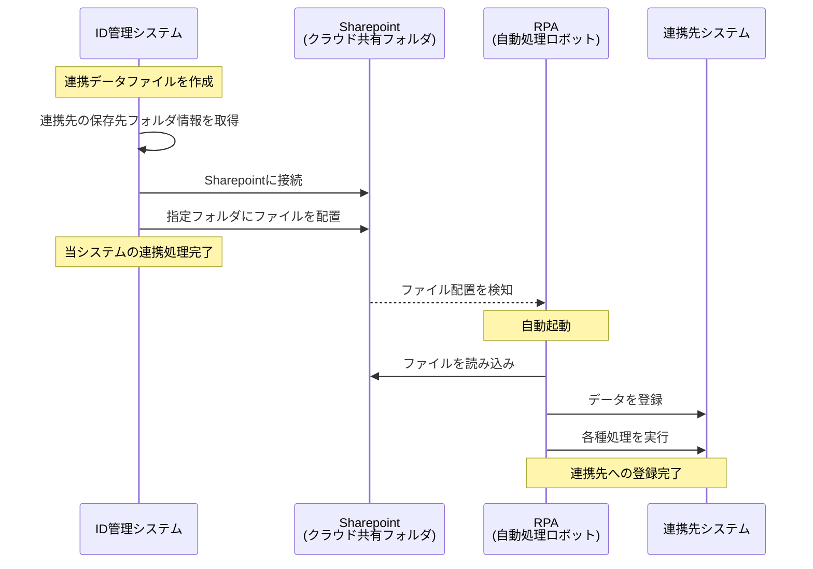

# RPAによる連携先システムへのデータ連携について

## 主な処理方法：
* BOXへのファイルの配置

### BOXへのファイルの配置

#### 概要
この方法では当システムで作成した連携データファイルを、BOXに保存します。その後、RPA（ロボットによる自動処理プログラム）が自動的にファイルを読み込み、連携先システムへのデータ登録を行います。

#### 処理の流れ
1. **連携先の保存先フォルダを確認**  
   連携先システムの設定から、ファイルを保存するBOX上のフォルダの場所を取得します。

2. **連携ファイルをBOXAPIを使用して指定フォルダに保存**  
   作成した連携データファイルを、BOXのAPIを用いて指定されたフォルダに配置します。この時点で当システム側の連携処理は完了となります。

3. **RPAが自動起動**  
   BOXに新しいファイルが配置されたことを検知して、RPA（ロボット）が自動的に起動します。

4. **RPAによるデータ登録**  
   起動したRPAが、配置されたファイルを読み込み、連携先システムに対して各種データの登録処理を自動実行します。

#### 処理フロー図

