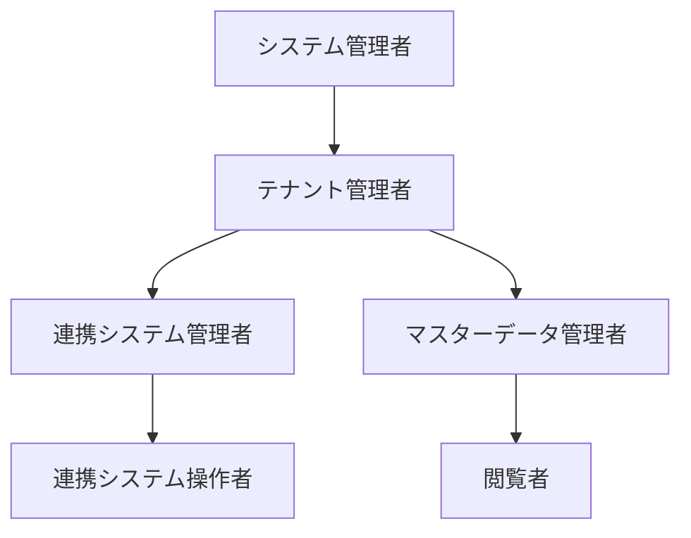

# 権限について

## 権限種類
| 定義名 | 権限名 | 権限概要 | 権限 | 備考 |
|----|----|----|----|----|
|（なし）|システム管理者|当システムの運用担当者。|任意のテナントにおいて、テナント管理者として振舞える権限を持つ。|他の権限とは別枠で直接ユーザーマスター上で付与される。|
| TENANT_ADMIN |テナント管理者|テナント内においての全権管理者。|・連携システムの追加／削除 ・連携システム管理者の権限設定 ・マスターデータ項目の追加／削除 ・マスターデータ管理者の権限設定 ・テナント共通コードマスターの登録 ・テナント管理者権限の設定 ・テナント内の各連携システム管理者の権限 ・テナント内のマスターデータ管理者の権限||
| RELATION_SYSTEM_ADMIN |連携システム管理者|連携元／連携先システムごとに設定できる、対象システムについての管理者権限。|・管理対象システムの連携データ定義追加／削除／変更 ・マスターデータと管理対象システムの連携データマッピングの編集 ・管理対象システムの連携システム管理者／操作者の権限設定||
| RELATION_SYSTEM_USER |連携システム操作者|連携元／連携先システムごとに設定できる、対象システムの操作権限。|・連携元システムから の取込操作／連携先システムへの連携実行 ・連携用ファイルのダウンロードファイル|取込／ファイル出力など|
| MASTER_DATA_ADMIN |マスターデータ管理者|マスターデータの管理を行う権限。|・マスターデータの追加／変更／削除が行える（項目定義ではなくデータそのものの操作） ・閲覧者（ダウンロード）の権限||
| NORMAL |閲覧者|マスターデータの閲覧のみが可能な最低限の権限。|・マスターデータの検索|当システムにログイン可能なユーザーは全てこの権限を有する。|
| DOWNLOAD |ダウンロード|検索結果をCSVなどのファイルでダウンロードすることができる。連携システム管理者、マスターデータ管理者以下の権限でファイルをダウンロードする場合に必要。|・マスターデータの検索結果やプリセットクエリー検索結果のダウンロード||

## 権限の階層構造
* 上位の権限は下位の権限を全て持つ。※ダウンロード権限は別途付与する。

## 権限によって利用できる機能

| No | 機能分類 | 機能名 | テナント管理者 | 連携システム管理者 | 連携システム操作者 | マスターデータ管理者 | 閲覧者 | 備考 |
|----|----|----:|:----:|:----:|:----:|:----:|:----:|----|
| 1 | ユーザー管理 | ユーザー検索 | ○ | | | | | |
| 2 | ユーザー管理 | ユーザー編集 | ○ | | | | | |
| 3 | グループ管理 | グループ検索 | ○ | ○ | ○ | ○ | ○ |グループの追加／削除はテナント管理者のみ。テナント管理者以外は自身が管理者であるグループのみ表示される。|
| 4 | グループ管理 | グループ編集 | ○ | ○ | ○ | ○ | ○ |グループの追加はテナント管理者のみ。テナント管理者以外は自身が管理者であるグループのみ編集できる。|
| 5 | 権限管理 | ユーザー権限設定 | ○ | ○ |  | ○ |  | 自身の持つユーザー権限と同等の権限まで設定可能。自身の権限は設定できない。 |
| 6 | 権限管理 | グループ権限設定 | ○ | ○ |  | ○ |  | 自身の持つユーザー権限と同等の権限まで設定可能。 |
| 7 | 管理機能 | 連携実行履歴 | ○ | ○ | ○ |  |  | 連携システム関連権限で閲覧可能 |
| 8 | 管理機能 | 操作ログ | ○ |  |  |  |  | |
| 9 | 就業者情報 | 就業者検索 | ○ | ○ | ○ | ○ | ○ |  |
| 10 | 就業者情報 | 就業者情報編集 | ○ |  |  | ○ |  | |
| 11 | 就業者情報 | 就業者連携データ出力設定 | ○ | ○ |  | ○ |  | |
| 12 | 組織情報 | 組織検索 | ○ | ○ | ○ | ○ | ○ | 全ユーザーが検索可能 |
| 13 | 組織情報 | 組織情報詳細 | ○ | ○ | ○ | ○ | ○ | 全ユーザーが閲覧可能 マスターデータ管理者が編集可能 |
| 14 | 組織情報 | 組織連携データ出力設定 | ○ | ○ |  | ○ |  | |
| 15 | 連携システム | 連携システム／インターフェイス一覧 | ○ | ○ | ○ |  |  |インターフェイスの追加／削除はテナント管理者のみ。 連携システム管理者／操作者は権限を持つシステムのみ表示される。|
| 16 | 連携システム | 連携元インターフェイス連携実行 | ○ | ○ | ○ |  |  |連携システム管理者／操作者は権限を持つシステムのみ|
| 17 | 連携システム | 連携元インターフェイス編集 | ○ | ○ |  |  |  |連携システム管理者は権限を持つシステムのみ|
| 18 | 連携システム | 連携元インターフェイス項目マッピング | ○ | ○ |  |  |  |連携システム管理者は権限を持つシステムのみ|
| 19 | 連携システム | 連携先インターフェイス連携実行 | ○ | ○ | ○ |  |  |連携システム管理者／操作者は権限を持つシステムのみ|
| 20 | 連携システム | 連携先インターフェイス編集 | ○ | ○ |  |  |  |連携システム管理者は権限を持つシステムのみ|
| 21 | 連携システム | 連携先インターフェイス項目マッピング | ○ | ○ |  |  |  |連携システム管理者は権限を持つシステムのみ|
| 22 | コード定義 | コードグループ検索 | ○ | ○ | | | | |
| 23 | コード定義 | コードグループ編集 | ○ | ○ |  |  |  | |
| 24 | コード定義 | コード変換グループ検索 | ○ | ○ | | | | |
| 25 | コード定義 | コード変換グループ編集 | ○ | ○ |  |  |  | |
| 26 | プリセットクエリー | クエリー検索 | ○ | ○ | ○ | ○ | ○ | テナント管理者以外は、クエリー使用権限テーブルで許可されたクエリーのみ表示される |
| 27 | プリセットクエリー | クエリー編集 | ○ | | | | | |
| 28 | プリセットクエリー | クエリー権限設定 | ○ | | | | | |
| 29 | システム共通 | 上記以外の機能 | ○ | ○ | ○ | ○ | ○ |  |

