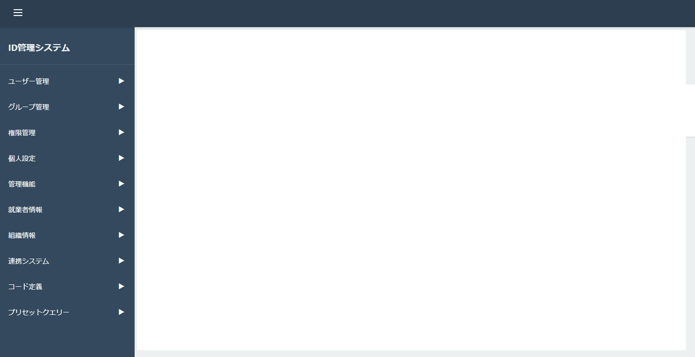

# 基本レイアウト

## 更新履歴

| 更新日     | 更新者 | 更新内容 |
| ---------- | ------ | -------- |
| 2025/12/25 |        | 新規作成 |

## 機能概要
全ての画面で共通となるサイドメニューとヘッダーのレイアウトを定義する。

## 画面レイアウト

## 項目定義

### サイドメニュー

| No. | 項目名     | 表示文言       | I/O | オブジェクト   | DBマッピング | 初期値 | 備考                                                                                                                                                                                                                                                              |
| --: | :--------- | :------------- | :-: | :------------- | :----------: | :----- | :---------------------------------------------------------------------------------------------------------------------------------------------------------------------------------------------------------------------------------------------------------------- |
|   1 | システム名 | ID管理システム |  O  | ラベル         |              |        | サイドメニュートップに表示                                                                                                                                                                                                                                        |
|   2 | 機能分類   | -              | I/O | 折り畳みリスト |              |        | 各機能分類を表示。クリックで折り畳み/展開を切り替える。機能が一つも表示されていない場合、その機能分類は表示しない。                                                                                                                                               |
|   3 | 機能名     | -              | I/O | リンク         |              |        | 機能分類が展開されている場合、インデントして表示。クリックで各機能画面に遷移する。 ログインユーザーが対象機能について、[権限について.md](../../概要資料/権限について.md)の**権限によって利用できる機能**に記載されている使用権限を持っている場合のみ表示する。 |

### ヘッダー

| No. | 項目名                 | 表示文言 | I/O | オブジェクト   | DBマッピング | 初期値 | 備考                                    |
| --: | :--------------------- | :------- | :-: | :------------- | :----------: | :----- | :-------------------------------------- |
|   4 | サイドメニュー表示切替 | -        |  I  | アイコンボタン |              |        | サイドメニューの収納/展開を切り替える。 |
|   5 | 全画面切替             | -        |  I  | アイコンボタン |              |        | ブラウザの全画面表示を切り替える。      |
|   6 | ログインユーザー名     | -        |  O  | ラベル         |              |        | ログイン中のユーザーの名称              |

## 機能仕様
### イベント定義
| No. | イベント名                 | トリガー条件                   | イベント概要                          | 画面表示／遷移先 |
| --: | :------------------------- | :----------------------------- | :------------------------------------ | :--------------- |
|   1 | 初期表示                   | -                              | 画面の初期表示を行う                  | -                |
|   2 | サイドメニュー表示切替押下 | サイドメニュー表示切替クリック | サイドメニューの収納/展開を切り替える | -                |
|   3 | 機能分類クリック           | 機能分類クリック               | 機能分類の折り畳み/展開を切り替える   | -                |
|   4 | 機能名クリック             | 機能名クリック                 | 選択した機能の画面に遷移する          | 各機能画面       |
|   5 | 全画面切り替えアイコン押下 | 全画面切り替えアイコンクリック | ブラウザの全画面表示を切り替える      | -                |

## イベント詳細
### 初期表示

- サイドメニューを展開状態で表示する。
- ログインユーザーの権限を取得する。
- 機能分類と機能名を表示する。
  - ログインユーザーの権限に応じて、使用可能な機能のみを表示する。
  - 機能分類は初期状態では折り畳まれている。
- ヘッダーにログインユーザー名を表示する。

### サイドメニュー表示切替クリック

- サイドメニューの収納/展開状態を切り替える。
  - 展開状態の場合：サイドメニューを収納し、コンテンツエリアを拡大する。
  - 収納状態の場合：サイドメニューを展開し、コンテンツエリアを縮小する。

### 機能分類クリック

- クリックした機能分類の折り畳み/展開を切り替える。
  - 折り畳み状態の場合：機能分類を展開し、配下の機能名をインデント表示する。
  - 展開状態の場合：機能分類を折り畳み、配下の機能名を非表示にする。

### 機能名クリック

- クリックした機能の画面に遷移する。

### 全画面切替クリック

- ブラウザの全画面表示を切り替える。
  - 通常表示の場合：全画面表示に切り替える。
  - 全画面表示の場合：通常表示に戻す。

## バリデーション定義
該当なし
