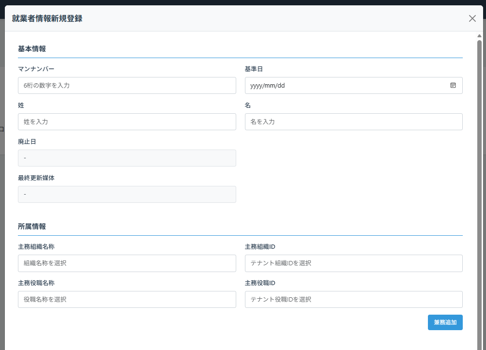
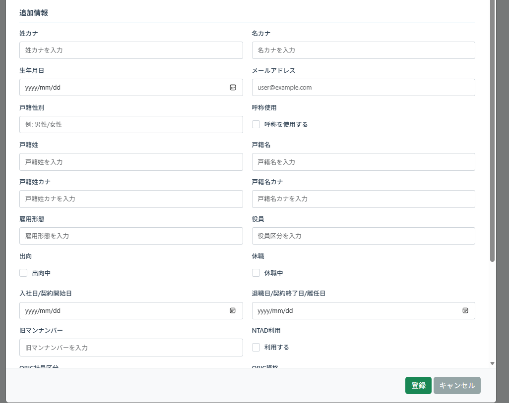
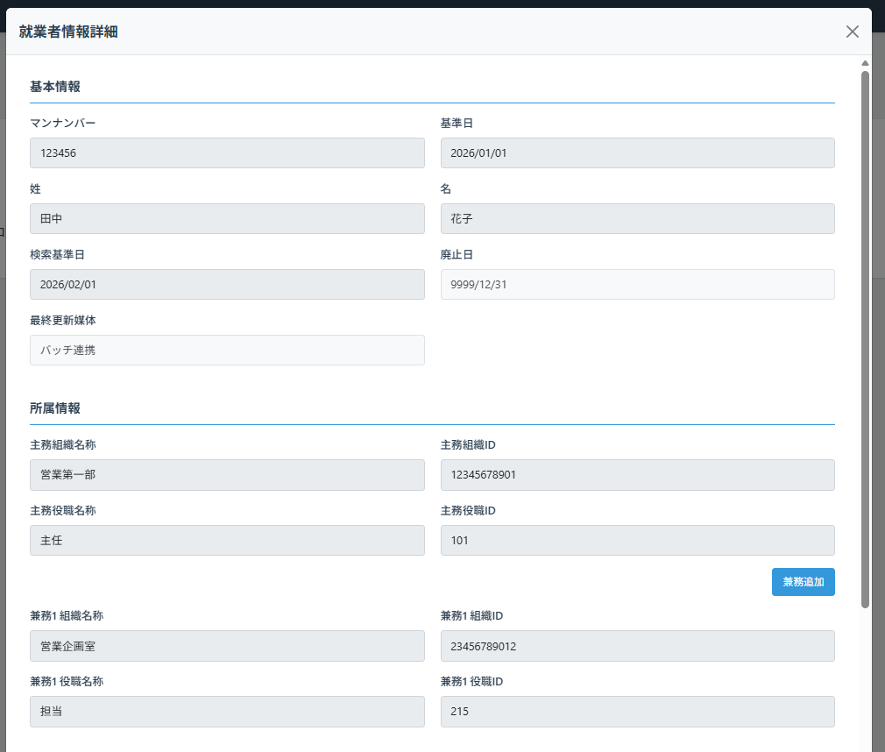
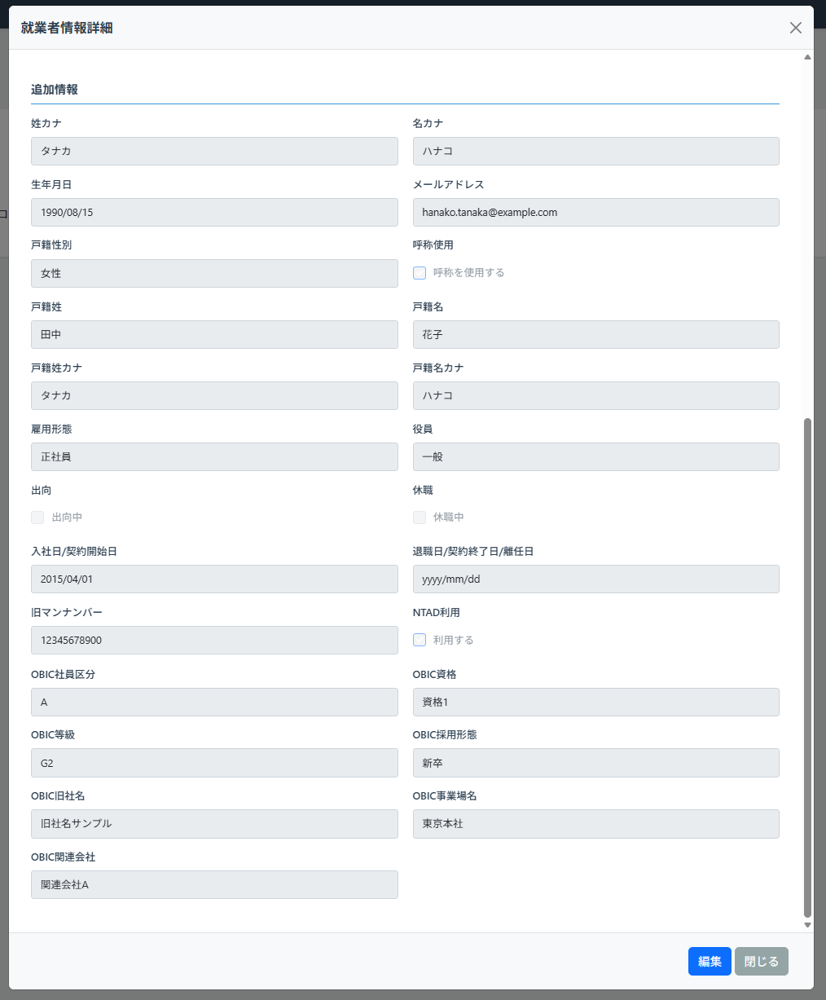
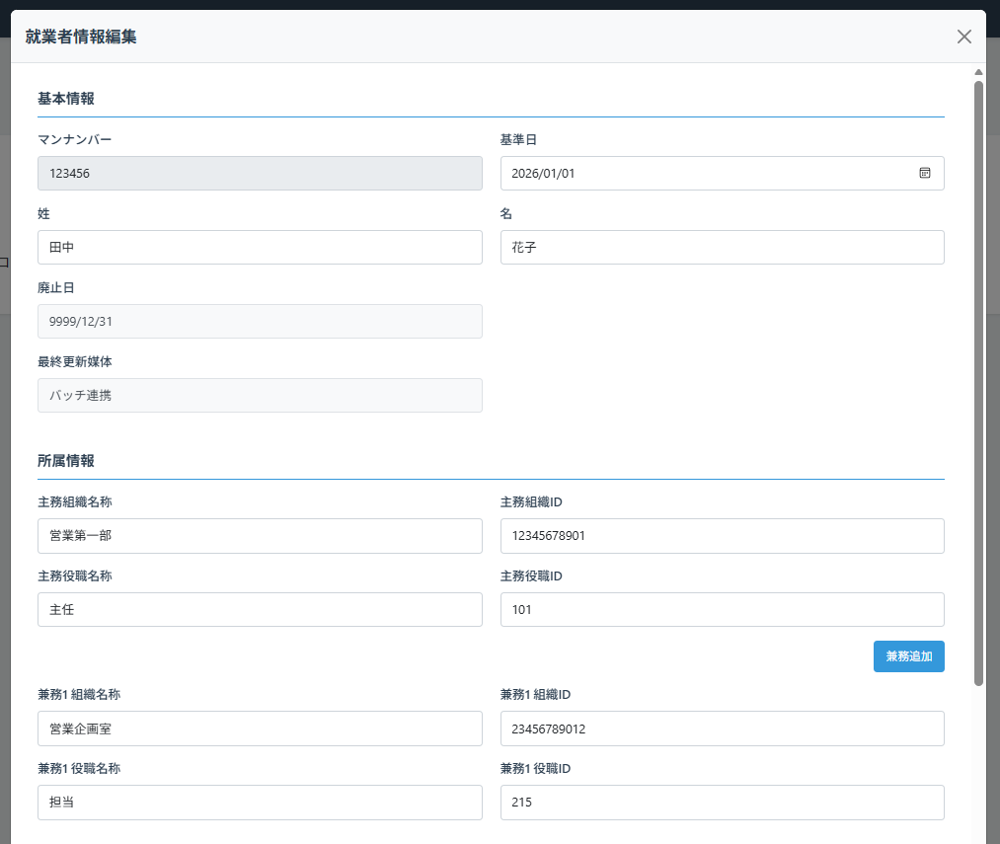
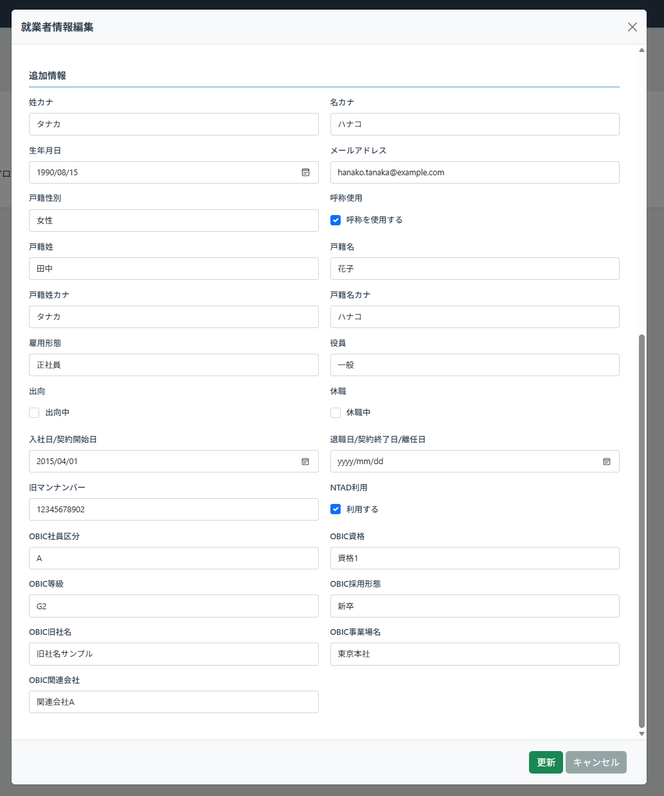

# 就業者情報詳細画面

## 更新履歴

| 更新日   | 更新者 | 更新内容 |
| -------- | ------ | -------- |
| 2026/1/5 |        | 新規作成 |

## 機能概要
就業者情報の詳細を表示／編集する画面。就業者検索画面上にダイアログ形式で表示される。
新規登録ボタン押下時は新規登録モードで表示し、初期状態から編集可能とする。
詳細表示モードでは全項目を参照のみで表示し、マスターデータ管理者権限を持つユーザーのみ編集ボタンが表示される。
編集ボタン押下後は編集モードとなり、各項目が入力可能になる（就業者属性項目の「変更不可」は除く）。

## 画面レイアウト

### 新規登録モード

### 詳細表示モード

### 編集モード

## 項目定義

| No. | 項目名             | 表示文言           | I/O | オブジェクト | DBマッピング | 初期値 | 備考                   |
| --: | :----------------- | :----------------- | :-: | :----------- | :----------- | :----- | :--------------------- |
|   1 | 画面タイトル(新規) | 就業者情報新規登録 |  O  | ラベル       |              |        | 新規登録モードのみ表示 |
|   2 | 画面タイトル(詳細) | 就業者情報詳細     |  O  | ラベル       |              |        | 詳細表示モードのみ表示 |
|   3 | 画面タイトル(編集) | 就業者情報編集     |  O  | ラベル       |              |        | 編集モードのみ表示     |

### 基本情報エリア
| No. | 項目名           | 表示文言     | I/O | オブジェクト | 初期値                      | DBマッピング                                   | 備考                                              |
| --: | :--------------- | :----------- | :-: | :----------- | :-------------------------- | :--------------------------------------------- | :------------------------------------------------ |
|   1 | エリアタイトル   | 基本情報     |  -  | ラベル       |                             |                                                |                                                   |
|   2 | テナント就業者ID | -            |  O  | ラベル       |                             | tenant_master.tenant_settings.personColumnName |                                                   |
|   3 | 〃               | -            | I/O | テキスト     |                             | person.tenant_person_id                        | 項目名はテナント設定から取得する                  |
|   4 | 姓               | 姓           |  -  | ラベル       |                             |                                                |                                                   |
|   5 | 〃               | -            | I/O | テキスト     |                             | person.last_name                               |                                                   |
|   6 | 名               | 名           |  -  | ラベル       |                             |                                                |                                                   |
|   7 | 〃               | -            | I/O | テキスト     |                             | person.first_name                              |                                                   |
|   8 | 検索基準日       | 検索基準日   |  -  | ラベル       | 前画面パラメータ.検索基準日 |                                                | 詳細表示モードのみ入力可能                        |
|   9 | 〃               | -            | I/O | 日付         |                             |                                                | yyyy/mm/dd形式                                    |
|  10 | 基準日           | 基準日       |  -  | ラベル       |                             |                                                |                                                   |
|  11 | 〃               | -            | I/O | 日付         |                             | person.base_date                               | yyyy/mm/dd形式                                    |
|  12 | 廃止日           | 廃止日       |  -  | ラベル       |                             |                                                |                                                   |
|  13 | 〃               | -            |  O  | 日付         |                             | person.abolish_date                            | yyyy/mm/dd形式。詳細表示/編集モード共通で参照のみ |
|  14 | 最終更新媒体     | 最終更新媒体 |  -  | ラベル       |                             |                                                |                                                   |
|  15 | 〃               | -            |  O  | ラベル       |                             | person.latest_medium                           | 詳細表示/編集モード共通で参照のみ                 |

### 所属情報エリア
| No. | 項目名         | 表示文言 | I/O | オブジェクト | 初期値 | DBマッピング                        | 備考                                                                                                                               |
| --: | :------------- | :------- | :-: | :----------- | :----- | :---------------------------------- | :--------------------------------------------------------------------------------------------------------------------------------- |
|   1 | エリアタイトル | 所属情報 |  -  | ラベル       |        |                                     |                                                                                                                                    |
|   2 | 主務組織       | 主務組織 |  -  | ラベル       |        |                                     |                                                                                                                                    |
|   3 | 主務組織名称   | -        | I/O | データリスト |        | organization.org_name               | 自テナントで有効な組織の組織名称をデータリストに設定し選択する 組織ID側が選択された場合対応する組織名称をセットする             |
|   4 | 主務組織ID     | -        | I/O | データリスト |        | organization.tenant_org_id          | 自テナントで有効な組織のテナント組織IDをデータリストに設定し選択する 組織名側が選択された場合対応するテナント組織IDをセットする |
|   5 | 主務役職       | 役職     |  -  | ラベル       |        |                                     |                                                                                                                                    |
|   6 | 主務役職名称   | -        | I/O | データリスト |        | org_position.org_position_name      | 自テナントで有効な役職の役職名称をデータリストに設定し選択する 役職ID側が選択された場合対応する役職名称をセットする             |
|   7 | 主務役職ID     | -        | I/O | データリスト |        | org_position.tenant_org_position_id | 自テナントで有効な役職のテナント役職IDをデータリストに設定し選択する 役職名側が選択された場合対応するテナント役職IDをセットする |
|   8 | 兼務追加ボタン | 兼務追加 |  -  | ボタン       |        |                                     | 押下時に空欄の兼務行を一行追加する 兼務行が既に20行存在する場合は追加不可                                                       |
|   9 | 兼務組織       | 兼務組織 |  -  | ラベル       |        |                                     | 兼務が存在する場合に表示される                                                                                                     |
|  10 | 兼務組織名称   | -        | I/O | データリスト |        | organization.org_name               | 自テナントで有効な組織の組織名称をデータリストに設定し選択する 組織ID側が選択された場合対応する組織名称をセットする             |
|  11 | 兼務組織ID     | -        | I/O | データリスト |        | organization.tenant_org_id          | 自テナントで有効な組織のテナント組織IDをデータリストに設定し選択する 組織名側が選択された場合対応するテナント組織IDをセットする |
|  12 | 兼務役職       | 役職     |  -  | ラベル       |        |                                     | 兼務が存在する場合に表示される                                                                                                     |
|  13 | 兼務役職名称   | -        | I/O | データリスト |        | org_position.org_position_name      | 自テナントで有効な役職の役職名称をデータリストに設定し選択する 役職ID側が選択された場合対応する役職名称をセットする             |
|  14 | 兼務役職ID     | -        | I/O | データリスト |        | org_position.tenant_org_position_id | 自テナントで有効な役職のテナント役職IDをデータリストに設定し選択する 役職名側が選択された場合対応するテナント役職IDをセットする |

### 追加情報エリア
* 下記は必要な項目を記載しているが、実装上は`就業者属性項目`の定義を基に項目ラベルと入力欄を`表示順`の順番で生成して表示する。また`変更不可`が設定されている場合は新規登録モード時のみ入力可能とする

| No. | 項目名                   | 表示文言                 | I/O | オブジェクト     | 初期値 | DBマッピング                          | 備考 |
| --: | :----------------------- | :----------------------- | :-: | :--------------- | :----- | :------------------------------------ | :--- |
|   1 | エリアタイトル           | 追加情報                 |  -  | ラベル           |        |                                       |      |
|   2 | 姓カナ                   | 姓カナ                   |  O  | ラベル           | -      | org_attribute.org_column_name         |      |
|   3 | 〃                       | -                        | I/O | テキスト         | -      | organization.org_attr.<org_colmun_id> |      |
|   4 | 名カナ                   | 名カナ                   |  O  | ラベル           | -      | org_attribute.org_column_name         |      |
|   5 | 〃                       | -                        | I/O | テキスト         | -      | organization.org_attr.<org_colmun_id> |      |
|   6 | 生年月日                 | 生年月日                 |  O  | ラベル           | -      | org_attribute.org_column_name         |      |
|   7 | 〃                       | -                        | I/O | 日付             | -      | organization.org_attr.<org_colmun_id> |      |
|   8 | メールアドレス           | メールアドレス           |  O  | ラベル           | -      | org_attribute.org_column_name         |      |
|   9 | 〃                       | -                        | I/O | テキスト         | -      | organization.org_attr.<org_colmun_id> |      |
|  10 | 戸籍性別                 | 戸籍性別                 |  O  | ラベル           | -      | org_attribute.org_column_name         |      |
|  11 | 〃                       | -                        | I/O | テキスト         | -      | organization.org_attr.<org_colmun_id> |      |
|  12 | 呼称使用                 | 呼称使用                 |  O  | ラベル           | -      | org_attribute.org_column_name         |      |
|  13 | 〃                       | -                        | I/O | チェックボックス | -      | organization.org_attr.<org_colmun_id> |      |
|  14 | 戸籍姓                   | 戸籍姓                   |  O  | ラベル           | -      | org_attribute.org_column_name         |      |
|  15 | 〃                       | -                        | I/O | テキスト         | -      | organization.org_attr.<org_colmun_id> |      |
|  16 | 戸籍名                   | 戸籍名                   |  O  | ラベル           | -      | org_attribute.org_column_name         |      |
|  17 | 〃                       | -                        | I/O | テキスト         | -      | organization.org_attr.<org_colmun_id> |      |
|  18 | 戸籍姓カナ               | 戸籍姓カナ               |  O  | ラベル           | -      | org_attribute.org_column_name         |      |
|  19 | 〃                       | -                        | I/O | テキスト         | -      | organization.org_attr.<org_colmun_id> |      |
|  20 | 戸籍名カナ               | 戸籍名カナ               |  O  | ラベル           | -      | org_attribute.org_column_name         |      |
|  21 | 〃                       | -                        | I/O | テキスト         | -      | organization.org_attr.<org_colmun_id> |      |
|  22 | 雇用形態                 | 雇用形態                 |  O  | ラベル           | -      | org_attribute.org_column_name         |      |
|  23 | 〃                       | -                        | I/O | テキスト         | -      | organization.org_attr.<org_colmun_id> |      |
|  24 | 役員                     | 役員                     |  O  | ラベル           | -      | org_attribute.org_column_name         |      |
|  25 | 〃                       | -                        | I/O | テキスト         | -      | organization.org_attr.<org_colmun_id> |      |
|  26 | 出向                     | 出向                     |  O  | ラベル           | -      | org_attribute.org_column_name         |      |
|  27 | 〃                       | -                        | I/O | チェックボックス | -      | organization.org_attr.<org_colmun_id> |      |
|  28 | 休職                     | 休職                     |  O  | ラベル           | -      | org_attribute.org_column_name         |      |
|  29 | 〃                       | -                        | I/O | チェックボックス | -      | organization.org_attr.<org_colmun_id> |      |
|  30 | 入社日/契約開始日        | 入社日/契約開始日        |  O  | ラベル           | -      | org_attribute.org_column_name         |      |
|  31 | 〃                       | -                        | I/O | 日付             | -      | organization.org_attr.<org_colmun_id> |      |
|  32 | 退職日/契約終了日/離任日 | 退職日/契約終了日/離任日 |  O  | ラベル           | -      | org_attribute.org_column_name         |      |
|  33 | 〃                       | -                        | I/O | 日付             | -      | organization.org_attr.<org_colmun_id> |      |
|  34 | 旧マンナンバー           | 旧マンナンバー           |  O  | ラベル           | -      | org_attribute.org_column_name         |      |
|  35 | 〃                       | -                        | I/O | テキスト         | -      | organization.org_attr.<org_colmun_id> |      |
|  36 | NTAD利用                 | NTAD利用                 |  O  | ラベル           | -      | org_attribute.org_column_name         |      |
|  37 | 〃                       | -                        | I/O | チェックボックス | -      | organization.org_attr.<org_colmun_id> |      |
|  38 | OBIC社員区分             | OBIC社員区分             |  O  | ラベル           | -      | org_attribute.org_column_name         |      |
|  39 | 〃                       | -                        | I/O | テキスト         | -      | organization.org_attr.<org_colmun_id> |      |
|  40 | OBIC資格                 | OBIC資格                 |  O  | ラベル           | -      | org_attribute.org_column_name         |      |
|  41 | 〃                       | -                        | I/O | テキスト         | -      | organization.org_attr.<org_colmun_id> |      |
|  42 | OBIC等級                 | OBIC等級                 |  O  | ラベル           | -      | org_attribute.org_column_name         |      |
|  43 | 〃                       | -                        | I/O | テキスト         | -      | organization.org_attr.<org_colmun_id> |      |
|  44 | OBIC採用形態             | OBIC採用形態             |  O  | ラベル           | -      | org_attribute.org_column_name         |      |
|  45 | 〃                       | -                        | I/O | テキスト         | -      | organization.org_attr.<org_colmun_id> |      |
|  46 | OBIC旧社名               | OBIC旧社名               |  O  | ラベル           | -      | org_attribute.org_column_name         |      |
|  47 | 〃                       | -                        | I/O | テキスト         | -      | organization.org_attr.<org_colmun_id> |      |
|  48 | OBIC事業場名             | OBIC事業場名             |  O  | ラベル           | -      | org_attribute.org_column_name         |      |
|  49 | 〃                       | -                        | I/O | テキスト         | -      | organization.org_attr.<org_colmun_id> |      |
|  50 | OBIC関連会社             | OBIC関連会社             |  O  | ラベル           | -      | org_attribute.org_column_name         |      |
|  51 | 〃                       | -                        | I/O | テキスト         | -      | organization.org_attr.<org_colmun_id> |      |

### ボタンエリア

| No. | 項目名           | 表示文言   | I/O | オブジェクト | DBマッピング | 初期値 | 備考                                           |
| --: | :--------------- | :--------- | :-: | :----------- | :----------- | :----: | :--------------------------------------------- |
|   1 | 登録ボタン       | 登録       |  -  | ボタン       |              |        | 新規登録モードのみ表示                         |
|   2 | 編集ボタン       | 編集       |  -  | ボタン       |              |        | 詳細表示モードかつマスターデータ管理者のみ表示 |
|   3 | 更新ボタン       | 更新       |  -  | ボタン       |              |        | 編集モードのみ表示                             |
|   4 | キャンセルボタン | キャンセル |  -  | ボタン       |              |        | 新規登録モード、編集モードのみ表示             |
|   5 | 閉じるボタン     | 閉じる     |  -  | ボタン       |              |        | 詳細表示モードのみ表示                         |

## 機能仕様
### イベント定義
| No. | イベント名                 | トリガー条件                       | イベント概要                         | 画面表示／遷移先   |
| --: | :------------------------- | :--------------------------------- | :----------------------------------- | :----------------- |
|   1 | 初期表示（新規登録モード） | パラメータなし                     | 新規登録用の画面を表示する           | -                  |
|   2 | 初期表示（詳細表示モード） | パラメータあり（就業者ID、基準日） | 指定された就業者の情報を表示する     | -                  |
|   3 | 検索基準日変更             | 検索基準日の設定値変更             | 就業者情報の詳細を参照表示する   | -                |
|   4 | 登録ボタン押下             | 登録ボタンクリック                 | 入力内容で就業者情報を登録する   | 就業者検索画面   |
|   5 | 編集ボタン押下             | 編集ボタンクリック                 | 画面を編集モードに切り替える     | -                |
|   6 | 更新ボタン押下             | 更新ボタンクリック                 | 入力内容で就業者情報を更新する   | 就業者検索画面   |
|   7 | キャンセルボタン押下       | キャンセルボタンクリック           | 編集内容を破棄して詳細表示に戻る | -                |
|   8 | 閉じるボタン押下           | 閉じるボタンクリック               | ダイアログを閉じる               | 就業者検索画面   |

## イベント詳細
### 初期表示（新規登録モード）
- `就業者情報項目定義`を取得し、追加情報エリアの各項目を生成する。
- `就業者情報項目定義`の`参照コードグループID`に設定されているコードを`コードグループマスター`、`コードマスター`から取得し、追加情報エリアのプルダウン項目を生成する。
- `部署マスター`、`役職マスター`から自テナントで有効な組織、役職を取得し、所属情報エリアのデータリスト項目を生成する。
  - 取得条件は以下の通り（部署マスター、役職マスター共通）
    - `有効終了日`＝9999/12/31
- 各項目を空欄で表示する。
- 画面タイトル（新規）を表示し、画面タイトル（詳細）、画面タイトル（編集）を非表示にする。
- 基準日、有効終了日を非表示にする。
- 登録ボタン、キャンセルボタンを表示し、編集ボタン、更新ボタン、閉じるボタンを非表示にする。

### 初期表示（詳細表示モード）
- `就業者情報項目定義`を取得し、追加情報エリアの各項目を生成する。
- `就業者情報項目定義`の`参照コードグループID`に設定されているコードを`コードグループマスター`、`コードマスター`から取得し、追加情報エリアのプルダウン項目を生成する。
- `部署マスター`、`役職マスター`から自テナントで有効な組織、役職を取得し、所属情報エリアのデータリスト項目を生成する。
  - 取得条件は以下の通り（部署マスター、役職マスター共通）
    - `有効終了日`＝9999/12/31
- パラメータで指定された*就業者ID*を元に`就業者情報`から対象の就業者の情報(履歴全て)を取得する。
  - 就業者が存在しない場合、エラーメッセージ(COM01009)を表示してダイアログを閉じる。
- 取得した就業者情報のうち、パラメータで指定された検索基準日に該当する有効期間データを各項目に表示する。
- 画面タイトル（詳細）を表示し、画面タイトル（新規）、画面タイトル（編集）を非表示にする。
- 閉じるボタンを表示し、登録ボタン、更新ボタン、キャンセルボタンを非表示にする。
- マスターデータ管理者権限を持つユーザーの場合、編集ボタンを表示する。それ以外の場合、編集ボタンを非表示にする。

### 検索基準日変更
- 各項目の値を、検索基準日に該当する有効期間のデータの値に変更する。
  - 検索基準日に該当するデータが存在しない場合、エラーメッセージ(COM01003)を表示し検索基準日を元に戻す。

### 編集ボタン押下
- 画面タイトル（編集）を表示し、画面タイトル（詳細）を非表示にする。
- 検索基準日を非表示にする。
- 参照表示の項目を編集可能に切り替える。
  - `就業者属性項目`で「変更不可」に設定されている項目は編集不可のままとする。
- 更新ボタン、キャンセルボタンを表示し、編集ボタン、閉じるボタンを非表示にする。

### 登録ボタン押下
- **クライアントサイドバリデーション**
  - フロント側で以下のチェックを実行する。チェックエラーの場合、該当のエラーメッセージを表示し終了する。
    - **基本情報入力チェック**
    - **所属情報入力チェック**
    - **追加情報入力チェック**
  - 確認メッセージ(COM01006)を表示する。
    - キャンセルが押下された場合、終了する。
- **サーバーサイドバリデーション**
  - サーバー側で以下のチェックを実行する。チェックエラーの場合、該当のエラーメッセージを表示し終了する。
    - **マスターデータ管理者チェック**
    - **基本情報入力チェック**
    - **所属情報入力チェック**
    - **追加情報入力チェック**
    - **重複チェック(登録)**
- **就業者情報更新**
  - 入力内容を就業者情報に登録する。
- **操作ログ**を記録する。
  - 対象機能：「就業者情報詳細」
  - 操作内容：「就業者情報登録：[テナント就業者ID]」
- 完了メッセージ(COM01004)を表示し、有効開始日を検索基準日として初期表示（詳細表示モード）で画面を表示し直す。

### 更新ボタン押下
- **クライアントサイドバリデーション**
  - フロント側で以下のチェックを実行する。チェックエラーの場合、該当のエラーメッセージを表示し終了する。
    - **基本情報入力チェック**
    - **所属情報入力チェック**
    - **追加情報入力チェック**
    - **変更有無チェック**
    - **履歴追加チェック**
  - 確認メッセージ(COM01006)を表示する。
    - キャンセルが押下された場合、終了する。
- **サーバーサイドバリデーション**
  - サーバー側で以下のチェックを実行する。チェックエラーの場合、該当のエラーメッセージを表示し終了する。
    - **マスターデータ管理者チェック**
    - **基本情報入力チェック**
    - **所属情報入力チェック**
    - **追加情報入力チェック**
    - **変更有無チェック**
    - **履歴追加チェック**
    - **重複チェック(更新)**
- **就業者情報の更新**
  - 有効開始日が変更前のデータから更新されていない場合
    - 入力内容でデータを更新する。
      - 更新条件は以下の通り
        - `就業者ID`＝対象の就業者ID
        - `有効開始日`＝有効開始日
        - `バージョン`＝データ取得時のバージョン
      - 更新対象データが見つからない場合、エラーメッセージ(COM01010)を表示し終了する。
  - 有効開始日が変更前のデータから更新されている場合
    - 変更前データの有効終了日を更新する。
      - 更新内容
        - `有効終了日`＝変更後の有効開始日-1日
      - 更新条件は以下の通り
        - `就業者ID`＝対象の就業者ID
        - `有効開始日`＝変更前の有効開始日
        - `バージョン`＝データ取得時のバージョン
      - 更新対象データが見つからない場合、エラーメッセージ(COM01010)を表示し終了する。
    - 入力内容を元に変更後データを登録する。
- **操作ログ**を記録する。
  - 対象機能：「就業者情報詳細」
  - 操作内容：「就業者情報更新：[テナント就業者ID]」
- 完了メッセージ(COM01004)を表示し、変更後の有効開始日を検索基準日として初期表示（詳細表示モード）で画面を表示し直す。

### キャンセルボタン押下
- 入力内容が変更されている場合、確認ダイアログ(COM01008)を表示する。
  - キャンセルされた場合、処理を中断する。
- 画面タイトル（詳細）を表示し、画面タイトル（編集）を非表示にする。
- 検索基準日を表示する。
- 検索基準日以外の編集表示の項目を編集不可に切り替える。
- 更新ボタン、キャンセルボタンを非表示にし、編集ボタン、閉じるボタンを表示する。

### 閉じるボタン押下
- ダイアログを閉じる。

## バリデーション定義
**メッセージ定義は[メッセージ定義.md](../メッセージ/メッセージ定義.md)を参照**
| No. | バリデーション名             | バリデーション内容                                                                                                                   | メッセージID               |
| --: | :--------------------------- | :----------------------------------------------------------------------------------------------------------------------------------- | :------------------------- |
|   1 | 基本情報入力チェック         | ・テナント就業者ID:必須、100文字以内 ・就業者名称:必須、100文字以内 ・有効開始日:必須、日付形式                                | COM02001,COM02002,COM02006 |
|   2 | 所属情報入力チェック         | ・テナント組織ID:必須、データ一致 ・組織名称:必須、データ一致 ・テナント役職ID:必須、データ一致 ・役職名称:必須、データ一致 | COM02001,PER02004          |
|   3 | 追加情報入力チェック         | 追加情報エリアの各項目ごとに、`就業者属性項目`の`必須`/`最大文字数`/`入力タイプ`に合致すること                                       | COM02001,COM02002,COM02006 |
|   4 | マスターデータ管理者チェック | ログインユーザーがマスターデータ管理者権限を持つこと                                                                                 | COM01001                   |
|   5 | 重複チェック(登録)           | テナント就業者IDが登録されている`就業者情報`.`テナント就業者ID`と重複しないこと                                                      | PER02001                   |
|   6 | 変更有無チェック(更新)       | 更新前後で有効開始日以外の項目に差分があること                                                                                       | PER02002                   |
|   7 | 履歴追加チェック             | 更新前後で有効開始日に差分がある場合、変更前の有効開始日＜有効開始日＜変更前の有効終了日であること                                   | PER02003                   |
|   8 | 重複チェック(更新)           | テナント就業者IDが更新対象以外の`就業者情報`.`テナント就業者ID`と重複しないこと                                                      | PER02001                   |
