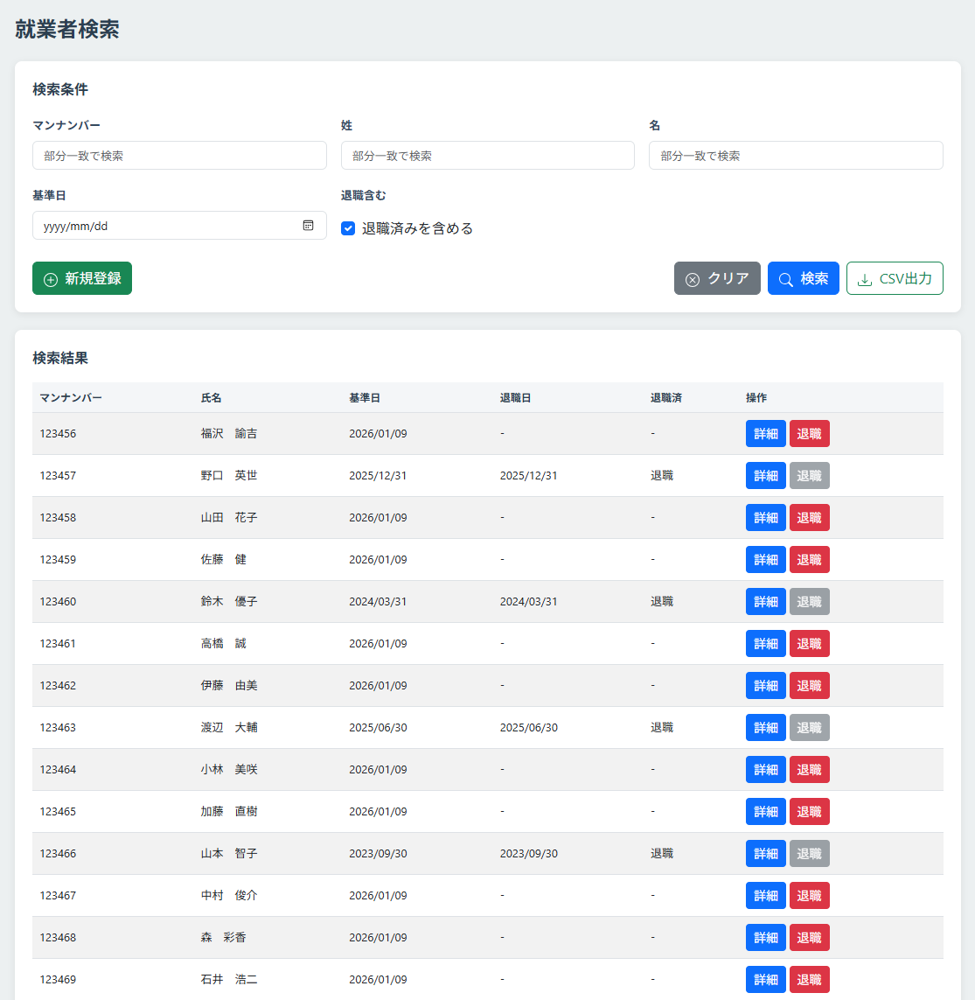
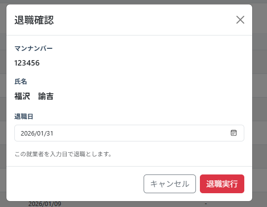

# 就業者検索画面

## 更新履歴

| 更新日    | 更新者 | 更新内容 |
| --------- | ------ | -------- |
| 2026/1/9  |        | 新規作成 |

## 機能概要
条件を指定して就業者情報を検索し、一覧表示する。
一覧から就業者情報を選択して就業者情報詳細画面に遷移することができる。

## 画面レイアウト



## 項目定義
| No. | 項目名       | 表示文言   | I/O | オブジェクト | 初期値 | DBマッピング | 備考 |
| --: | :----------- | :--------- | :-: | :----------- | :----- | :----------- | :--- |
|   1 | 画面タイトル | 就業者検索 |  -  | ラベル       |        |              |      |

### 検索条件エリア
| No. | 項目名           | 表示文言 | I/O | オブジェクト     | 初期値 | DBマッピング                                   | 備考                                                                                           |
| --: | :--------------- | :------- | :-: | :--------------- | :----- | :--------------------------------------------- | :--------------------------------------------------------------------------------------------- |
|   1 | エリアタイトル   | 検索条件 |  -  | ラベル           |        |                                                |                                                                                                |
|   2 | テナント就業者ID | -        |  O  | ラベル           |        | tenant_master.tenant_settings.personColumnName | 項目名はテナント設定から取得する                                                               |
|   3 | 〃               | -        |  I  | テキスト         |        |                                                | 就業者コード（マンナンバー）を指定する                                                         |
|   4 | 姓               | 姓       |  -  | ラベル           |        |                                                |                                                                                                |
|   5 | 〃               | -        |  I  | テキスト         |        |                                                | 就業者の姓を指定する                                                                           |
|   6 | 名               | 名       |  -  | ラベル           |        |                                                |                                                                                                |
|   7 | 〃               | -        |  I  | テキスト         |        |                                                | 就業者の名を指定する                                                                           |
|   8 | 基準日           | 基準日   |  -  | ラベル           |        |                                                |                                                                                                |
|   9 | 〃               | -        |  I  | 日付             |        |                                                | いつ時点の情報を検索するかを指定する。未入力の場合、就業者ごとに最大の基準日のデータを取得する |
|  10 | 退職含むチェック | 退職含む |  -  | ラベル           |        |                                                |                                                                                                |
|  11 | 〃               | -        |  I  | チェックボックス |        |                                                | チェックONの場合検索対象に退職データを含む                                                     |
|  12 | 新規登録ボタン   | 新規登録 |  -  | ボタン           |        |                                                | 就業者情報の新規登録を行う（就業者情報編集へ遷移）                                             |
|  13 | クリアボタン     | クリア   |  -  | ボタン           |        |                                                | 検索条件欄を全てクリアする                                                                     |
|  14 | 検索ボタン       | 検索     |  -  | ボタン           |        |                                                | 就業者を検索する                                                                               |
|  15 | CSV出力ボタン    | CSV出力  |  -  | ボタン           |        |                                                | 検索条件に該当するデータ全件をCSVで出力する                                                    |


### 検索結果エリア
* ページング用項目は[システム共通/ページネーション.md](../システム共通/ページネーション.md)を参照
* ソート順はテナント就業者IDの昇順

| No. | 項目名           | 表示文言 | I/O | オブジェクト | 初期値 | DBマッピング                                   | 備考                                                                             |
| --: | :--------------- | :------- | :-: | :----------- | :----- | :--------------------------------------------- | :------------------------------------------------------------------------------- |
|   1 | テナント就業者ID | -        |  O  | ラベル       |        | tenant_master.tenant_settings.personColumnName | 列タイトル。項目名はテナント設定から取得する                                     |
|   2 | 〃               | -        |  O  | ラベル       |        | person.tenant_person_id                        |                                                                                  |
|   3 | 姓＋名           | 氏名     |  -  | ラベル       |        |                                                | 列タイトル                                                                       |
|   4 | 〃               | -        |  O  | ラベル       |        | person.last_name,<br>person.first_name         | 姓と名の間に全角スペースを表示                                                   |
|   5 | 基準日           | 基準日   |  -  | ラベル       |        |                                                | 列タイトル                                                                       |
|   6 | 〃               | -        |  O  | ラベル       |        | person.base_date                               | yyyy/mm/dd形式                                                                   |
|   7 | 退職日           | 退職日   |  -  | ラベル       |        |                                                | 列タイトル                                                                       |
|   8 | 〃               | -        |  O  | ラベル       |        | person.retire_date                             | yyyy/mm/dd形式                                                                   |
|   9 | 退職済           | 退職済   |  -  | ラベル       |        |                                                | 列タイトル                                                                       |
|  10 | 〃               | -        |  O  | ラベル       |        | person.is_abolished                            | trueの場合、"退職"。それ以外の場合、出力しない。                                 |
|  11 | 操作             | 操作     |  -  | ラベル       |        |                                                | 列タイトル                                                                       |
|  12 | 詳細ボタン       | 詳細     |  -  | ボタン       |        |                                                | 操作列に配置。クリックで就業者詳細画面に遷移                                     |
|  13 | 退職ボタン       | 退職     |  -  | ボタン       |        |                                                | 操作列に配置。クリックで就業者退職ダイアログを開く。退職済みの就業者の場合、無効 |


## 機能仕様
### イベント定義
* ページング関連イベントは[システム共通/ページネーション.md](../システム共通/ページネーション.md)を参照

| No. | イベント名                                   | トリガー条件                 | イベント概要                                                      | 画面表示／遷移先                     |
| --: | :------------------------------------------- | :--------------------------- | :---------------------------------------------------------------- | :----------------------------------- |
|   1 | 画面初期表示                                 | 初期表示/更新時              | 画面の初期表示を行う。                                            | -                                    |
|   2 | 新規登録ボタン押下                           | 新規登録ボタンクリック       | 就業者情報詳細画面に遷移する。                                    | 就業者情報詳細画面（新規登録モード） |
|   3 | クリアボタン押下                             | クリアボタンクリック         | 検索条件をクリアする。                                            | -                                    |
|   4 | 検索ボタン押下                               | 検索ボタンクリック           | 条件に一致する就業者を検索する。                                  | -                                    |
|   5 | CSV出力ボタン押下                            | CSV出力ボタンクリック        | 検索条件に該当する就業者情報をCSVファイル形式でダウンロードする。 | -                                    |
|   6 | 詳細ボタン押下                               | 詳細ボタンクリック           | 就業者情報詳細画面に遷移する。                                    | 就業者情報詳細画面（詳細表示モード） |
|   7 | 退職ボタン押下                               | 退職ボタンクリック           | 退職確認ダイアログを表示する。                                    | 退職確認ダイアログ                   |


## イベント詳細
### 初期表示
- `テナントマスター`.`テナント設定`から`就業者コードカラム名`を取得し、検索条件エリア、検索結果エリア、退職確認ダイアログのテナント就業者IDラベルの文言に設定する。
- 検索条件エリアを初期状態で表示する。
- 検索結果エリアは非表示とする。
- ページングエリアは非表示とする。

### 新規登録ボタン押下
- 就業者情報詳細画面に遷移する（新規登録モード）。

### クリアボタン押下
- すべての検索条件項目をクリアする。
- 検索結果エリアを非表示にする。

### 検索ボタン押下
- `就業者情報`から検索条件に一致する就業者を検索し、検索結果エリアに表示する。
  - 抽出条件は以下の通り
    - テナント就業者ID：部分一致
    - 姓：部分一致
    - 名：部分一致
    - 検索基準日：`有効開始日`≦検索基準日(未指定の場合は9999/12/31)≦`有効終了日`
    - 退職済を含む：trueの場合、検索基準日条件とorで次の条件を追加
      - `有効終了日`≦検索基準日(未指定の場合は9999/12/31) かつ `退職`がtrue
   - ページネーションの現在ページを1ページ目に設定する。
   - 検索結果が0件の場合、データの代わりにメッセージ(該当データがありません。)を表示する。

### CSV出力ボタン押下
- **サーバーサイドバリデーション**
  - サーバー側で以下のチェックを実行する。チェックエラーが発生した時点でメッセージをダイアログ表示し、処理を中断する。
    - **ダウンロード権限チェック**
- **出力データの取得**
  - `就業者属性項目`から全データを取得する。
  - `テナントマスター`から`就業者コードカラム名`を取得する。
  - `就業者情報`から検索条件に一致する就業者を*全件*取得する。
    - 抽出条件は以下の通り
      - テナント就業者ID：部分一致
      - 姓：部分一致
      - 名：部分一致
      - 検索基準日：`有効開始日`≦検索基準日(未指定の場合は9999/12/31)≦`有効終了日`
      - 退職済を含む：trueの場合、検索基準日条件とorで次の条件を追加
        - `有効終了日`≦検索基準日(未指定の場合は9999/12/31) かつ `退職`がtrue
    - 検索結果が0件の場合、メッセージ(COM01003)をダイアログ表示し処理を終了する。
- **CSVファイルの出力**
  - 検索結果をCSVファイルに出力し、クライアントに送信する。出力形式は以下の通り。
    - UTF-8, CRLF
    - タイトル列あり
    - ダブルクォートエスケープあり
    - 出力順：テナント就業者IDの昇順
    - 出力項目：
      - `就業者情報`.`テナント就業者ID`(列名は`テナントマスター`の`就業者コードカラム名`)
      - `就業者情報`.`有効開始日`(yyyy/mm/dd形式)
      - `就業者情報`.`有効終了日`(yyyy/mm/dd形式)
      - `就業者情報`.`就業者姓`
      - `就業者情報`.`就業者名`
      - `就業者情報`.`退職`(trueの場合、"退職"。それ以外の場合、出力しない)
      - `就業者情報`.`就業者属性`の全項目(`就業者属性項目`.`表示順`の昇順で出力。日付項目の場合、yyyy/mm/dd形式で出力。日時項目の場合、yyyy/mm/dd hh:mm形式で出力)

#### 出力サンプル
```
"マンナンバー","有効開始日","有効終了日","姓","名","退職","主務組織","主務役職","旧マンナンバー","姓カナ","名カナ","呼称使用","戸籍姓","戸籍名","戸籍姓カナ","戸籍名カナ","戸籍性別","生年月日","メールアドレス","雇用形態","役員","出向","休職","入社日/契約開始日","退職日/契約終了日/離任日","NTAD利用","OBIC社員区分","OBIC資格","OBIC等級","OBIC採用形態","OBIC旧社名","OBIC事業場名","OBIC関連会社"
"123456","2025/10/02","9999/12/31","豊臣","秀吉","0","大阪営業所経理部","執行役員","-","トヨトミ","ヒデヨシ","1","羽柴","秀吉","ハシバ","ヒデヨシ","男","1585/10/12","exampletoyo@nhk-tech.co.jp","役員","執行役員","0","0","2012/02/01","-","1","役員","役員","役員","中途","MT","第三共同ビル","織田重工"
"654321","2026/01/01","9999/12/31","田中","太郎","0","東京本社","スタッフ","123333","タナカ","タロウ","0","-","-","-","-","男","1958/02/04","exampletama@nhk-tech.co.jp","直接雇用シニアスタッフ","-","0","0","1970/10/12","2026/03/31","1","シニアスタッフ","直接雇用スタッフ","直接雇用スタッフ","新卒","-","第七共同ビル","-"
```

### 詳細ボタン押下
- クリックした行の就業者の就業者ID、基準日をパラメータとして、就業者情報詳細画面に遷移する（詳細表示モード）。

### 退職ボタン押下
- クリックした行の就業者の就業者ID、基準日をパラメータとして、退職確認ダイアログを表示する。

## バリデーション定義
**メッセージ定義は[メッセージ定義.md](../メッセージ/メッセージ定義.md)を参照**
| No. | バリデーション名         | バリデーション内容                                                                                       | メッセージID |
| --: | :----------------------- | :------------------------------------------------------------------------------------------------------- | :----------- |
|   1 | ダウンロード権限チェック | ログインユーザーが以下のいずれかの権限を持つこと。<br>テナント管理者、マスターデータ管理者、ダウンロード | COM01001     |

<br>
<br>

# 退職確認ダイアログ

## 機能概要
就業者検索画面の退職ボタン押下時に表示されるダイアログ。
退職対象の就業者ID、氏名を表示し、退職日を入力して退職処理を実行する。

## 画面レイアウト



### 退職確認ダイアログ
| No. | 項目名               | 表示文言                           | I/O | オブジェクト | 初期値 | DBマッピング                                   | 備考                             |
| --: | :------------------- | :--------------------------------- | :-: | :----------- | :----- | :--------------------------------------------- | :------------------------------- |
|   1 | ダイアログタイトル   | 退職確認                           |  -  | ラベル       |        |                                                |                                  |
|   2 | テナント就業者ID     | -                                  |  O  | ラベル       |        | tenant_master.tenant_settings.personColumnName | 項目名はテナント設定から取得する |
|   3 | 〃                   | -                                  |  O  | ラベル       |        | person.tenant_person_id                        |                                  |
|   4 | 姓＋名               | 氏名                               |  -  | ラベル       |        |                                                |                                  |
|   5 | 〃                   | -                                  |  O  | ラベル       |        | person.last_name,<br>person.first_name         |                                  |
|   6 | 退職日               | 退職日                             |  -  | ラベル       |        |                                                |                                  |
|   7 | 〃                   | -                                  |  I  | 日付         |        |                                                |                                  |
|   8 | 注釈文言             | この就業者を入力日で退職とします。 |  -  | ラベル       |        |                                                |                                  |
|   9 | 退職実行ボタン       | 退職実行                           |  -  | ボタン       |        |                                                |                                  |
|  10 | 退職キャンセルボタン | キャンセル                         |  -  | ボタン       |        |                                                |                                  |

## 機能仕様
### イベント定義

| No. | イベント名                                   | トリガー条件                 | イベント概要                                                      | 画面表示／遷移先                     |
| --: | :------------------------------------------- | :--------------------------- | :---------------------------------------------------------------- | :----------------------------------- |
|   1 | 退職確認ダイアログ・退職実行ボタン押下       | 退職実行ボタンクリック       | 対象就業者に退職日を設定する。                                    | 一覧/検索画面                        |
|   2 | 退職確認ダイアログ・退職キャンセルボタン押下 | 退職キャンセルボタンクリック | 退職確認ダイアログを閉じる。                                      | 一覧/検索画面                        |

## イベント詳細

### 退職実行ボタン押下
- **クライアントサイドバリデーション**
  - フロント側で以下のチェックを実行する。チェックエラーの場合、該当のエラーメッセージを表示し終了する。
    - **入力チェック**
- **退職対象データの取得**
    - `就業者情報`から更新対象レコードを取得する。
      - 抽出条件は以下の通り
        - `就業者ID`＝退職ボタンを押下した行の就業者ID
        - `有効終了日`＝9999/12/31
        - `退職`＝false
- **サーバーサイドバリデーション**
  - サーバー側で以下のチェックを実行する。チェックエラーが発生した時点でメッセージをダイアログ表示し、処理を中断する。
    - **就業者退職権限チェック**
    - **入力チェック**
    - **退職対象チェック**
- **就業者情報の更新**
  - **退職対象就業者情報の更新**
    - 取得した`就業者情報`を書き換えたレコードを更新する。　※`就業者情報`更新時はデータ取得時のバージョンを更新条件に含めること
        - `退職日`に退職日を設定
        - `最終更新媒体`を「マスター編集」に設定
        - `バージョン`を1加算
    - 1件でも更新ができなかった場合、全てロールバックしメッセージ(COM01010)をダイアログ表示し処理を終了する。
- **操作ログの登録**
  - 操作ログTBLに下記の内容を記録する。
    - 対象機能：「就業者検索」
    - 操作内容：「就業者情報退職：`テナント就業者ID` `姓` `名` `退職日`」

- 完了メッセージ(COM01004)を表示する。
- 現在のページで検索を再実行し、一覧を更新する。
  - 退職後に現在のページにデータがない場合は、最終ページを表示する。

### 退職キャンセルボタン押下
- 退職確認ダイアログを閉じる。


## バリデーション定義
**メッセージ定義は[メッセージ定義.md](../メッセージ/メッセージ定義.md)を参照**
| No. | バリデーション名       | バリデーション内容                                                                   | メッセージID      |
| --: | :--------------------- | :----------------------------------------------------------------------------------- | :---------------- |
|   1 | 入力チェック           | 退職日:必須、日付形式                                                                | COM02001,COM02006 |
|   2 | 就業者退職権限チェック | ログインユーザーが以下のいずれかであること。<br>テナント管理者、マスターデータ管理者 | COM01001          |
|   3 | 退職対象チェック       | `就業者情報`の退職対象の就業者の最新レコードの有効開始日が退職日より前であること。   | PER01001          |


