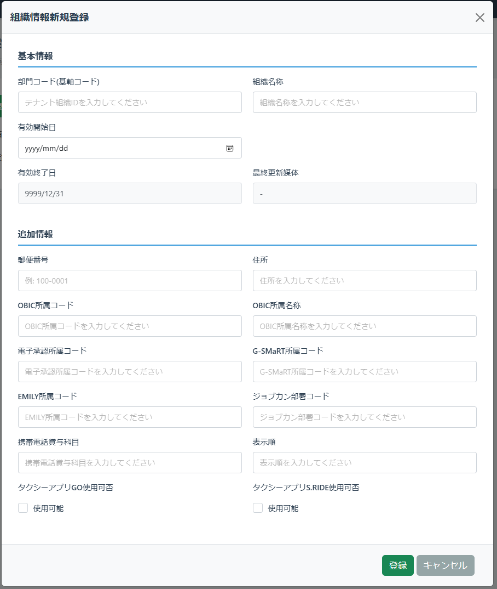
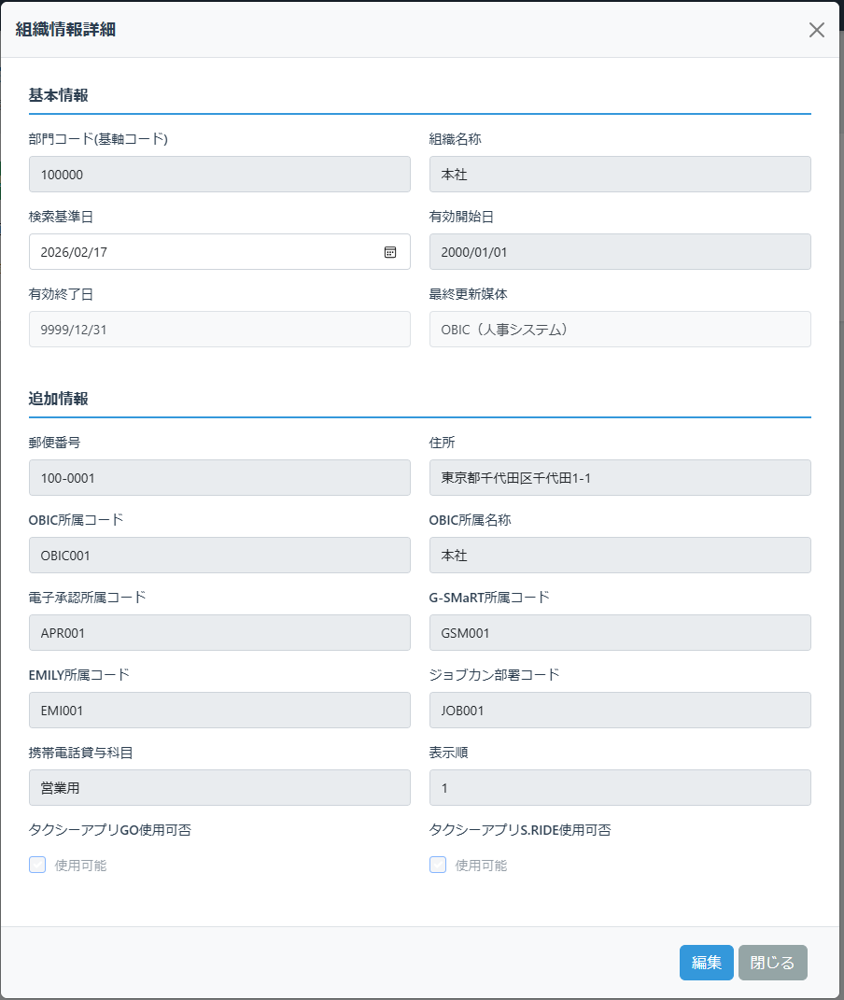
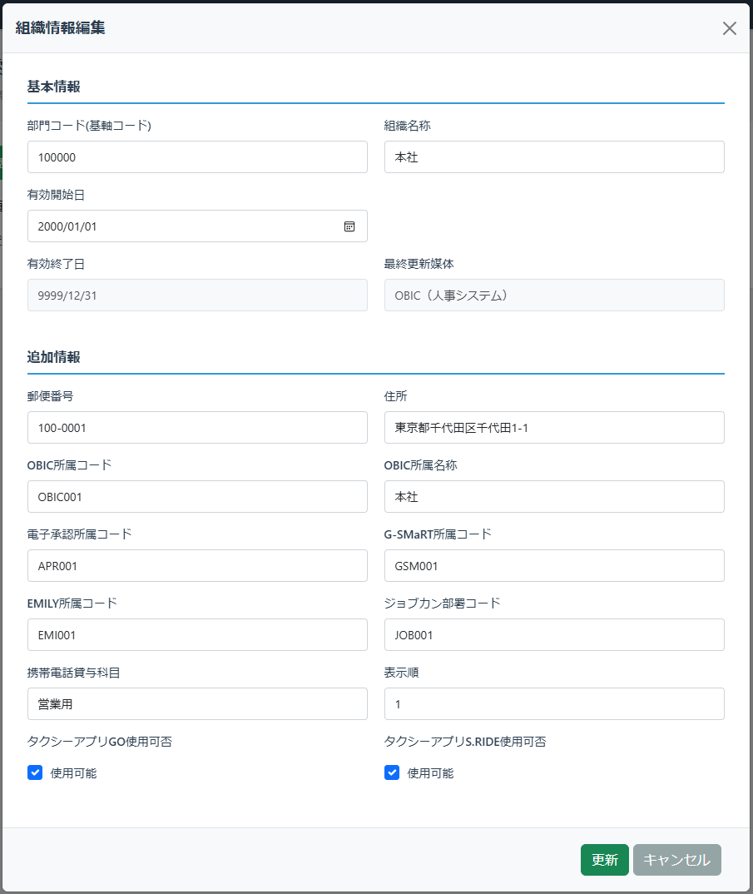

# 組織情報詳細画面

## 更新履歴

| 更新日    | 更新者 | 更新内容 |
| --------- | ------ | -------- |
| 2026/2/13 | 網代   | 新規作成 |

## 機能概要
組織情報の詳細を表示／編集する画面。組織検索画面上にダイアログ形式で表示される。
新規登録ボタン押下時は新規登録モードで表示し、初期状態から編集可能とする。
詳細表示モードでは全項目を参照のみで表示し、マスターデータ管理者権限を持つユーザーのみ編集ボタンが表示される。
編集ボタン押下後は編集モードとなり、各項目が入力可能になる（組織属性項目の「変更不可」は除く）。

## 画面レイアウト

### 新規登録モード

### 詳細表示モード

### 編集モード

## 項目定義

| No. | 項目名               | 表示文言         | I/O | オブジェクト | 初期値 | DBマッピング | 備考                   |
| --: | :------------------- | :--------------- | :-: | :----------- | :----- | :----------- | :--------------------- |
|   1 | 画面タイトル（新規） | 組織情報新規登録 |  O  | ラベル       |        |              | 新規登録モードのみ表示 |
|   2 | 画面タイトル（詳細） | 組織情報詳細     |  O  | ラベル       |        |              | 詳細表示モードのみ表示 |
|   3 | 画面タイトル（編集） | 組織情報編集     |  O  | ラベル       |        |              | 編集モードのみ表示     |

### 基本情報エリア
| No. | 項目名         | 表示文言     | I/O | オブジェクト | 初期値                      | DBマッピング                                | 備考                                              |
| --: | :------------- | :----------- | :-: | :----------- | :-------------------------- | :------------------------------------------ | :------------------------------------------------ |
|   1 | エリアタイトル | 基本情報     |  -  | ラベル       |                             |                                             |                                                   |
|   2 | テナント組織ID | -            |  O  | ラベル       | -                           | tenant_master.tenant_settings.orgColumnName |                                                   |
|   3 | 〃             | -            | I/O | テキスト     |                             | organization.tenant_org_id                  | 項目名はテナント設定から取得する                  |
|   4 | 組織名称       | 組織名称     |  -  | ラベル       | -                           |                                             |                                                   |
|   5 | 〃             | -            | I/O | テキスト     |                             | organization.org_name                       |                                                   |
|   6 | 検索基準日     | 検索基準日   |  -  | ラベル       | 前画面パラメータ.検索基準日 |                                             | 詳細表示モードのみ入力可能                        |
|   7 | 〃             | -            | I/O | 日付         |                             |                                             | yyyy/mm/dd形式                                    |
|   8 | 有効開始日     | 有効開始日   |  -  | ラベル       | -                           |                                             |                                                   |
|   9 | 〃             | -            | I/O | 日付         |                             | organization.start_date                     | yyyy/mm/dd形式                                    |
|  10 | 有効終了日     | 有効終了日   |  -  | ラベル       | -                           |                                             |                                                   |
|  11 | 〃             | -            |  O  | 日付         |                             | organization.end_date                       | yyyy/mm/dd形式。詳細表示/編集モード共通で参照のみ |
|  12 | 最終更新媒体   | 最終更新媒体 |  -  | ラベル       | -                           |                                             |                                                   |
|  13 | 〃             | -            |  O  | ラベル       |                             | organization.latest_medium                  | 詳細表示/編集モード共通で参照のみ                 |

### 追加情報エリア
* 下記は必要な項目を記載しているが、実装上は`組織属性項目`の定義を基に項目ラベルと入力欄を`表示順`の順番で生成して表示する。また`変更不可`が設定されている場合は新規登録モード時のみ入力可能とする

| No. | 項目名                       | 表示文言                     | I/O | オブジェクト     | 初期値 | DBマッピング                          | 備考                                                                   |
| --: | :--------------------------- | :--------------------------- | :-: | :--------------- | :----- | :------------------------------------ | :--------------------------------------------------------------------- |
|   1 | エリアタイトル               | 追加情報                     |  -  | ラベル           |        |                                       |                                                                        |
|   2 | 郵便番号                     | 郵便番号                     |  O  | ラベル           | -      | org_attribute.org_column_name         |                                                                        |
|   3 | 〃                           | -                            | I/O | テキスト         | -      | organization.org_attr.<org_colmun_id> |                                                                        |
|   4 | 住所                         | 住所                         |  O  | ラベル           | -      | org_attribute.org_column_name         |                                                                        |
|   5 | 〃                           | -                            | I/O | テキスト         | -      | organization.org_attr.<org_colmun_id> |                                                                        |
|   6 | OBIC所属コード               | OBIC所属コード               |  O  | ラベル           | -      | org_attribute.org_column_name         |                                                                        |
|   5 | 〃                           | -                            | I/O | テキスト         | -      | organization.org_attr.<org_colmun_id> |                                                                        |
|   6 | OBIC所属名称                 | OBIC所属名称                 |  O  | ラベル           | -      | org_attribute.org_column_name         |                                                                        |
|   7 | 〃                           | -                            | I/O | テキスト         | -      | organization.org_attr.<org_colmun_id> |                                                                        |
|   8 | 電子承認所属コード           | 電子承認所属コード           |  O  | ラベル           | -      | org_attribute.org_column_name         |                                                                        |
|   9 | 〃                           | -                            | I/O | テキスト         | -      | organization.org_attr.<org_colmun_id> |                                                                        |
|  10 | G-SMaRT所属コード            | G-SMaRT所属コード            |  O  | ラベル           | -      | org_attribute.org_column_name         |                                                                        |
|  11 | 〃                           | -                            | I/O | テキスト         | -      | organization.org_attr.<org_colmun_id> |                                                                        |
|  12 | EMILY所属コード              | EMILY所属コード              |  O  | ラベル           | -      | org_attribute.org_column_name         |                                                                        |
|  13 | 〃                           | -                            | I/O | テキスト         | -      | organization.org_attr.<org_colmun_id> |                                                                        |
|  14 | ジョブカン部署コード         | ジョブカン部署コード         |  O  | ラベル           | -      | org_attribute.org_column_name         |                                                                        |
|  15 | 〃                           | -                            | I/O | テキスト         | -      | organization.org_attr.<org_colmun_id> |                                                                        |
|  16 | 携帯電話貸与科目             | 携帯電話貸与科目             |  O  | ラベル           | -      | org_attribute.org_column_name         |                                                                        |
|  17 | 〃                           | -                            | I/O | テキスト         | -      | organization.org_attr.<org_colmun_id> |                                                                        |
|  18 | タクシーアプリGO使用可否     | タクシーアプリGO使用可否     |  O  | ラベル           | -      | org_attribute.org_column_name         |                                                                        |
|  19 | 〃                           | -                            | I/O | チェックボックス | -      | organization.org_attr.<org_colmun_id> |                                                                        |
|  20 | タクシーアプリS.RIDE使用可否 | タクシーアプリS.RIDE使用可否 |  O  | ラベル           | -      | org_attribute.org_column_name         |                                                                        |
|  21 | 〃                           | -                            | I/O | チェックボックス | -      | organization.org_attr.<org_colmun_id> |                                                                        |
|  22 | 表示順                       | 表示順                       |  O  | ラベル           | -      | org_attribute.org_column_name         | 組織ツリー情報において、同一親組織の中で何番目に表示するかを指定する。 |
|  23 | 〃                           | -                            | I/O | 数値             | -      | organization.org_attr.<org_colmun_id> |                                                                        |

### ボタンエリア
| No. | 項目名           | 表示文言   | I/O | オブジェクト | 初期値 | DBマッピング | 備考                                           |
| --: | :--------------- | :--------- | :-: | :----------- | :----- | :----------: | :--------------------------------------------- |
|   1 | 登録ボタン       | 登録       |  -  | ボタン       |        |              | 新規登録モードのみ表示                         |
|   2 | 編集ボタン       | 編集       |  -  | ボタン       |        |              | 詳細表示モードかつマスターデータ管理者のみ表示 |
|   3 | 更新ボタン       | 更新       |  -  | ボタン       |        |              | 編集モードのみ表示                             |
|   4 | キャンセルボタン | キャンセル |  -  | ボタン       |        |              | 新規登録モード、編集モードのみ表示             |
|   5 | 閉じるボタン     | 閉じる     |  -  | ボタン       |        |              | 詳細表示モードのみ表示                         |

## 機能仕様
### イベント定義
| No. | イベント名                 | トリガー条件                         | イベント概要                     | 画面表示／遷移先 |
| --: | :------------------------- | :----------------------------------- | :------------------------------- | :--------------- |
|   1 | 初期表示（新規登録モード） | パラメータなし                       | 新規登録用の画面を表示する       | -                |
|   2 | 初期表示（詳細表示モード） | パラメータあり（組織ID、検索基準日） | 組織情報の詳細を参照表示する     | -                |
|   3 | 検索基準日変更             | 検索基準日の設定値変更               | 組織情報の詳細を参照表示する     | -                |
|   4 | 登録ボタン押下             | 登録ボタンクリック                   | 入力内容で組織情報を登録する     | 組織検索画面     |
|   5 | 編集ボタン押下             | 編集ボタンクリック                   | 画面を編集モードに切り替える     | -                |
|   6 | 更新ボタン押下             | 更新ボタンクリック                   | 入力内容で組織情報を更新する     | 組織検索画面     |
|   7 | キャンセルボタン押下       | キャンセルボタンクリック             | 編集内容を破棄して詳細表示に戻る | -                |
|   8 | 閉じるボタン押下           | 閉じるボタンクリック                 | ダイアログを閉じる               | 組織検索画面     |

## イベント詳細
### 初期表示（新規登録モード）
- `組織情報項目定義`を取得し、追加情報エリアの各項目を生成する。
- `組織情報項目定義`の`参照コードグループID`に設定されているコードを`コードグループマスター`、`コードマスター`から取得し、追加情報エリアのプルダウン項目を生成する。
- 各項目を空欄で表示する。
- 画面タイトル（新規）を表示し、画面タイトル（詳細）、画面タイトル（編集）を非表示にする。
- 基準日、有効終了日を非表示にする。
- 登録ボタン、キャンセルボタンを表示し、編集ボタン、更新ボタン、閉じるボタンを非表示にする。

### 初期表示（詳細表示モード）
- `組織情報項目定義`を取得し、追加情報エリアの各項目を生成する。
- `組織情報項目定義`の`参照コードグループID`に設定されているコードを`コードグループマスター`、`コードマスター`から取得し、追加情報エリアのプルダウン項目を生成する。
- パラメータで指定された*組織ID*を元に`組織情報`から対象の組織の情報(履歴全て)を取得する。
  - 組織が存在しない場合、エラーメッセージ(COM01009)を表示してダイアログを閉じる。
- 取得した組織情報のうち、パラメータで指定された検索基準日に該当する有効期間データを各項目に表示する。
- 画面タイトル（詳細）を表示し、画面タイトル（新規）、画面タイトル（編集）を非表示にする。
- 閉じるボタンを表示し、登録ボタン、更新ボタン、キャンセルボタンを非表示にする。
- マスターデータ管理者権限を持つユーザーの場合、編集ボタンを表示する。それ以外の場合、編集ボタンを非表示にする。

### 検索基準日変更
- 各項目の値を、検索基準日に該当する有効期間のデータの値に変更する。
  - 検索基準日に該当するデータが存在しない場合、エラーメッセージ(COM01003)を表示し検索基準日を元に戻す。

### 編集ボタン押下
- 画面タイトル（編集）を表示し、画面タイトル（詳細）を非表示にする。
- 検索基準日を非表示にする。
- 参照表示の項目を編集可能に切り替える。
  - `組織属性項目`で「変更不可」に設定されている項目は編集不可のままとする。
- 更新ボタン、キャンセルボタンを表示し、編集ボタン、閉じるボタンを非表示にする。

### 登録ボタン押下
- **クライアントサイドバリデーション**
  - フロント側で以下のチェックを実行する。チェックエラーの場合、該当のエラーメッセージを表示し終了する。
    - **基本情報入力チェック**
    - **追加情報入力チェック**
  - 確認メッセージ(COM01006)を表示する。
    - キャンセルが押下された場合、終了する。
- **サーバーサイドバリデーション**
  - サーバー側で以下のチェックを実行する。チェックエラーの場合、該当のエラーメッセージを表示し終了する。
    - **マスターデータ管理者チェック**
    - **基本情報入力チェック**
    - **追加情報入力チェック**
    - **重複チェック(登録)**
- **組織情報更新**
  - 入力内容を組織情報に登録する。
- **操作ログ**を記録する。
  - 対象機能：「組織情報詳細」
  - 操作内容：「組織情報登録：[テナント組織ID]」
- 完了メッセージ(COM01004)を表示し、有効開始日を検索基準日として初期表示（詳細表示モード）で画面を表示し直す。

### 更新ボタン押下
- **クライアントサイドバリデーション**
  - フロント側で以下のチェックを実行する。チェックエラーの場合、該当のエラーメッセージを表示し終了する。
    - **基本情報入力チェック**
    - **追加情報入力チェック**
    - **変更有無チェック**
    - **履歴追加チェック**
  - 確認メッセージ(COM01006)を表示する。
    - キャンセルが押下された場合、終了する。
- **サーバーサイドバリデーション**
  - サーバー側で以下のチェックを実行する。チェックエラーの場合、該当のエラーメッセージを表示し終了する。
    - **マスターデータ管理者チェック**
    - **基本情報入力チェック**
    - **追加情報入力チェック**
    - **変更有無チェック**
    - **履歴追加チェック**
    - **重複チェック(更新)**
- **組織情報の更新**
  - 有効開始日が変更前のデータから更新されていない場合
    - 入力内容でデータを更新する。
      - 更新条件は以下の通り
        - `組織ID`＝対象の組織ID
        - `有効開始日`＝有効開始日
        - `バージョン`＝データ取得時のバージョン
      - 更新対象データが見つからない場合、エラーメッセージ(COM01010)を表示し終了する。
  - 有効開始日が変更前のデータから更新されている場合
    - 変更前データの有効終了日を更新する。
      - 更新内容
        - `有効終了日`＝変更後の有効開始日-1日
      - 更新条件は以下の通り
        - `組織ID`＝対象の組織ID
        - `有効開始日`＝変更前の有効開始日
        - `バージョン`＝データ取得時のバージョン
      - 更新対象データが見つからない場合、エラーメッセージ(COM01010)を表示し終了する。
    - 入力内容を元に変更後データを登録する。
- **操作ログ**を記録する。
  - 対象機能：「組織情報詳細」
  - 操作内容：「組織情報更新：[テナント組織ID]」
- 完了メッセージ(COM01004)を表示し、変更後の有効開始日を検索基準日として初期表示（詳細表示モード）で画面を表示し直す。

### キャンセルボタン押下
- 入力内容が変更されている場合、確認ダイアログ(COM01008)を表示する。
  - キャンセルされた場合、処理を中断する。
- 画面タイトル（詳細）を表示し、画面タイトル（編集）を非表示にする。
- 検索基準日を表示する。
- 検索基準日以外の編集表示の項目を編集不可に切り替える。
- 更新ボタン、キャンセルボタンを表示し、編集ボタン、閉じるボタンを非表示にする。

### 閉じるボタン押下
- ダイアログを閉じる。

## バリデーション定義
**メッセージ定義は[メッセージ定義.md](../メッセージ/メッセージ定義.md)を参照**
| No. | バリデーション名             | バリデーション内容                                                                                 | メッセージID               |
| --: | :--------------------------- | :------------------------------------------------------------------------------------------------- | :------------------------- |
|   1 | 基本情報入力チェック         | ・テナント組織ID:必須、100文字以内 ・組織名称:必須、100文字以内 ・有効開始日:必須、日付形式  | COM02001,COM02002,COM02006 |
|   2 | 追加情報入力チェック         | 追加情報エリアの各項目ごとに、`組織属性項目`の`必須`/`最大文字数`/`入力タイプ`に合致すること       | COM02001,COM02002,COM02006 |
|   3 | マスターデータ管理者チェック | ログインユーザーがマスターデータ管理者権限を持つこと                                               | COM01001                   |
|   4 | 重複チェック(登録)           | テナント組織IDが登録されている`組織情報`.`テナント組織ID`と重複しないこと                          | ORG02001                   |
|   5 | 変更有無チェック(更新)       | 更新前後で有効開始日以外の項目に差分があること                                                     | ORG02002                   |
|   6 | 履歴追加チェック             | 更新前後で有効開始日に差分がある場合、変更前の有効開始日＜有効開始日＜変更前の有効終了日であること | ORG02003                   |
|   7 | 重複チェック(更新)           | テナント組織IDが更新対象以外の`組織情報`.`テナント組織ID`と重複しないこと                          | ORG02001                   |
