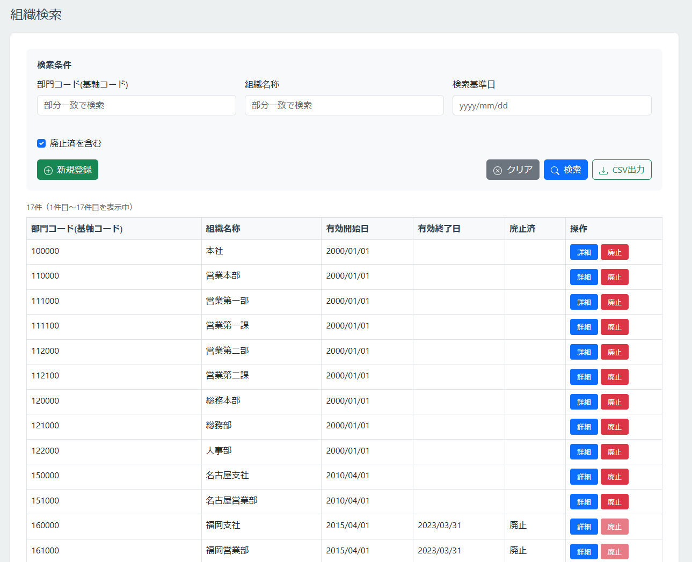

# 組織検索画面

## 更新履歴

| 更新日    | 更新者 | 更新内容 |
| --------- | ------ | -------- |
| 2026/2/10 | 網代   | 新規作成 |

## 機能概要
条件を指定して組織情報を検索し、一覧表示する。
一覧から組織の廃止や登録内容の詳細を確認できる。

## 画面レイアウト



## 項目定義
| No. | 項目名       | 表示文言 | I/O | オブジェクト | 初期値 | DBマッピング | 備考 |
| --: | :----------- | :------- | :-: | :----------- | :----- | :----------: | :--- |
|   1 | 画面タイトル | 組織検索 |  -  | ラベル       |        |              |      |

### 検索条件エリア
| No. | 項目名         | 表示文言     | I/O | オブジェクト     | 初期値 | DBマッピング                                | 備考                                                                                                                                            |
| --: | :------------- | :----------- | :-: | :--------------- | :----- | :------------------------------------------ | :---------------------------------------------------------------------------------------------------------------------------------------------- |
|   1 | エリアタイトル | 検索条件     |  -  | ラベル           |        |                                             |                                                                                                                                                 |
|   2 | テナント組織ID | -            |  O  | ラベル           |        | tenant_master.tenant_settings.orgColumnName | 項目名はテナント設定から取得する                                                                                                                |
|   3 | 〃             | -            |  I  | テキスト         |        |                                             | 部門コード(基軸コード)を指定する                                                                                                                |
|   4 | 組織名称       | 組織名称     |  -  | ラベル           |        |                                             |                                                                                                                                                 |
|   5 | 〃             | -            |  I  | テキスト         |        |                                             | 組織名称を指定する。                                                                                                                            |
|   6 | 検索基準日     | 検索基準日   |  -  | ラベル           |        |                                             |                                                                                                                                                 |
|   7 | 〃             | -            |  I  | 日付             |        |                                             | いつ時点の情報を検索するかを指定する。未入力の場合、組織ごとに最大の有効開始日のデータを取得する                                                |
|   8 | 廃止済を含む   | 廃止済を含む |  -  | ラベル           |        |                                             |                                                                                                                                                 |
|  11 | 〃             | -            |  I  | チェックボックス |        |                                             | 廃止日の設定された組織を検索対象に含めるかを指定する。OFFの場合、含めない。ONの場合、含める                                                     |
|  12 | 新規登録ボタン | 新規登録     |  -  | ボタン           |        |                                             | 組織情報の新規登録を行う（組織情報編集へ遷移）                                                                                                  |
|  13 | クリアボタン   | クリア       |  -  | ボタン           |        |                                             | 検索条件欄を全てクリアする                                                                                                                      |
|  14 | 検索ボタン     | 検索         |  -  | ボタン           |        |                                             | 組織情報を検索する                                                                                                                              |
|  15 | CSV出力ボタン  | CSV出力      |  -  | ボタン           |        |                                             | 検索条件に該当するデータ全件をCSVで出力する。<br>ログインユーザーがテナント管理者、マスターデータ管理者、ダウンロードの権限を持つ場合のみ表示。 |

### 検索結果エリア
* ページング用項目は[システム共通/ページネーション.md](../システム共通/ページネーション.md)を参照

| No. | 項目名         | 表示文言   | I/O | オブジェクト |     | 初期値 | DBマッピング                                | 備考                                                                       |
| --: | :------------- | :--------- | :-: | :----------- | --- | :----- | :------------------------------------------ | :------------------------------------------------------------------------- |
|   1 | テナント組織ID | -          |  O  | ラベル       |     |        | tenant_master.tenant_settings.orgColumnName | 列タイトル。項目名はテナント設定から取得する                               |
|   2 | 〃             | -          |  O  | ラベル       |     |        | organization.tenant_org_id                  |                                                                            |
|   3 | 組織名称       | 組織名称   |  -  | ラベル       |     |        |                                             | 列タイトル                                                                 |
|   4 | 〃             | -          |  O  | ラベル       |     |        | organization.org_name                       |                                                                            |
|   5 | 有効開始日     | 有効開始日 |  -  | ラベル       |     |        |                                             | 列タイトル                                                                 |
|   6 | 〃             | -          |  O  | ラベル       |     |        | organization.start_date                     | yyyy/mm/dd形式                                                             |
|   7 | 有効終了日     | 有効終了日 |  -  | ラベル       |     |        |                                             | 列タイトル                                                                 |
|   8 | 〃             | -          |  O  | ラベル       |     |        | organization.end_date                       | yyyy/mm/dd形式。9999/12/31の場合は出力しない。                             |
|   9 | 廃止済         | 廃止済     |  -  | ラベル       |     |        |                                             | 列タイトル                                                                 |
|  10 | 〃             | -          |  O  | ラベル       |     |        | organization.is_abolished                   | trueの場合、"廃止"。それ以外の場合、出力しない。                           |
|  11 | 操作           | 操作       |  -  | ラベル       |     |        |                                             | 列タイトル                                                                 |
|  12 | 詳細ボタン     | 詳細       |  -  | ボタン       |     |        |                                             | 操作列に配置。クリックで組織詳細画面に遷移                                 |
|  13 | 廃止ボタン     | 廃止       |  -  | ボタン       |     |        |                                             | 操作列に配置。クリックで組織廃止ダイアログを開く。廃止済の組織の場合、無効 |

## 機能仕様
### イベント定義
* ページング関連イベントは[システム共通/ページネーション.md](../システム共通/ページネーション.md)を参照

| No. | イベント名         | トリガー条件           | イベント概要                                                    | 画面表示／遷移先                   |
| --: | :----------------- | :--------------------- | :-------------------------------------------------------------- | :--------------------------------- |
|   1 | 画面初期表示       | 初期表示/更新時        | 画面の初期表示を行う。                                          | -                                  |
|   2 | 新規登録ボタン押下 | 新規登録ボタンクリック | 組織情報詳細画面に遷移する。                                    | 組織情報詳細画面（新規登録モード） |
|   3 | クリアボタン押下   | クリアボタンクリック   | 検索条件をクリアする。                                          | -                                  |
|   4 | 検索ボタン押下     | 検索ボタンクリック     | 条件に一致する組織を検索する。                                  | -                                  |
|   5 | CSV出力ボタン押下  | CSV出力ボタンクリック  | 検索条件に該当する組織情報をCSVファイル形式でダウンロードする。 | -                                  |
|   6 | 詳細ボタン押下     | 詳細ボタンクリック     | 組織情報詳細画面に遷移する。                                    | 組織情報詳細画面（詳細表示モード） |
|   7 | 廃止ボタン押下     | 廃止ボタンクリック     | 廃止確認ダイアログを表示する。                                  | 廃止確認ダイアログ                 |


## イベント詳細
### 画面初期表示
- `テナントマスター`.`テナント設定`から`組織コードカラム名`を取得し、検索条件エリア、検索結果エリア、廃止確認ダイアログのテナント組織IDラベルの文言に設定する。
- 検索条件エリアを初期状態で表示する。
- 検索結果エリアは非表示とする。
- ページングエリアは非表示とする。

### 新規登録ボタン押下
- 組織情報詳細画面に遷移する（新規登録モード）。

### クリアボタン押下
- すべての検索条件項目をクリアする。
- 検索結果エリアを非表示にする。

### 検索ボタン押下
1. `組織ツリーバージョン情報`の`バージョン`を取得する。(廃止実行ボタン押下時に使用する。)
1. `組織情報`から検索条件に一致する組織を検索し、検索結果エリアに表示する。
    - 抽出条件は以下の通り
        - テナント組織ID：部分一致　
        - 組織名称：部分一致
        - 検索基準日：`有効開始日`≦検索基準日(未指定の場合は9999/12/31)≦`有効終了日`
        - 廃止済を含む：trueの場合、検索基準日条件とorで次の条件を追加
            - `有効終了日`≦検索基準日(未指定の場合は9999/12/31) かつ `廃止`がtrue
    - ページネーションの現在ページを1ページ目に設定する。
    - 検索結果が0件の場合、データの代わりにメッセージ(該当データがありません。)を表示する。

### CSV出力ボタン押下
- **サーバーサイドバリデーション**
  - サーバー側で以下のチェックを実行する。チェックエラーが発生した時点でメッセージをダイアログ表示し、処理を中断する。
    - **ダウンロード権限チェック**
- **出力データの取得**
  - `組織属性項目`から全データを取得する。
  - `テナントマスター`から`組織コードカラム名`を取得する。
  - `組織情報`から検索条件に一致する組織を*全件*取得する。
    - 抽出条件は以下の通り
      - テナント組織ID：部分一致
      - 組織名称：部分一致
      - 検索基準日：`有効開始日`≦検索基準日(未指定の場合は9999/12/31)≦`有効終了日`
      - 廃止済を含む：trueの場合、検索基準日条件とorで次の条件を追加
        - `有効終了日`≦検索基準日(未指定の場合は9999/12/31) かつ `廃止`がtrue
    - 検索結果が0件の場合、メッセージ(COM01003)をダイアログ表示し処理を終了する。
- **CSVファイルの出力**
  - 検索結果をCSVファイルに出力し、クライアントに送信する。出力形式は以下の通り。
    - UTF-8, CRLF
    - タイトル列あり
    - ダブルクォートエスケープあり
    - 出力順：テナント組織IDの昇順
    - 出力項目：
      - `組織情報`.`テナント組織ID`(列名は`テナントマスター`の`組織コードカラム名`)
      - `組織情報`.`有効開始日`(yyyy/mm/dd形式)
      - `組織情報`.`有効終了日`(yyyy/mm/dd形式)
      - `組織情報`.`組織名称`
      - `組織情報`.`廃止`(trueの場合、"廃止"。それ以外の場合、出力しない)
      - `組織情報`.`組織属性`の全項目(`組織属性項目`.`表示順`の昇順で出力。日付項目の場合、yyyy/mm/dd形式で出力。日時項目の場合、日付項目の場合はyyyy/mm/dd hh:mm形式で出力)

#### 出力サンプル
```
"部門コード(基軸コード)","有効開始日","有効終了日","組織名称","廃止","郵便番号","住所","OBIC所属コード","電子承認所属コード","G-SMaRT所属コード","EMILY所属コード","ジョブカン部署コード,"携帯電話貸与科目","タクシーアプリGO使用可否","タクシーアプリS.RIDE使用可否","表示順"
"123456","2000/10/02","9999/12/31","総務・人事部","150-0047","東京都渋谷区神山町4番14号 第三共同ビル","144010","11700","11700","144010","1456","販管","可能","不可","1"
"123456","2000/10/02","2020/06/30","神戸事業所","廃止","650-8515","神戸市中央区中山手通2-24-7 ＮＨＫ神戸放送局内","36100","30100","30100","300310","2125","販管","可能","不可","1"
```

### 詳細ボタン押下
- クリックした行の組織の組織ID、検索基準日をパラメータとして、組織情報詳細画面に遷移する（詳細表示モード）。

### 廃止ボタン押下
- クリックした行の組織の組織ID、テナント組織ID、組織名称をパラメータとして、廃止確認ダイアログを表示する。


## バリデーション定義
**メッセージ定義は[メッセージ定義.md](../メッセージ/メッセージ定義.md)を参照**
| No. | バリデーション名         | バリデーション内容                                                                                       | メッセージID |
| --: | :----------------------- | :------------------------------------------------------------------------------------------------------- | :----------- |
|   1 | ダウンロード権限チェック | ログインユーザーが以下のいずれかの権限を持つこと。<br>テナント管理者、マスターデータ管理者、ダウンロード | COM01001     |

<br>
<br>

# 廃止確認ダイアログ

## 機能概要
条件を指定して組織情報を検索し、一覧表示する。
一覧から組織の廃止を行ったり、組織詳細画面で詳細の確認

## 画面レイアウト


## 項目定義
| No. | 項目名               | 表示文言                                                                                                                                             | I/O | オブジェクト | 初期値 |                DBマッピング                 | 備考                             |
| --: | :------------------- | :--------------------------------------------------------------------------------------------------------------------------------------------------- | :-: | :----------- | :----- | :-----------------------------------------: | :------------------------------- |
|   1 | ダイアログタイトル   | 廃止確認                                                                                                                                             |  -  | ラベル       | -      |                                             |                                  |
|   2 | テナント組織ID       | -                                                                                                                                                    |  O  | ラベル       | -      | tenant_master.tenant_settings.orgColumnName | 項目名はテナント設定から取得する |
|   3 | 〃                   | -                                                                                                                                                    |  O  | ラベル       | -      |         organization.tenant_org_id          |                                  |
|   4 | 組織名称             | 組織名称                                                                                                                                             |  -  | ラベル       | -      |                                             |                                  |
|   5 | 〃                   | -                                                                                                                                                    |  O  | ラベル       | -      |            organization.org_name            |                                  |
|   6 | 廃止日               | 廃止日                                                                                                                                               |  -  | ラベル       | -      |                                             |                                  |
|   7 | 〃                   | -                                                                                                                                                    |  I  | 日付         | -      |                                             |                                  |
|   8 | 注釈文言             | 組織を廃止すると、その配下にある全組織も同日に廃止になります。<br>残したい組織がある場合は、先に組織ツリーを編集して別の組織配下に移動してください。 |  -  | ラベル       | -      |                                             |                                  |
|   9 | 廃止実行ボタン       | 廃止実行                                                                                                                                             |  -  | ボタン       | -      |                                             |                                  |
|  10 | 廃止キャンセルボタン | キャンセル                                                                                                                                           |  -  | ボタン       | -      |                                             |                                  |

## 機能仕様
### イベント定義
* ページング関連イベントは[システム共通/ページネーション.md](../システム共通/ページネーション.md)を参照

| No. | イベント名                                   | トリガー条件                 | イベント概要                                     | 画面表示／遷移先 |
| --: | :------------------------------------------- | :--------------------------- | :----------------------------------------------- | :--------------- |
|   1 | 廃止確認ダイアログ・廃止実行ボタン押下       | 廃止実行ボタンクリック       | 対象および配下となる組織全てに廃止日を設定する。 | 一覧/検索画面    |
|   2 | 廃止確認ダイアログ・廃止キャンセルボタン押下 | 廃止キャンセルボタンクリック | 廃止確認ダイアログを閉じる。                     | 一覧/検索画面    |

## イベント詳細

### 廃止実行ボタン押下
-. **クライアントサイドバリデーション**
  -. フロント側で以下のチェックを実行する。チェックエラーの場合、該当のエラーメッセージを表示し終了する。
    -. **入力チェック**
- **廃止対象データの取得**
    - `組織ツリー情報`から、廃止対象組織IDに該当する行の`組織階層パス`を取得する。
      - 抽出条件は以下の通り
        - `組織ID`＝廃止ボタンを押下した行の組織ID
        - `有効終了日`＝9999/12/31  
    - `組織ツリー情報`、`組織情報`から更新対象レコードを取得する。
      - 抽出条件は以下の通り
        - `組織階層パス`＝上記で取得した値で前方一致
        - `有効終了日`＝9999/12/31
        - `廃止`＝false
- **サーバーサイドバリデーション**
  - サーバー側で以下のチェックを実行する。チェックエラーが発生した時点でメッセージをダイアログ表示し、処理を中断する。
    - **組織廃止権限チェック**
    - **入力チェック**
    - **廃止対象チェック**
- **組織情報の更新** 
  - **組織ツリー情報TBLのバージョン更新**
    - `組織ツリーバージョン情報`の`バージョン`を1加算して更新する。 ※検索時のバージョンを更新条件に含めること
    - 更新ができなかった場合は全てロールバックし、メッセージ(COM01010)をダイアログ表示し処理を終了する。
  - **廃止対象組織とその配下組織（廃止済は除外）の廃止日データ登録**
    - 取得した`組織ツリー情報`、`組織情報`を書き換えたレコードを更新する。　※`組織情報`更新時はデータ取得時のバージョンを更新条件に含めること
        - `有効終了日`に廃止日を設定
        - `最終更新媒体`を「マスター編集」に設定（`組織情報`のみ）
        - `バージョン`を1加算（`組織情報`のみ）
    - 1件でも更新ができなかった場合、全てロールバックしメッセージ(COM01010)をダイアログ表示し処理を終了する。
- **操作ログの登録**
  - 操作ログTBLに下記の内容を記録する。※廃止日を更新した全ての組織について出力する
    - 対象機能：「組織検索」
    - 操作内容：「組織情報廃止：`テナント組織ID` `部門名` `廃止日`」
- 廃止確認ダイアログを閉じる。
- 完了メッセージ(COM01004)を表示する。
- 現在のページで検索を再実行し、一覧を更新する。
  - 廃止後に現在のページに該当するデータがない場合は、最終ページを表示する。

### 廃止キャンセルボタン押下
- 廃止確認ダイアログを閉じる。


## バリデーション定義
**メッセージ定義は[メッセージ定義.md](../メッセージ/メッセージ定義.md)を参照**
| No. | バリデーション名     | バリデーション内容                                                                                                 | メッセージID      |
| --: | :------------------- | :----------------------------------------------------------------------------------------------------------------- | :---------------- |
|   1 | 入力チェック         | 廃止日:必須、日付形式                                                                                              | COM02001,COM02006 |
|   2 | 組織廃止権限チェック | ログインユーザーが以下のいずれかの権限を持つこと。<br>テナント管理者、マスターデータ管理者                         | COM01001          |
|   3 | 廃止対象チェック     | `組織情報`および`組織ツリー情報`の廃止対象の組織とその配下組織の最新レコードの有効開始日が廃止日より前であること。 | ORG01001          |
